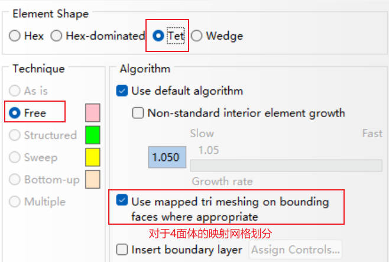
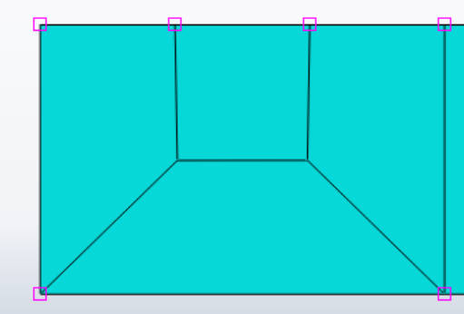
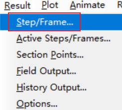
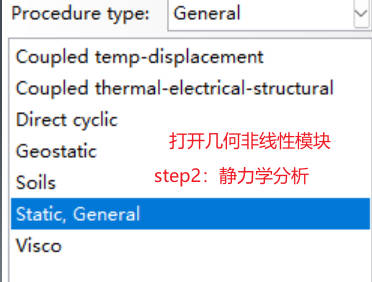
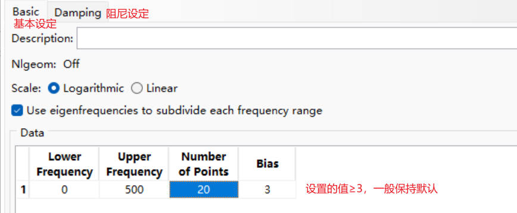
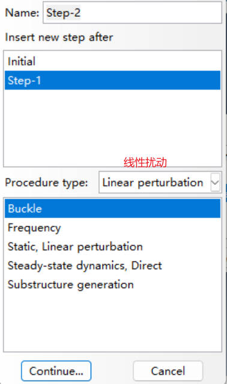

# ABAQUS_intro

## 0.帮助文档

[达索官方网站帮助文件](https://help.3ds.com/2021/English/DSSIMULIA_Established/SIMULIA_Established_FrontmatterMap/sim-r-DSDocAbaqus.htm?contextscope=all&id=b15ba98a76ce4305b417ecdd54e5394d)

[6.7-2016 版本](http://130.149.89.49:2080/)

[6.14](http://130.149.89.49:2080/v6.14/index.html)

## 1.概述

### 1.1文件系统

**有限元要素：单元，网格，节点，材料，连接关系，求解设置，边界条件**

**1.数据库文件**

`.cae`: 格式文件，包含具体的建模信息。

`.odb`: 包含输出结果，变形后的结果。

**2.数据文件**

`.dat`: 记录数据，参数检查，单元质量检查等信息

**3.输入文件**

`.inp`: 包含有限元模型，即有限元的 7 个要素，不包含几何模型

`.pes`: 参数更改后重新的 `inp` 文件

动态查看：`ctrl+alt+左键`

### 1.2模块介绍

**零部件模块：**Part

**装配体模块：**Assembly，类似建模软件，同一个零部件可多次调用，装配约束

**草图模块：**二维形式

### 1.3分析流程

## 2.流程

`ctrl+alt+左键`：动态观察

鼠标左键长按打开下拉列表：

壳体抽取中面设置：

### 2.1 选择

隐藏实例和显示全部的实例：

### 2.2 装配

assembly ：模型装配完毕后，对其进行新的定位操作，完成装配体件内各实体位置关系的约束。

### 2.3 分析步

创建不同的分析步，描述不同的相互关系，载荷和边界条件；

1.通用分析步

2.线性摄动分析步

### 2.4 相互作用

interaction，相互作用模块；

## 3.网格划分

[hypermesh 指南](https://mp.weixin.qq.com/s?__biz=MzI2NzMyNjI2Nw==&mid=2247530124&idx=1&sn=71711d37bacab69d571c50fa348cd8b4&chksm=ea82b0d8ddf539ceb83943b21d0e58e56bbd4589d3e41ef15faff1f6b42bdd326cc94be45dbc&scene=27)

[HyperMesh2021 安装教程及软件下载](https://www.bilibili.com/read/cv16122305?from=search&spm_id_from=333.337.0.0)

六面体网格：

- **扫掠网格 (Sweep)-黄色**
- **结构化网格 (Structured)-绿色**
- **自由网格划分 (free)-粉红色**
- **自底向上的网格划分-浅棕色**

Hex (六面体) 或者 Hex (六面体占优)，不想剖分则只能选择四面体 (Tex) 进行，且只能选择自由划分网格技术。

**映射网格划分技术的适用情况**

### 3.1圆形平面网格划分

圆形区域网格划分：铜钱形。

橘黄色：当前网格划分不适用，解决方式：

- 模型切割
- 修改网格划分

### 3.2二合一的网格划分

**避免产生三角形网格**

由二变为一

**三合一的网格划分**

**混合划分**

$10 = 2*2 + 2*3$

### 3.3自底向上的网格划分

## 4.Assembly 模块

Assembly 模块：

优势：同一个零部件可调用多次

独立实体 (Independent)：网格划分需针对每个零件进行

非独立实体 (Dependent)：只需针对母体进行即可

- 旋转平移

- 阵列

- 装配约束

- 共节点

  模型的布尔求和：材料冲突

  网格模型共节点：**注意容差的大小 < 最小网格尺寸 ;适用于材料不一致的情况**

## 5.线性静力学分析

### 5.1简介

**前提**

材料线性；结构小变形，小位移，小转动，刚度不变

**弹性力学的基本假设**

1.连续性假设

2.线弹性假设

3.均匀性假设

4.各项同性假设

5.小变形假设

**线性分析内容**

1.线性静力学分析

- 系统运动速度为 0
- 动态稳定分析，平动加速度+旋转加速度。该类情况下加速度的变化频率远小于结构系统自身的自振频率

2.线性动力学分析

### 5.2实体静力学分析流程

#### 1.工作路径的指定和文件保存

#### 2.前处理

**2.1几何模型的构建 (part)**

统一单位制：如 mm| Mpa | t

**2.3材料参数的定义 (property)**

- 创建材料：杨氏模量 E =2.1e5 Mpa 和泊松比 v = 0.3
- 创建截面
- 截面指派，完成指派后，颜色由灰白色变为绿色。

**2.4网格系统的构建(mesh)**

- 网格划分：绿色表示结构化网格划分

  - 建议第一次网格划分(系统默认的)，确定数量和质量

  - 网格的控制：数量和质量角度，加载的位置，进行模型切分等操作
  - 第二网格划分

- 单元类型

  - 六面体，默认 C3D8R

- 装配体操作(Assembly)，创建

#### 3.求解

**3.1求解器的设定(step)**

- 静力学分析，静力通用分析步
- 场输出，云图。contact: 接触
- 历史输出，变量-时间的历史曲线

**3.2连接关系的构建**

- 相互作用

**3.3边界条件的设定(load)**

- 载荷边界条件：载荷施加
- 位移边界条件：约束问题，如固端约束：Encastre
- 切换到 Job 设置

#### 4.后处理

**4.1位移**

**4.2应力**

**其他**

考虑重力：密度 $7.85×10^{-9} \textup{t/mm}^3$

## 6.壳体结构静力学分析

### 6.1流程

#### 1.工作路径设置和保存

#### 2.前处理

1.几何建模

2.材料参数的定义

- 创建材料
- 创建截面，部件名称-截面类型-材料类型-截面属性
- 截面指派，Middle surface 从中面向两侧配置

3.网格系统的构建

- 网格划分
- 单元类型：S4R，4 节点缩减积分的单元
- 装配

#### 3.求解

1.求解器设定

- 通用分析步
- 场输出，云图，应力和位移
- 历史输出

2.连接关系的构建，针对多个部件分析设置

3.边界条件的设定，位移边界条件以及荷载边界条件

#### 4.后处理

设置图例样式：

1.设定位移和应力的显示比例

2.sneg(SENG=-1.0)：shell 的下侧表面

spos(SPOS=1.0)：上侧表面

或修改为包络形式：Envelope

#### 5.其他

**采用抽取中面的方式创建**

创建 solid 实体并抽取中面

## 7.非线性分析

### 7.1简介

**非线性行为：**

载荷引起结构刚度发生变化

典型的情况：金属材料的弹塑性 + 大变形问题(细长杆+长薄板) + 状态变化(接触+单元失效)

#### 非线性分类

**几何非线性**

**ABAQUS standard 默认假设小变形；ABAQUS explicit 默认假设大变形；**

- 结构的大变形/大旋转 (Large deflections or rotations)
- 双稳态分析，越跃失稳 (Snap through)
- 初始应力或者载荷刚度 (Initial stresses or load stiffening)

**材料非线性**

- 金属弹塑性：小应变-线弹性；大应变-塑性变形（不可逆）

- 超弹性材料：应力应变为非线性曲线（可恢复变形）

- 其他形式：材料属性可以为温度或其他领域的函数

**边界非线性**

边界条件的不连续，如接触

#### 自动增量步控制

存在于隐式分析中：牛顿-拉夫逊法

- 初始增量步：开始的第一个分量步大小，(默认为当前分析步大小，推荐为分析步时间的 5%-10%)
- 最小增量步/最大增量步：允许的最小/大增量步大小，默认 (1e-5) / 当前分析步大小
- 最大增量步数：默认 100
- 当增量步不收敛时，增量步大小缩小为当前增量步的 25%（默认只允许缩小 5 次）
- 迭代步数在 5 次以下，增量步将增大当前增量步的 50%。

### 7.2几何非线性分析

大变形分类：

- 刚体位移，运动产生，多体动力学分析
- 弹性变形，受力产生，弹塑性分析 | 超弹性分析

#### 1.前处理

- 几何模型的构建
- 材料参数的定义
  - 创建材料
  - 创建截面
  - 截面指派
  - 法向设定

- 网格构建
  - 装配体构建，**独立实体 (Independent)**
  - 网格划分，全局尺寸设置为 1
  - 单元类型，保持默认，B31

#### 2.求解

- 求解器的设定

  - 静力通用分析步

  

- 输出云图的设定

  - 场输出，S,U
  - 历史输出

- 连接关系的构建

- 边界条件的设定

  - 位移边界条件
  - 载荷边界条件

#### 3.后处理

位移 ； 应力

### 7.3材料非线性

真实应变：
$$
\epsilon = \ln (\frac{l}{l_0})=\ln(1+\epsilon_{norm})
$$
材料非线性引起的几何非线性的变形较大，需打开非线性分析，同时避免不收敛。

### 7.4边界非线性

#### 1.连接关系的构建

接触的 5 个要素：

- 主面

- 从面，小而细的面

- 接触状态
  - 过盈接触，主从面存在过盈/穿透
  - 间隙接触，存在间隙
  - 正接触，刚好接触

- 接触的类型，

  - 法向 Normal Behavior (**硬接触**，主，从面不穿透，可能导致主从面的作用力无限大，收敛困难）

    **软接触**：主从面可以穿透，方便模型的标定

  - 切向 Tangential Behavior：有摩擦，如 Penalty，库伦摩擦，Ft=u*Fn；

    无摩擦，可任意滑移

- 接触的参数

  - 法向 Normal Behavior，硬接触不需要参数
  - 切向 Tangential Behavior，摩擦-Penalty-摩擦系数 0.15

滑移方式：

- 有限滑移，适用的场合广泛
- 小滑移

**针对硬接触收敛困难，可考虑软接触**

## 8.结构动力学分析

> chapter07 线性动态分析

$$
M\ddot{y} + c\dot{y}+Ky - P =0\\
$$

**线性动力学分析**

- 模态分析
- 线性屈曲分析

以下 4 个基于模态叠加法

- 谐响应分析
- 响应谱分析
- 随机振动分析
- 模态瞬态分析

dynamic Implicit 动力隐式

### 8.1模态分析

**模态是系统的固有属性，与外荷载无关**

单位制统一性：mm，Mpa，t，如定义密度为：7.85e-9

**输出结果查看：**

具体数值查看

**1.model01**

自由模态，无需施加边界和位移条件

**2.model02**

约束模态，施加边界和位移条件

**3.model03**

常规静力模态

**两个分析步：**

step1 和 step2 

边界条件：

- 位移边界条件-左端固定约束
- 载荷边界条件-100N

### 8.2谐响应分析

**定义**

- 频率响应分析
- 时域计算+稳态受迫振动
- 输出=频率+幅值

**作用**

- 确定结构在已知幅值和频率的正弦荷载作用下的**稳态响应**
- 偏心质量旋转产生离心力，如桥梁，发动机等

**如何做**

- 荷载必须是正弦荷载2
- 直接法
- 模态叠加法

**关键过程**

1.分析步的设定：

输出设定：

- 模态分析的输出无需调整，默认输出位移
- 谐响应分析，**创建场输出和应力输出，两个中必须有一个**

**边界条件设定**

- 位移约束定义在 step1
- 荷载条件定义在 step2

## 9.线性屈曲分析

**进行结构的稳定性计算，根据特征值求出 (Eigenvalue Equation) 得出临界荷载。**

step 模块分析创建的不同：

- 选择 Buckle 后，无法考虑非线性因素
- 特征值提取方式：Lanczos (兰索斯法)
- 一般模态分析，只进行场输出，位移

- 屈曲分析：载荷大小无关，轴向施加

