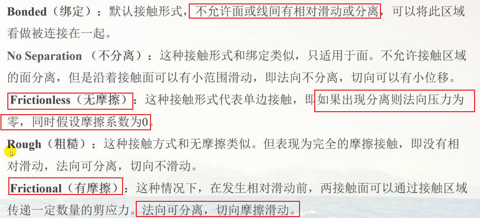
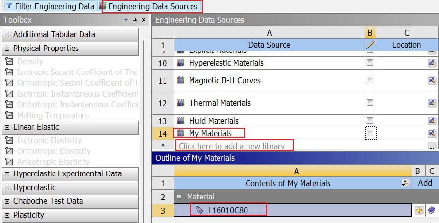

# WORKBENCH

> [知乎参考教程](https://zhuanlan.zhihu.com/p/415082498?utm_medium=social&utm_oi=921694761339990016&utm_id=0)

## 0.DM建模操作

**初始设置**

**Imprint Faces(映射面)**

**1.画线**

**2.设置映射面！！！**

## 1.简介

### 1.1发展历史启发

ANSYS WORKBENCH 界面从 12.0 开始已经经历了 7 年时间，12.0 以后为小范围的改进。

**有限单元法(不适合初学者)**

- 数学问题
- 算法研究
- 变分原理，加权余量法

**有限元分析(工程师)**

- 工程问题
- 工程问题验证
- 以各种力学物理学为基础

### 1.2软件初始设置

**文件保存位置的更改**

**默认单位的变更**

## 2.分析的基本流程

- 分析类型选择

- 材料加载
- 约束，加载及接触

**展示结果的技巧**

1. 切换为原始的比例
2. 将红色区域的下限值设置为材料极限的极限值

## 3.L型支架分析

### 3.1直角弯折

**应力奇异**：采用不同的网格划分尺寸，计算出的值存在较大差别。

网格密度和应力最大值的问题：

### 3.2圆角弯折

**使用自带的三维建模界面-DM**

网格无关性的判定准则

**网格精度定性判定指标**：默认显示区域存在部分连续位置完整覆盖**两排单元格**，则精度得到保证

### 3.3应力奇异和位移对比

**应力奇异-(刚性约束和尖端处)**

应力奇异：随着网格的不断加密，应力值不断增加，应力值覆盖的单元格范围也不满足精度要求；

受力体由于几何关系，在求解应力函数的时候出现的应力无穷大。(有限元分析无法计算尖角处的问题，即**该处计算的值是无效的**)

根据弹性理论，尖角处应力无穷大，但是由于离散误差，有限元分析不会得出无穷大的结果，而是随着网格的细化，尖角处的应力值不断增加。

**应力奇异是数学算法问题，应力奇异一般出现在刚性约束和尖角处，可认为应力奇异是应力集中的极端情况。**

产生应力梯度的方向的必然产生应力集中。

**关键点**

- 多数的应力奇异点都在非非危险的部位
- 对于 L 型支架，应力奇异点在容易断裂的地方，此时需要更改设计的结构

**位移对比**

- 网格对变形结果的影响很小
- 划分的粗细对位移结果的影响较小

### 3.4总结

网格划分的精度对位移的影响很小，可优先对比位移的结果，如果出现大的偏差，则说明设置存在问题

在设置完全一致的情况下，应力的结果影响因素：

- 网格密度
- 应力奇异

## 4.单元的认识

在计算机算力逐渐强大的今天，使用四面体和六面体单元划分网格求解得到的精度值逐渐在缩小。

- 理论上来说，六面体的网格划分精度是由于四面体的，但是为了得到六面体单元，有时不得不对结构的一些部位进行简化，一定程度上也是牺牲了精度。
- 而四面体一般没有简化某些部位的情况，且易于自动划分，一定程度上弥补了同六面体的精度差距。

## 5.装配体分析

### 5.1分析思路

相比于零件设置，装配体包含接触的设置

默认生成的接触形式：Bond（绑定类型)

**接触的分类**

- 绑定接触 (bonded)：不允许面线之间有相对滑动或分离趋势，即看作被连接到一起。**如焊接**

- 无摩擦接触 (frictionless)：假定摩擦系数为 0
- 不分离接触 (no separartion)
- 粗糙接触 (rough)

### 5.2刚体平移的错误

**微小力的产生**

将荷载平均分配在每个节点上，实际计算机计算时会产生微小力造成不平衡。

**通过弱弹簧作用消除**

原则上可通过弱弹簧抵消微小力的作用，但一般会出现新手难以发现的问题。

- **弱弹簧设置**

- **弱弹簧查看**

### 5.3接触的基本设置

**常见的问题**：接触遗漏，整体模型存在不平衡。

**接触基础**

接触设置出现问题通常不是接触算法的原因造成的，一般是由于接触分析和接触设置错误导致的。

**应力显示设置**

### 5.4圣维南原理

分布弹性体上一小块面积或体积内的荷载所引起的物体中的应力，在稍远的地方，基本只同荷载的合力和和合力矩有关。

即如果作用在弹性体上一小块面积或体积内的荷载合力及合力矩都为 0，则在远离荷载作用区的应力几乎为 0.

**圣维南原理通过应力值判定，而非位移值判定！**

**四大强度理论**

- **塑性屈服强度理论**

- **脆性断裂理论**

**安全系数**

通过软件计算：`solution`=>`tool` => `stress tool`

或通过手动计算：计算得到的最大应力值 / 屈服强度值。

## 6.有限元分析方法

### 6.1间隙的设置

前 4 个一般可自动控制

- 接触算法
- 接触刚度
- 容差
- pinball 区域
- **接触的间隙**

**获取间隙的信息：** 在 solution information 页面下搜索 gap，查看 initial gap 的信息，单位为 mm。

**接触面见存在接触的情况**

设置为 gap 距离消除间隙

**关键-曲面接触间隙问题**

**求解错误后再次求解-需清空数据**

gap 小于一定的值，软件自动忽略，**一般设置为 0.01 以下**。

### 6.2间隙的自动控制

**经典版中为 close gap 选项**

默认关闭，打开后会影响计算精度-**推荐在网格精度划分合适的情况下进行**

 在 solution information 页面：auto contact offset used to close gap

### 6.3赫兹接触

> 推荐书籍

- 赫兹接触是经验公式

- 赫兹接触与有限元分析理论没有关联

- 只是可以用有限元分析中的有限元接触算法验证赫兹接触的准确性

## 7.均布荷载的简化

简化为均布荷载时的问题，如桌面上放置六面体块的分析简化过程：

正确的力简化应该分为四个角的集中力，而不是底面的均布荷载。

## 8.单元介绍

### 8.1 默认单元的更改

WB 的默认单元设置：

六面体精度 > 四面体精度(退化单元) > 五面体精度

**在 WB 中选择一阶或二阶单元**

同样在网格划分时设置：

**在 WB 中选择退化单元**

只需在网格划分时选择三角形即可

### 8.2 自由度的设置

**自由度的设置：**

### 8.3 约束的设置

### 8.4 远端位移和远端力

**新建材料库**

**远端位移约束**

以刚性的方式将所选的实体 (线，面) 连接到一个公共点，在该点上对 6 个自由度进行设置，**用于设置实体模型的旋转自由度。**

**远端力**

> [参考文章](http://www.360doc.com/content/21/0915/13/15913066_995586978.shtml)

## 9.APDL与Workbench交互

### 9.1WB文件系统

**首先打开文件显示：**

**dp0-重点文件夹**

**SYS文件**

### 9.2WB文件的传递

**打包-archive**

相比于直接保存传递，打包传递完整性更好

## 10.网格质量的评估

- 高宽比接近于 1 最好
- 雅克比率接近于 1
- 平行偏差为 0 最好，评估四边形单元
- 最大角度，三角形-60°，四边形-90°
- 正交品质 (orthogonal quality)，0 最差，1 最好

## 11.螺栓预紧力的施加

> [ANSYS Workbench螺栓多载荷添加预紧力](https://zhuanlan.zhihu.com/p/634886935)

