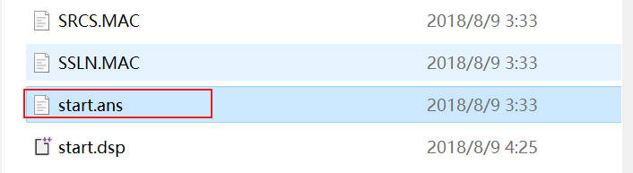

# ANSYS 工具条的使用

## 1.快捷截图按钮设置

### 1.1 功能简介

基于工具条设置按钮，在 ANSYS中可一键截图保存为 `.jpg` 图片：

核心宏文件为：

```text
! ViewCapturetoFile.mac
! 详细内容可见：王新敏《ANSYS工程结构数值分析》111页或官方帮助文档
! 多出采用缺省设置的命令可不必写出，这里仅作讲解使用
/show, jpeg, 0
jpeg, qual, 80  !图像质量比例参数，缺省为75
jpeg, orient, horiz !缺省设置，图像方向水平
jpeg, color, 2  !缺省设置，彩色输出
jpeg, tmod, 1   !文本控制方式，缺省为0
/gfile, 1200    !分辨率，缺省800
/cmap, _tempcmap_, cmp,, save
/rgb, index, 100, 100, 100, 0   !图片背景设置为白色
/rgb, index, 0, 0, 0, 15
/replot
/cmap, _tempcmap_, cmp
/delete, _tempcmap_, cmp
/show, close
/device, vector, 0  !缺省设置：关闭矢量显示方式，几何体实体填充
```

### 1.2 配置过程

**1.放置 `.mac` 宏文件**

将 `.mac` 文件的放置在本地电脑 ANSYS 安装的位置处：`...\ANSYS Inc\v192\ANSYS\apdl`

**2.设置按钮**

打开 `...\ANSYS Inc\v192\ANSYS\apdl` 目录下的 `start.ans`  文件，添加如下的命令：



```text
! 设置按钮名称为ViewCapture
*ABBR,ViewCapture,ViewCapturetoFile.mac
```


## 2.基于python的批量计算


