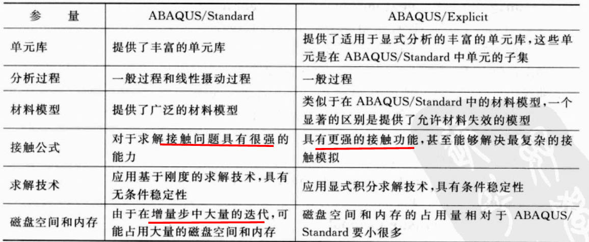
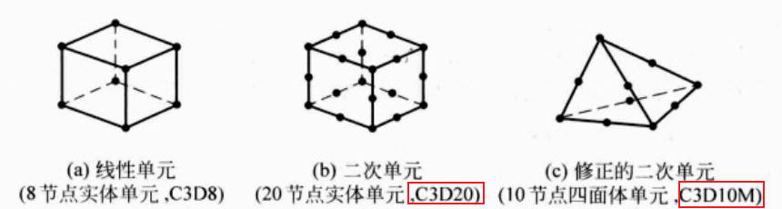
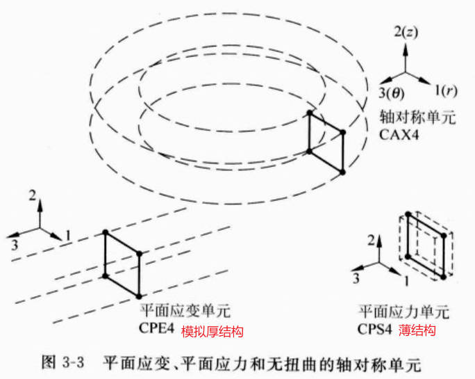
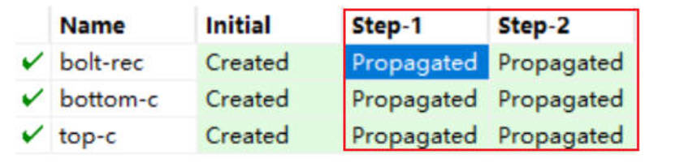
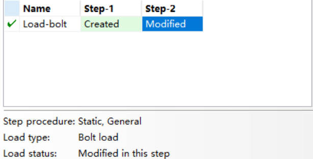

# ABAQUS_notes

## 1.绪论

对于非线性分析，用户仅需提供结构的几何形状，材料性能，边界条件，荷载工况等。

### 1.1 组成

ABAQUS/Standard

- 通用分析模块

- 内部附加 3 个特殊用途的模块：Aqua/Design/Foundation

ABAQUS/Explicit

- 具有专门用途的分析模块，显示动力学分析
- 对改变接触条件的高度非线性问题非常有效

ABAQUS/CAE (Complete ABAQUS Enviroment)

- ABAQUS 的交互式图形环境
- 结构几何形状建模，对几何体进行材料赋予，载荷和边界条件，分解以便于网格的划分

隐式求解：需要同时求解一套方程组或计算整体刚度矩阵

显式求解：从一个增量步推到下一个增量步

### 1.2 模块

**step**

分析步：应用 step 模块生成分析步骤

- 初始步 (initial step)：施加边界条件约束桁架的端点
- 分析步 (analysis step)：在桁架中心施加集中力

分类：一般分析步 (general analysis steps)：线性和非线性响应，在 Explicit 只能使用一般分析步；

线性摄动步 (linear perturbation steps)：**只能用来分析线性问题**；

实际并并步存在真正意义的集中荷载或点荷载，荷载总是施加在有限大小的区域上，如果被施加载荷的区域很小，将其处理为理想的集中荷载是合适的。

**mesh**

显示橙黄色：没有用户的帮助无法划分

**assembly**

 **非独立实体(Dependent instance)**：相当于原始部件的一个链接，和原始体共用几何体和网格，但不能单独划分网格。

**独立实体(Independent instance)**：为原始部件的几何模型的复制

### 1.3 显示隐式区别

Standard：必须迭代才能进行解答，尤其是对于一些接触和材料复杂的情况，可能需要大量迭代，此时使用则代价较大；

Explicit：通过前一步增量步显式地推动力学状态，无需迭代，节省内存和磁盘空间；

**网格加密的成本**

显式方法可直接预测网格细分带来的成本增加；隐式方法则十分困难；

**积分单元**

Standard：提供完全积分单元或缩减积分单元(R)；

Explicit：除了修正的四面体单元和三角形单元外，只提供缩减积分单元；

## 2.有限单元和刚体

### 2.1 有限单元

C：Continuum，连续体/实体单元

S：shell，壳体单元

AX：轴对称单元

PE：平面应变单元，plain strain

PS：平面应力单元，plain stress

R：缩减积分单元

H：杂交公式单元

B31：一阶三维梁单元，中间标识插值的阶数 3

B32：二阶三维梁单元 

C3D8：实体单元-3D-8节点，线性单元

C3D4：常应变四面体单元，为得到精确解答一般需要划分非常细的网格

**单元的表征**

- 单元族，实体单元(C)，壳单元(S)，梁单元(B)，桁架单元(T)，刚性体单元 (rigid body)等
- 自由度
- 节点数
- 数学描述，一般基于拉格朗日或材料描述，材料和单元保持关联，且材料不能从单元中流出或越过单元的边界；欧拉或空间描述则单元在空间固定，材料可流动，通常应用于流体力学模拟。
- 积分，大部分单元运用高斯积分来计算每个单元内每个积分点处的材料响应；对于一些实体单元，则可以选择完全积分或缩减积分(R)

CAX类单元可以模拟 360 度的环状结构

### 2.2 积分单元

完全积分单元

## 3.接触

### 3.1 接触间相互作用

默认的模型是无粘结的无摩擦类型

接触间的法向作用

切向作用：接触面间的相对运动和可能存在的摩擦剪应力

刚度大，网格粗的作为主面；

### 3.2 过盈量和预紧力设置

在1，2 分析步处分别设置过盈量 (否则 Interference fit 显示的灰色按钮，无法点击)：

**边界和预紧力设置**

- 边界设置在初始分析步

- 螺栓荷载分两步施加

  step1 施加小荷载，1000

  steps 施加最终荷载，10000

## 4.实体单元

非协调模式单元可以降低成本获得较高精度，但注意单元的扭曲变形不能过大。

考虑应用缩减积分的二次单元，其对网格扭曲不敏感。

材料不可压缩或接近不可压缩时，泊松比 > 0.475，采用杂交单元。

### 4.1 选择建议

- 尽可能减小网格的扭曲
- 三维问题最好采用 6 面体单元，可在成本较低的情况下得到最好的结果
- 一些自由划分网格算法，采用 4 面体单元划分；对于小位移无接触问题，二次四面体 (C3D10) 可得到较合理的结果；修正的 C3D10M 单元可以应对大变形和接触问题，但是 4 面体单元分析时间长于等效 6 面体单元
- 除非使用了大量单元，否则使用线性低阶单元的结果不精确，如 C3D4

## 5.弹塑性分析

> ABAQUS有限元分析实例详解 (石亦平, 周玉蓉)-chapter06

尽量不施加点荷载，因为荷载造成大的局部应变，可能导致弹塑性中的不收敛问题；

设定的最大真实应力和塑性应变应大于模型可能出现的应力应变值；

必须施加点荷载的，建议使用耦合约束为荷载作用点附近的几个节点建立刚性连接，这些节点共同承担荷载；

C3D20 容易产生体积自锁，C3D20R 需划分足够密的网格避免体积自锁；

建议使用的单元：

- C3D8I
- C3D8R
- C3D10M

**塑性应变**

- PEEQ: 等效塑性应变，塑性应变的累计
- PEMAG: 塑性应变量，某一时刻的塑性应变，与加载历史无关

如一个单向拉伸的体，发生塑性应变，而后通过单向压缩恢复其初始长度，则此时 PEMAG 为 0；二 PEEQ 则是过程中塑性应变的累积；

