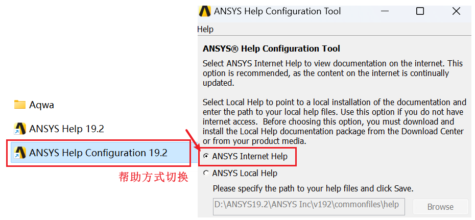
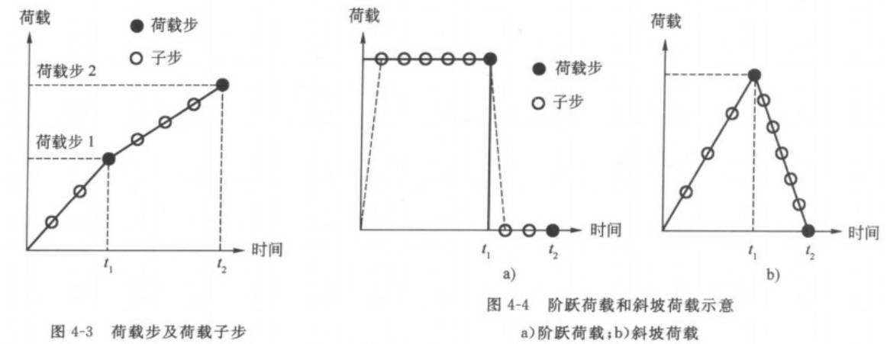
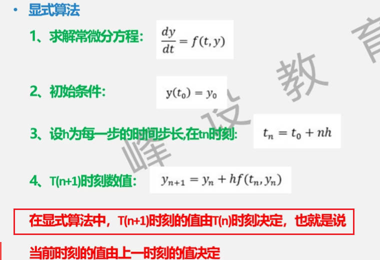
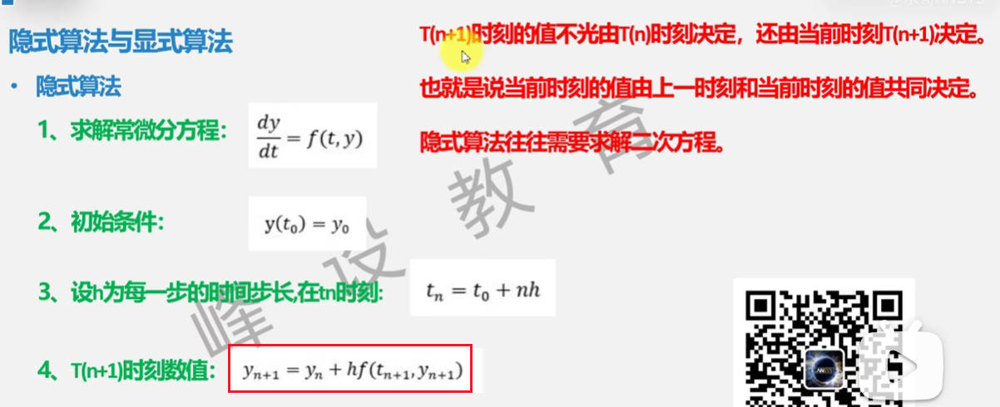
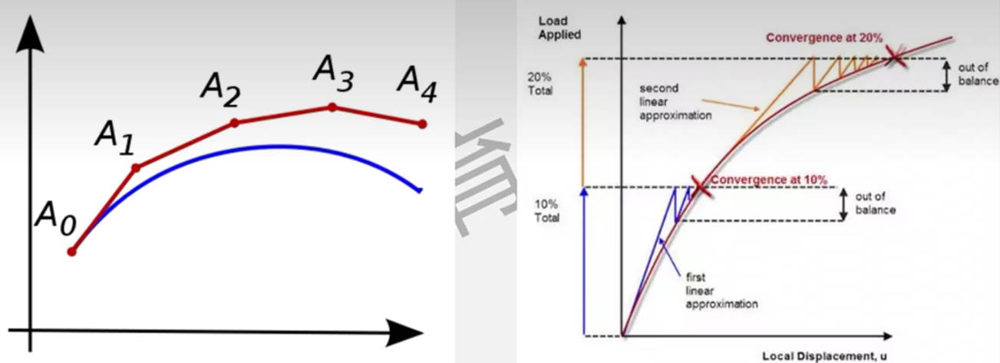
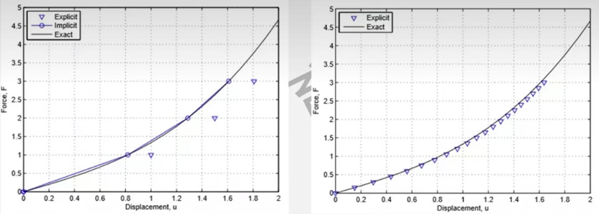
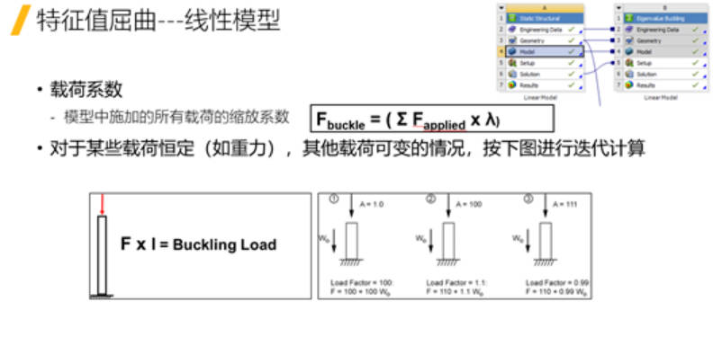
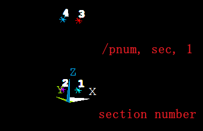
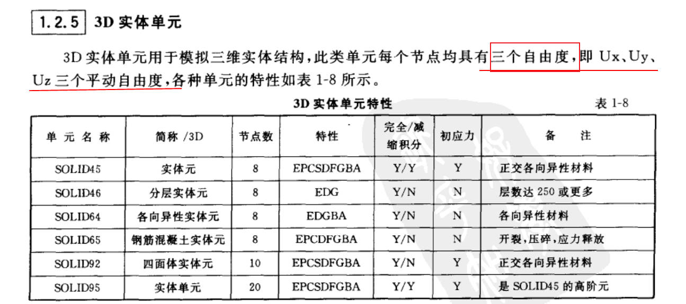
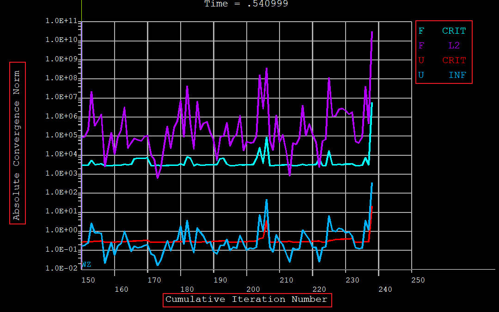

# ANSYS

## 资源导航

- [康奈尔大学免费ANSYS培训课程](http://www.1cae.com/a/ansys/50/ansys-training-7360.htm)；
- [仿真秀-王新敏](https://www.fangzhenxiu.com/expert/pro_204400-hipost/)；


## 基础：有限元理论

> [ANSYS Workbench结构工程高级应用](https://book.douban.com/subject/27017989/)

### 1. 有限单元法

> Finite Element Method, FEM

将连续介质看作由**有限个节点连接**起来的**有限个单元**组成，然后对每个单元通过取定的插值函数将其**内部每一个节点的位移用单元节点位移表示**，然后根据连续介质整体的协调关系建立包含节点未知量的方程，最后通过计算机求解；

- 有限个节点连接的有限个单元；
- 内部节点的位移用单元位移表示；
- 根据连续性的协调关系求解节点未知量；
- 为了获得较为精确的解，需要校验网格的无关性；

**有限数量的节点位移表示每个单元的应力应变关系，而后形成单元矩阵求解；**


### 2. 有限元分析的实现

节点位移建立位移函数，该位移函数使用多项式进行拟合，表示单元中任意一点的位移。

**节点位移组成位移函数，可表示单元内任意一点位移**

位移函数 $u$ $\longrightarrow$ 求导得到应变函数$\epsilon$ $\longrightarrow$ 乘以弹性模量E得到应力函数 $\sigma$$\longrightarrow$ 单元刚度方程 $F=KX$ 

$k_e \delta_e=F_e+F^e_E$

最后通过整体分析得到全部的结点位移，进而计算应力和内力。

**流程简介**

1. 原始数据的输入和形成：几何物理参数、边界条件、单元种类和数量、网格划分等；
2. 单元刚度矩阵的形成；
3. 总刚度矩阵的形成；
4. 方程组的求解；
5. 结果后处理，利用位移推导出应力结果，采用单元平均应力法或节点平均应力法；

**约束要素**

- 约束的类型(那几个自由度)；
- 约束的方向(坐标系)；
- 约束的位置；
- 约束的区域

**有限元计算误差**

- 数值求解过程中发生的舍入误差；
- **网格剖分引起的离散误差；**
- **单元数越多，离散误差越小，当然计算规模越大，舍入误差累计的就越多；**


### 3. 节点解和单元解

> [节点解和单元解](https://mp.weixin.qq.com/s?__biz=MzA4NzI1NjE0Nw==&mid=2649752039&idx=1&sn=e3fa5ceeada403d46c6821a5d0cef1e3&chksm=88389cdbbf4f15cd1659d2b1d8f79e34f3d8a5e20519ea8619f2ece134853fa3cdc466c0ff8f&scene=27) | [节点单元解](https://fscae.com/869/)

**1.用高斯积分点代表单元的解**

有限元在求解结构问题时，最先得到的是**各个节点的位移**，再通过弹性力学方程得到**单元的应力和应变**，得到的**单元应力应变实际上是一个函数**，这个函数能够描述单元内所有位置处的应力场。但这样没法在软件中显示结果，因此单元解需要确定一些积分点（高斯点），用这些积分点的解代表单元解。


**2.单元解是积分点的解(精度高)，节点解是外推后平均的解**

**积分点通常和单元的节点位置不重合**，实际的单元节点解答需将积分点的解根据某种规则外推，以一种近似的方法得到单元节点的解。由于每个单元外推得到的单元节点解并不完全一致，因此，最初外推得到的单元的节点解不连续，为了让其连续，将不同单元之间的节点外推得到的节点解进行算术平均，这样在连续节点处的节点解仅有一个数值，这样便得到实际在软件中显示的节点解。

- 有限元分析通常以位移作为基本未知量，因此后处理首先应当检查变形结果；
- 区分单元的应力解答和节点的应力解答，未平均的应力解答和平均的应力解答，应力集中和应力奇异；
- 变形（结构的刚度），支反力（结构的传力路线），应力（结构的强度）；

```text
! eresx, no   !不从积分点外推
```


**3.有限元结果中位移，应力，应变的来源和精确度**

- **流程：得到节点位移 > 得到单元积分点的应力应变 > 外推得到节点应力应变**
- 在位移方面，节点位移是有限元求解最为准确的；

- 在应力应变方面，积分点的值最为准确(一般为高斯积分点，在相同积分点的情况下达到最大精度)；
- 默认情况下，ANSYS 采用积分点外推得到节点解，精度低于积分点处的解；

- **关闭积分点外推，节点解(应力，应变)就是积分点的解(应力，应变)**；


### 4. 线性方程组的解法

> 有限元法基础-张雄，P32

有限元分析都要求解大型线性方程组 $K \alpha=R$，一般来说刚度矩阵 $K$ 是稀疏的，因为在有限元分析中，每个单元只于很少的几个节点相连，因此结构的总体刚度矩阵是高度稀疏的。

求解线性方程组的两大方法：

1. **直接法**，可是是事先估算出求解方程组所需的运算次数，适用于中等规模($10^5$ 自由度)以下的问题；
2. **迭代法**，运算次数取决于假定的初始解向量对解的精度要求，适用于大型问题，**在并行计算上具有理想的可扩展性，即随着 CPU 数量的增加，CPU 时间成比例地减少**；

## 术语说明

### 1. 等效塑性应变

> [Plastic Equivalent Strain, PEEQ](https://www.jishulink.com/post/178504)

**表征材料在复杂应力状态下累计塑性变形程度的标量参数**

当材料受到多轴加载而非单纯的单轴拉伸或压缩时，各向异性地存在多个塑性应变分量。等效塑性应变则是通过某一准则（如von Mises应力准则或Tresca准则）**将这些塑性应变分量转化为一个统一的数值**，以便于理解和比较不同加载条件下的材料塑性行为。

例如，在von Mises准则下，等效塑性应变是基于剪切应变能密度理论，**将三个主塑性应变按照相同的方式组合，以模拟材料的塑性流动**。当PEEQ 大于零时，说明材料已经进入了塑性阶段；当PEEQ达到一定程度时，可能会预示着材料接近或达到其破坏状态，特别是在金属成形、焊接、疲劳分析等场合，监控 PEEQ 变化有助于判断材料的安全性以及工艺过程的有效性。

等效应变（Effective Strain）可以帮助工程师在复杂的应力状态下评估材料的整体塑性变形和损伤演化。

### 2. 塑性应变量

> Plastic Strain Magnitude,PEMAG

这个术语在有限元分析软件如 ABAQUS 中用来表示某一时刻或某一位置处材料的塑性应变大小，即塑性应变量。它不同于等效塑性应变 PEEQ，**PEMAG 描述的是瞬时的塑性应变状态，只关注当前加载步骤或瞬间的塑性应变值，而不考虑之前加载历程中塑性应变的累积效应。**

在工程应用中，PEMAG可以帮助工程师了解结构或材料在受力过程中局部区域是否出现塑性变形以及塑性变形的程度如何。


## 0. 设置

### 1. 工具条

- 文件位置：`D:\ANSYS19.2\ANSYS Inc\v192\ANSYS\apdl`


[水哥工具条说明](https://mp.weixin.qq.com/s?__biz=MzIzNTQ4OTE2Nw==&mid=2247486595&idx=1&sn=172fbd25bb53993a5d2fd1a78aea7818&chksm=e8e71e63df9097758c1cfef186e8e9743e415db8dd2ed2a0ed701875fe727ad6ad25c4ebbbc3&scene=21#wechat_redirect)

将文件中对应命令的注释取消即可。

- 打开 Mechanical APDL Product Launcher，点击 Customization/Preferences，**勾选 Read START.ANS file at start-up**，即打开自定义的工具条。


**对于工具条中的宏文件设置**

- 由于默认的搜索路径设置，需将宏文件放置在和启动文件一样的文件位置，即 `D:\ANSYS19.2\ANSYS Inc\v192\ANSYS\apdl`；
- 注意宏文件名称的命名，避免与软件已有的命令产生冲突；


### 2. 帮助文档

19.2 支持在线帮助文档，从软件直接跳转无需注册登录：[ANSYS HELP](https://ansyshelp.ansys.com/account/secured?returnurl=/Views/Secured/main_page.html?v=192)

帮助切换方式：




### 3. APDL 语法

注意乘号 (*) 前不能有空格，在官方文档：`Ansys_Parametric_Design_Language_Guide3.7` 中规定


### 4. 变量名命名

- 长度不超过 32 字符


### 5. h 和 p 方法

一种是加密网格（h单元方法），另一种是提升网格的阶次(p单元)

- p 方法和保持有限元的剖分网格固定不变，增加各单元基底函数的阶次


### 6. vglue和vovlap

**搭接运算**

`vovlap,nv1~nv9`：限于同等级元素，体搭接要求相交部分与母体同级

**粘贴**

`vglue,nv1~nv9`：应用更为广泛，与切割命令对应


### 7. 文件类型解读


- `save,Fname,Ext,Dir`；`resume,Fname,Ext,Dir`

- `.log`：每次操作的命令；
- `.dbb`：`.db` 文件的上一步操作，相当于备份文件；
- `.db` ：包含实体模型和有限元模型，`save` 命令，保存生成该文件；
- `cdb` ：文件只包含有限元模型；
- 日志文件 `.log` 和错误文件 `.err` 采用追加的方式；

### 8. 图形控制命令

`/windows,wn,xmin,xmax,ymin,ymax,ncopy`

- 窗口编号 (1-5)，可为 `all`
- `xmin,xmax,ymin,ymax`：窗口大小设置，`x` 范围为 (-1~1.67)，`y`范围为 (-1~1)
- `xmin`: off，on，full (全屏窗口)，left，right，top，bot 则半屏显示窗口；ltop，lbot，rtop，rbot则为 1/4 屏幕窗口；squa 则为当前图形区域形成最大的正方形窗口；**dele 删除窗口**

### 9. 核心数设置

> [解决ANSYS运行内存不够的问题](https://www.fangzhenxiu.com/post/6243161/ )

```shell
! 解决内存运行不足
! 默认文件分割尺寸，1单位表示1MB
/config, fsplit, 256  

! nbuf:求解器每个文件的缓存数量，默认4，范围1-32
/config, nbuf, 9
```

**Launcher 设置**

- 取消系统的虚拟内存设置，ANSYS有自己的虚拟内存系统；
- 勾选 `Use custom memory settings` 
  - `Database` 数据库文件，包含运行所需的数据，由于是用来存储实体模型、网格和结果文件的，相当于把 `*.db` 文件放在内存里，用来加速运算；
  - `Total Workspace`：理解为总的内存空间，`Total Workspace` 内存 = `Database`  内存 + 计算过程所需内存；


- 设置 CPU 核心数量
  - SMP，Shared-Memory parallel， 超过2个处理器(核)后，需要使用 HPC，一个HPC licenses (High Performance computing) 支持两个处理器(核)；
  - MPP，Distributed computing；
  - Mechanical Enterprise 许可证默认可使用 4 核并行计算；


- 求解器设置：大规模计算建议采用PCG求解器，且还支持分布式计算(多核心)；


### 10. 求解器类型

> [ANSYS 求解器类型上](https://www.fangzhenxiu.com/post/810771/) | [ANSYS 求解器类型下](https://www.fangzhenxiu.com/post/2266702/)

`eqslv, -1`：程序自动选择求解器

- 波前法(FRONT DIRECT SLOVER)
- 稀疏矩阵法(SPARSE DIRECT SOLVER)
- 预共轭梯度法(PCG SOLVER)


使用超过 4 个处理器，共享内存和分布式内存求解器都需要 HPC 许可证；

**SMP 模式**

> Shared-Memory parallel

-  共享内存，适用于单机多核并行；
- 物理内存连续，所有处理器共用一个物理内存；
- 默认使用 4 核，不需要 HPC；
- 一个 HPC licenses 可以支持两个处理器(核)；


**DMP 模式**

> Distributed-Memory parallel

- 分布式并行计算，单机多核或多机多核并行(本机或联机)；
- 计算时间方面，MPP 的计算时间更短；
- 多机联机时需要MPI 软件 (message passing interface)；


**0.直接求解和间接迭代求解**

直接求解法可获得非常精确的解向量，间接迭代法主要依赖于用户指定的收敛准则，因此放松默认公差将对精度产生重要影响，尤其对导出量的精度。

对于接近病态的刚度阵，不要使用迭代求解器，例如PCG等。它们会需要更多的迭代次数，并有可能不收敛。可以使用直接法求解器，例如稀疏求解器等。这些求解器可以有效求解病态问题。


**1.稀疏阵直接解法求解器(SPAR)**

- 稀疏矩阵法是性能很强大的算法，一般默认为稀疏矩阵法（除了子结构计算默认波前法外），即sparse direct solver；

```fortran
! 核内求解设置
! 默认采用 incore求解，物理内存不够的再采用outcore求解
bcsoption,, incore
bcsoption,, force, 4    ! 指定内存大小4GB
```

- 稀疏矩阵直接解法采用直接消元法而不是进行迭代求解；
- 其可以支持实矩阵与复矩阵、对称与非对称矩阵、拉格朗日乘子；

- 需要存储分解后的矩阵因此对于内存要求较高；
- 其具有一定的并行性，可以利用到4-8个CPU；
- 求解方式：核内求解，最优核外求解，最小核外求解，推荐使用核内求解，基本不需要磁盘的输入与输出；


**2.雅可比共轭梯度法求解器(JCG)**

```fortran
! value为求解精度控制选项，默认为1e-5
EQSLV,JCG,value
```

- 从单元矩阵公式出发，适合于包含**大型的稀疏矩阵三维标量场的分析**，如三维磁场分析；
- 适用于静态分析、完全法谐响应计算或全瞬态分析；


**3.预条件共轭梯度法求解器(PCG)**

```fortran
!其中：PCG-表示激活PCG求解器；Value1-求解精度，默认1e-5；Value2-PCG求解器乘子，默认是1。
EQSLV,PCG,Value1,Value2
! 计算临时数据是否保存再内存中
MSAVE, Value 
! Value1-求解难度系数(1-5),设置为5与与直接法相当,Value2-是否减少I/O读写选项,Value3-计算数据驻留模式
PCGOPT, Value1,, Value2, , , Value3
! 是否检查小主元，小主元主要是由于约束不足，因此如果出现小主元信息，一定要检查约束是否正确
PIVCHECK,Value
```

- `PCG` 解实体单元模型比 `JCG` 大约快4～10倍；
- 用 EMAT 文件，而不是 FULL 文件；
- `PCG` 所需内存约是 `JCG` 的两倍，因为保留了两个矩阵；
- 运算大模型时，`PCG` 总是比直接解法(`spar`)要快，对**大规模问题，建议采用PCG法**。此法比波前法计算速度要快10倍以上（前提是您的计算机内存较大）。对于**工程问题**，可将ANSYS缺省的**求解精度从 1E-8 改为 1E-4或 1E-5 即可**；
- 适用于结构分析，具有对称、稀疏、有界和无界矩阵的单元有效，适用于静态或稳态分析和瞬态分析或子空间特征值分析；


**4.不完全乔列斯基共轭梯度法求解器(ICCG)**

```fortran
EQSLV,ICCG  !预共轭梯度求解器
```

- 与雅可比共轭梯度法在操作上相似，比雅可比共轭梯度法使用更复杂的先决条件，使用不完全乔勒斯基共轭梯度法需要大约两倍于雅可比共轭梯度法的内存；
- 适用于静态分析，全谐波分析（HROPE，FULL）或全瞬态分析；
- 速度快于直接解法；

**对于求解器，建议首选直接法，如果计算硬件不能满足要求，再选择PCG；其他两种共轭梯度求解速度相对PCG较慢**。

### 11. 单位统一


在 **mm-N-Mpa** 单位制下，**加速度变为 $9.8×10^3 mm/s^2$**


## 1. 非线性分析

**获得收敛，代价，精度，结果验证**

### 1.0 原理概述

> Altair 有限元仿真实践原理,chapter13 P216

判断求解的问题是否为非线性，最好的方法是**考察一个或多个关键荷载作用点的荷载-位移曲线响应**。

当结构的响应和荷载不是线性关系，则为非线性。

- 结构响应：变形，应力，应变；
- 荷载：力，压力，力矩，扭矩，温度；


### 1.1 基本过程

自重和集中荷载都保持恒定的方向，但是面荷载会随着单元方向的改变而改变，称为随动荷载。

1. **创建模型**：与线性静力分析类似

2. **设置求解控制参数**：线性静力分析中一般不需要设置求解控制参数，但非线性中的设置则十分重要。

   （1）分析类型和分析选项

   `antype`：设置分析类型，缺省为静态

   `nlgeom`：是否考虑大变形，缺省为 off

   （2）设置时间或时间步

   `nsubst`：设置初始子步数，最大子步，最小子步

   `autots`：自动时间步，缺省时由程序自动选择打开或关闭

   （3）设置输出控制

   `outres`：设置输出结果类型及其频度

   （4）设置求解器选项

   `eqslv,选择的求解器类型`，稀疏矩阵求解器 sparse

   （5）重启控制

   `rescontrol`

   （6）帮助收敛选项

   `lnsrch`：线性搜索，存在接触单元缺省打开

   `pred`：打开预测器，缺省时打开

   `neqit`：设置容许的最大平衡迭代次数，超过该次数则不收敛；缺省的设置次数是合理的

   `cnvtol`：设置收敛准则，一般来说不收敛与其关系不大

   （7）设置弧长法

   `arclen,on`：激活弧长法，对跳跃屈曲十分有效

   `arctrm`：对弧长求解什么时候终止进行控制

   （8）设置 NR 选项

   （9）激活应力刚化效应 `sstif`

   （10）其他控制参数的设置

3. **加载和求解**：注意变形前后荷载的方向，计算过程存在较多的平衡迭代，求解时间远大于线性静力分析；**叠加原理不成立**

4. **查看结果**：采用 /post1 查看某个时间点的所有结果，生成结果动画；/post26 查看随时间变化的曲线；

**收敛检查**

- 查看输出文件，使用 `/output` 命令写入到一个文件中，包含每个子步的收敛信息，通过荷载步，时间等查看是否收敛；
- 查看错误文件 `.err`  
- 查看监控文件 `.mntr`，检查收敛情况
- 在 /post1 中用 set, list 命令查看结果，不收敛的结果写入子步 999999 中

**网格检查**

- **单元等值线**，检查网格粗糙程度，中断或消失的等值线较多表示网格太粗糙
- **路径结果图为光滑曲线而非锯齿状曲线**

- 变形形状图，一般在求解时单元形状检查会打开


### 1.2 材料非线性

塑性、超弹性、蠕变、黏弹性；

**塑性理论**

**屈服准则**

- 规定材料开始塑性变形的应力状态，**是应力状态的单值度量；**
- 单向受拉试件可以简单比较轴向应力和材料屈服应力判断是否发生塑性应变；

- 对于一般的应力状态，是否达到屈服点需要通过屈服准则判定，与单轴测试的屈服应力相比较的应力状态；
- Kinematic Hardening(随动强化) 屈服准则包含：von Mises 屈服准则（各向同性）和 Hill 屈服准则（各向异性）；

**流动准则**

- **描述屈服时塑性应变的方向；**
- 定义塑性应变 $\epsilon_p$ 增量和应力 $\sigma$ 之间的关系；
- 缺省为关联流动法则（也称Mises 流动法则或法向流动法则），塑性流动方向和屈服面外法线方向相同；

**强化准则**

- 定义材料进入塑性变形后的后继屈服面的变化；**材料继续加载或卸载，再次进入屈服的状态**
- 理想的弹塑性材料无应力强化效应，后继屈服面和初始屈服面相同；
- 硬化材料包括等向强化、随动强化和混合强化准则；
  - 等向强化：材料进入塑性变形后，后继屈服面在各个方向均匀扩张，**其形状、中心、在应力空间的方位**保持不变；**硬化引起的拉伸屈服强度增加会导致压缩屈服强度同等增加**；—大应变、单调加载
  - 随动强化：后继屈服面在空间作刚体移动，形状、大小和方位均保持不变；**拉伸屈服强度增加导致压缩屈服强度减少—包辛格效应(Bauschinger)；**—小变形、循环加载


### 1.3 几何非线性

> ANSYS 工程结构与数值分析-P435 | [几何非线性总结](https://zhuanlan.zhihu.com/p/506782813)

- **几何变形引起结构刚度改变的一类问题属于几何非线性问题；**

- 结构的平衡方程必须在**未知变形后的位置上建立**；

- **线性计算**中，结构的刚度矩阵不变，不考虑结构变形后刚度矩阵的重建；

- 一般工程经验上，对于普通精度要求的问题，**变形超过5%或转角超过10°时**，建议打开大变形开关；


单元刚度矩阵（单元局部坐标系）$\rightarrow$ 单元刚度矩阵（总体坐标系）$\rightarrow$ 集成结构刚度矩阵

- 单元形状改变，单元刚度发生变化；

- 单元方向的改变，如大转动。单刚在向总体坐标系转换时发生变化；

- 较大的应变使得单元在某个面内具有较大的应力状态；**应力刚化效应，显著增加面外刚度；**

  激活的时候，应力刚度矩阵添加到结构刚度矩阵中；

大变形：包含大应变，大位移，应力刚化；


#### 1.大应变

> large-strain

包括：**单元形状改变，单元方向改变，应力刚化效应**导致的结构刚度变化，即包括大位移和应力刚化；

对数应变和真实应力用于支持大应变单元的大变形分析；


#### 2.大位移

> large deflections with small strain

也称**大转动或大挠度**，包括**单元方向改变（大转动），应力刚化效应**，假定为**小应变**；

工程应力和工程应变用于小变形分析或仅支持大位移单元的大变形分析；

**应力刚化**

stress stiffening，面内应力和面外横向刚度的耦合效应。


### 1.4 接触非线性

- 接触是一种高度非线性行为，求解的困难在于：刚度突变造成收敛困难；初接触区域未知；

- 大多数接触包含摩擦，而摩擦是非保守系统，因此需要小的**荷载步和精确的加载历史**；

- 接触表面不互相穿透，能够传递法向压力和切向摩擦力，不传递法向拉力。

求解难点：

- 刚度突变造成收敛困难
- 分析之初接触区域是未知的
- 较小的荷载步和精确的加载历史

实际接触体相互不穿透，因此需在两个面间建立**强制的接触协调关系**：

#### 1. 罚函数

用弹簧建立两个面的关系，以防止有限元分析时相互穿过；**弹簧的刚度称为罚函数，即接触刚度**；分开时，弹簧不起作用；面开始穿透时，弹簧才起作用。

而有限的穿透量才能产生接触力，因此该方法要求穿透量必须大于 0。但实际中物体不允许相互穿透，**故穿透量小的精度也更高，接触刚度也更大，更大的接触刚度会导致收敛困难**

#### 2. Lagrange 乘子法

增加附加自由度 (接触压力) 来满足不可穿透条件

#### 3. 增广 Lagrange 法

以上 2 者混合使用：

- 迭代开始，接触协调基于罚函数法
- 达到平衡检查穿透容差时，可增加接触压力，继续迭代

#### 4. 面面接触分析

1.**创建模型，划分网格**：对刚-柔模型，可仅对柔体接触面的部分分网

2.**识别接触对**：判断可能发生接触的区域，通过不同的实常数定义接触对

3.**指定接触面和目标面**：**不可穿透目标面(刚体)**

4.**定义刚性目标面**：3D-targe170

5.**定义柔性接触面并生成接触单元**：3D-conta173(4节点) 和 conta174(8节点)

6.**定义实常数、单元及其 keyopt**：控制接触行为

7.**刚性目标面的运动控制**

8.必要边界条件


### 1.5 接触分析概念

#### 0.接触单元实常数

```shell
r, nset, r1, r2, r3, r4, r5, r6	! nset 为组号
rmore, r7, r8, r9, r10, r11, r12 ! 超过6个后的定义
rmore, r13, r14, r15, r16, r17, r18 ! 每重复执行一次rmore，则增加6个值
```

**接触单元 CONTA174 实常数**

```shell
! 前 6 个参数
! r1:目标圆半径 r2:超单元厚度 fkn:法向接触刚度系数 ftoln:侵入容差 icont:初始闭合系数； pinb:pinball 区域
r, nset, r1, r2, fkn, ftoln, icont, pinb
! pmax:初始侵入上限 pmin:初始侵入下限 taumax:最大接触摩擦应力 fkop:接触分离刚度 fkt:切向刚度系数
rmore, pmax, pmin, taumax, cnof, fkop, fkt
```


#### 1. 接触对

接触面和目标面构成一个接触对，**不同的接触对必须通过不同的实常数组定义，即使实常数没有变化也要定义不同的组号，但一组实常数可对应多个面**


#### 2. 接触检测点

目标面和接触面**是否处于接触状态**，需通过接触点的状态才能确定，**接触检测点位置由单元 keyopt 定义**

接触检测点位于接触单元的积分点上，分为节点积分和**高斯积分（面面接触默认值）**

- 接触单元的积分点不能侵入目标面，**原则上目标面可以入侵接触面；**
- 节点本身作积分点：在受到均布压力时，节点等效力不具有代表性；
- 高斯积分点 (面面接触缺省) 比节点本身做积分点会产生更精确的结果；


#### 3. 侵入距离

侵入距离是指沿着接触面上积分点法向到目标面的距离，**具有唯一性**


采用 Lagrange 乘子法，需定义该算法容许的最大侵入——**侵入容差**

- 通过**比例系数 ftoln** 定义，一般＜1.0，通常＜0.2，缺省为 0.1；
- **容许侵入距离=下覆单元深度×比例系数 ftoln；**
- 侵入距离＞容许的侵入距离，求解不收敛；
- 容许的侵入距离太小，则迭代的次数太多或不收敛；


#### 4. 接触刚度

量纲：力/长度$^3$；基于力的接触模型量纲：力/长度

****

**观察求解曲线，如果迭代次数过多，可能接触刚度设置的过大；侵入量过大，接触刚度过小；**

****

**法向接触刚度**

- 使用实常数 FKN 定义，定义比例系数（一般在 0.01~10 之间，**缺省为 1.0**）;
- 对于弯曲为主的问题，比例系数（0.01-0.1）之间，负数代表绝对值;
- **接触刚度实常数 fkn 和侵入容差 ftoln**;

**切线接触刚度**

- 用实常数 FKT (个别单元使用 fks) 定义，**缺省为 MU×FKN（1.0）**;
- 正值 FKT 为比例系数，负值 FKT 为切线接触刚度的绝对值;

**确定接触刚度=试算+经验**

1. 开始取较低的值，较低导致的不收敛更容易解决
2. 前几个子步计算分析，直到最终荷载的一个比例
3. 检查每个子步中的侵入量和迭代次数
   - 收敛困难是由过大的侵入引起，则定义的 FKN 低或 FTOLN 过小
   - 收敛困难是由不平衡力和位移增量达收敛时需过多的迭代次数，则 FKN 值可能过大
4. 按需调整 **FKN** 或 **FTOLN** 的值

`Keyopt(10)`：控制法向和切向接触刚度修正

- `Keyopt(10)=0` 表示禁止已经闭合状态的单元接触刚度修正

- `Keyopt(10)=1` 表示允许已处于闭合状态单元的接触刚度可改变

- `Keyopt(10)=2` 表示对所有单元将在每个子步上由程序自动修正


#### 5. Pinball 运算

以接触单元积分点为中心的圆或球，**描述接触单元周围远或近场边界**

- 接触单元相对于目标面的运动和位置决定了接触单元的状态
- STAT=0 表示分离的远场接触；
- STAT=1 表示分离的近场接触；
- STAT=2 表示滑动接触；
- STAT=3 表示粘合接触；

**目标面进入 Pinball 区域后，接触单元被当作分离的近场接触**


实常数 PINB 定义 Pinball 区域的大小，**正值表示比例系数，负值表示绝对值**

- 缺省为半径 $P_r$ = 4 × 下覆单元深度(刚-柔) | 2 × 下覆单元深度(柔-柔)；
- 大变形关闭时 `nlgeom, 0`，半径 $P_r$ 变为原来的一半


**下覆单元深度 Depth** （Depth of the Underlying Elemnet)—计算多个参数的基值。

- 下覆单元为大块实体时，深度为实体单元厚度；
- 为壳或梁单元时，下覆单元深度为单元厚度的 4 倍；


#### 6. 接触方向

接触面的外法线方向与目标面的外法线方向互指

法线方向检查：`/psymb,esys,1` ，用显示坐标系进行检查

不指向对应面，则用 `esurf,, reve` 进行反转或采用 `enorm` 重新定义 单元方向


#### 7. KEYOPT


**通过接触面 KEYOPT(5) 设置闭合间隙调整**

- 接触面和目标面有**网格划分之后带来的间隙**
- 原来存在的**几何间隙**

- `keyopt=3`：螺栓和孔壁之间存在间隙，但是不考虑


**通过接触面 KEYOPT(12) 选择接触行为**

- `KEYOPT(12)=0` 标准接触模式，法向单向接触，接触分离时，法向压力=0
- `KEYOPT(12)=1` 理想粗糙接触模式，模拟无滑动，表面完全粗糙的接触摩擦问题，对应摩擦系数无限大，**忽略输入的摩擦系数 MU**

- `KEYOPT(12)=2` 不分离接触模式，一旦接触就连在一起，但容许相对滑动
- **`KEYOPT(12)=3` 绑定接触模式，一旦接触就绑定**
- `KEYOPT(12)=4`  不分离接触模式，在 Pinball 区域内一旦接触就沿着接触面的法线方向将接触和目标连在一起，且容许滑动
- `KEYOPT(12)=5` 绑定接触模式，在 Pinball 区域内一旦接触，则沿着接触面的法向和切向方向绑定在一起
- `KEYOPT(12)=6` 绑定接触，初始处于接触的接触积分点保持与目标面接触；初始处于分离的保持分离

**对于不分离或绑定接触**，用户需设置 FKOP 实常数（缺省为1）

- fkop 为正，接触分离刚度=fkop×接触闭合时施加的刚度
- fkop 为负，表示接触分离刚度的绝对值

在接触发生分离时，产生回拉力可能不足以阻止分离，为了减少分离，定义较大的 FKOP 值


#### 8. 初始接触的设置

> CNCHECK 查看接触对的初始状态

==在仅通过接触约束刚体运动时，必须保证在初始几何体中接触对是接触的，即所建立的模型是刚好接触的。==

即便建模时刚好接触，仍然有以下的原因：

- 刚体具有复杂的外形，很难确定第一个接触点**发生在何处**；
- 即使几何模型在初始时处于接触状态，但经过**网格划分也会产生小缝隙**；
- 目标面和接触面也可能发生过大的初始侵入，导致不收敛或接触面之间脱开接触关系；


**cnof VS icont**

cnof （contact surface offset）：把整个接触面移动 cnof 距离，use real constant CNOF to specify a contact surface offset；

icont（initial contact closure）：所有初始分离的接触点向目标面移动，Use the real constant ICONT to specify a small initial contact closure。**任何落在区域内的接触检测点会自动移动到目标面上**；建议使用十分小的 icont 值，避免发生不连续的现象；


**定义初始接触是建立接触分析模型的最重要的一步；调整初始接触条件的方法：**

- **实常数 CNOF(cnof) 定义接触面偏移**

  **正值 cnof 使接触面移向目标面，负值 conf 可使其分离**，通过 `keyopt(5)` 设置

  `keyopt(5)=1`：闭合间隙；

  `keyopt(5)=2`：减少初始侵入;

  `keyopt(5)=3`：闭合间隙或减少初始侵入;

  同时输入 cnof 和 pinb 须保证 pinb > cnof，**keyopt(5)>0，icont=0 (缺省为 0);**


- **采用实常数 ICONT 定义一个小的初始接触环**

  沿着**目标面**的调整环深度，任何落在调整环区域内的接触检测点被自动移动到目标面上；

  ICONT 无输入时，程序自动提供一个小值；

  深度 = 正值 ICONT × 下覆单元深度 | abs(负值 ICONT)；


- **采用实常数 PMIN 和 PMAX 定义初始容许的侵入范围**

  PMIN: 初始侵入下限，PMAX: 初始侵入上限，**通过平移实现**；

  初始侵入 < PMIN and 在 Pinball 区域内，自动调整**目标面**；


- **定义 KEYOPT(9) 调整初始侵入或间隙**

  


**真正的初始侵入：几何模型产生的侵入或间隙以及用户定义的接触面偏移产生的侵入或间隙**

- `keyopt(9)=0`，几何和接触面偏移产生的初始侵入;
- `keyopt(9)=1`，忽略初始侵入;

- `keyopt(9)=2`，施加渐变的初始侵入，conf+几何模型的偏移;


#### 9. 不对称和对称接触

不对称接触在模拟面-面接触最有效，即所有的接触单元在一个面上，而目标单元在另一个面上。

把一个面既定义为目标面有定义为接触面，而后生成两组接触对，即为对称接触，**主要为了减少侵入**

- 接触面和目标面区分不明显
- 二者网格都十分粗糙


#### 10. 生成目标单元和接触单元

**生成方法**

- **ESURF: 在既有面或单元上覆盖生成单元的命令；**
- EINTF: 生成两节点单元；
- 网格工具法: 利用分网工具生成
- 直接生成法
  - TSHAP 法: 生成刚性目标面；
  - 常规法: 先定义节点，在创建单元

**目标单元**

- 对柔性目标面：采用 `esurf` 沿着现有网格边界生成目标单元

- 对刚性目标面：直接法中的命令 `tshap`，可通过实常数 r1 和 r2 定义目标单元的形状

**接触单元**

一般采用命令 `eintf` 或 `esurf` 生成

### 1.6 故障检查

求解前设置：`nldiag, nrre, on`;

可以把非线性诊断信息写入文件，而后在 /post1 中显示结果：

- 可视化导致不收敛的 NR 迭代的残差信息；
- 开始化导致二分和旋转的单元；
- 对没有收敛的分析进行调整，而后重启；

求解后设置：在 /post1 中使用 plnsol, nrres,,, jobname.nr

- 解决方法是降低接触刚度；


## 2. 几何建模与属性设定

### 2.1 BISO和BKIN

> [ANSYS本构模型中的强化模型](https://fscae.com/5062/) | [非线性分析-弹塑性详解](https://zhuanlan.zhihu.com/p/547064151?utm_id=0&wd=&eqid=e5bdce4e00060c5900000006646ad96c)

- 由于比例极限和屈服点非常接近，有限元软件假设两者值相等；
- 真实应力：$\sigma_t=\sigma(1+\epsilon),\epsilon_t=\ln(1+\epsilon)$
- Von Mises 屈服准则，它是各向同性的屈服准则；对于各向异性的材料，常用 **Hill屈服准则** 等
- 强化准则：**等向强化（Isotropic Hardening）；随动强化(Kinematic Hardening)**
- 等效塑性是一个标量，显示的是塑性应变的绝对值，它总是显示为正值，从而导致等效总应变也总是为正


### 2.2 坐标系设定

> [ANSYS中的坐标系](https://mp.weixin.qq.com/s?src=11&timestamp=1716174952&ver=5271&signature=UTMZS0VcDBPXUeE41sMEddkY-v7meVKYj6Q6LJPcCpEOUWrF7amA-A7m15WtYpsJwd304uFtzjc3Vcoh0crLTf2FBoBRBEFKTEiZQhEBcZTm2d3qNQLEzgsA8r*R0cXA&new=1)

#### 工作平面坐标系

`csys,4`：以工作平面为坐标系，工作平面：一个无限大的二维平面；

`wprota,thxy,thyz,thzx`：绕 z 轴，x轴，y轴；如 `wprota,90`：将工作平面绕 z 轴旋转 90 度；

`cswpla, 101, 0` 以当前工作平面创建局部坐标系；


#### 单元坐标系

规定正交异性材料特性的方向，在复合材料中非常有用。

```fortran
LOCAL,11,0,,,,,,45 !建立局部坐标系
ESYS,11!依据局部坐标系建立单元坐标系
EMODIF,ALL,ESYS,11 !设置当前选择的单元的单元坐标系
```


#### 节点坐标系

默认的节点坐标系是笛卡尔坐标系，**节点力和节点边界条件(约束)的方向就是节点坐标系的方向；**

可通过 `/psymb, ndir, 1` 显示节点坐标系，**但是注意，只有在对默认状态的节点坐标系改动后，才会显示出节点坐标系的方向；**

`/post26` 中的结果以结果坐标系表达；

```fortran
! 实现圆周约束
csys, 1
nrota,all
```


#### 结果坐标系

`/post1` 模式下，在该坐标系下显示结数值。默认为笛卡尔坐标系，即默认的位移，应力和支座反力按照笛卡尔坐标系表达，要得到其他坐标系下的结果，需切换到作用的结果坐标系。

```fortran
rsys, 11
```


#### 显示坐标系

默认为 `dsys, 0`，设定不同的显示坐标系，可改变 `klist, nlist` 等显示的坐标值内容。

```fortran
dsys, 101
```


### 2.3 组装建模

写入命令：`cdwrite,all`

导入命令：`cdread`

会自动增加节点的编号

组装后定义接触和预紧单元，最后加载求解。

螺栓起到预紧和摩擦的作用，用六面体和圆柱体的意义不大

`*status,par`：获取设定参数的值

`resume,filename,db`：恢复对应的数据文件

**注意**

- **组合构件的接触单元设定一般是在构件完全导入后进行，否则编号会出现问题**
- 组合部件的局部坐标系设定在导入后会影响原先前面部分的坐标系，**即使在组合部件内部删除了也没用**
- 导入时，建议将每个单元各对应一个实常数和secID

注意复制过程中 `MAT, TYPE, REAL, ESYS, SECNUM` 的属性基于模式单元设置，而不是基于当前设置(upon the elements in the pattern and not upon the current specification settings)。

```fortran
! vgen, itime, nv1, nv2, ninc, dx, dy, zy, kinc, noelem, imove
! egen, itime, ninc, iel1, iel2, ieinc, minc, tinc, rinc, cinc, sinc, dx, dy, dz
```

- `minc` - material number 材料编号增量；
- `tinc` - type number 单元类型编号增量；
- `rinc` - real number 实常数编号增量；
- `cinc` - element coordinate system number 单元坐标系统编号增量；

**cdb 和 iges 的文件内容**


**分次导入组合件**

- sload 的效果无法移动复制；

- 摩擦设定可以移动，但无法复制，需要分词导入；

- 对于不同包含的不同图素，需要分别移动，导入时可以设定为一个组；

  ```fortran
  cmgrp, cmgrp_name, cm1_name, cm2_name, cm3_name, cm4_name, cm5_name, cm6_name, cm7_name, cm8_name
  vgen,...
  agen,...
  lgen,...
  ```


### 2.4 截面偏置

> [慎用梁截面偏置](https://www.fangzhenxiu.com/post/1891878/)

`secoffset` 可以调整梁的几何位置，用于偏心连接和变截面情况。

但要谨慎使用截面偏置，对于 BEAM189 单元：

- 默认情况，截面采用质心轴建模；
- 在节点上施加外荷载时，质心轴和荷载施加位置不共线时，则施加的轴力荷载将导致梁弯曲；
- 截面的质心和剪心不重合时，施加的剪切荷载导致扭转应变和力矩；
- 节点上有轴力或横向力等**与偏置方向不同的外荷载**时，使用截面偏置会导致不正确的结果；
- 若节点上不施加外力，只有内力在截面间传递，则偏置不影响；


## 3. 网格与单元

### 3.1 网格划分

**复制和移动（lgen,item=1为移动）**

Lgen,item(复制的数目加一)，NL1, NL2, NINC(间隔步),Dx,Dy,Dz,(复制移动的增量),kINC,NOELEM,IMOVE(是否移动0否，1是)，为0时，item>=2,否则item=1;

在NINC(默认为1)的步骤中，从模式从NL1到NL2(默认为NL1)生成行。如果NL1 = ALL，则忽略NL2和NINC，模式是所有选中的行[LSEL]。

**移动的坐标:** `Keypoint location increments in the active coordinate system (--, Dθ, DZ for cylindrical, --, Dθ, -- for spherical)`

```txt
! vgen,2,nv1,nv2,ninc,dx,dy,dz,kinc,默认0自动生成节点和单元,imove
! item=复制次数加1
! imove=0默认复制操作，=1,则表示移动操作
```

**单元形状控制**

`mshape,key,dimension`

- 0
  - 2D 四边形单元划分网格
  - 3D 六面体单元划分

- 1
  - 2D 三角形
  - 3D 四面体

**网格类型**

`mshape,0`：自由网格划分；1：映射网格划分


### 3.2 单元尺寸控制

**映射网格划分**

`desize,minl,minh,mxel,angl,angh,edgmn,edgmx,adjf,adjm`

- `minl`：使用低阶单元时最小的单元数(default=3)
- `minh`：使用高阶单元时最小的单元数(default=2)
- `angl`：使用低阶单元时最大跨角(15°)
- `angh`：使用高阶单元时最大跨角(28°)
- `edgmn`：最小单元边长
- `adjf`：自由网格划分时的纵横比，h 单元=1，p 单元=4
- `adjm`：映射网格划分时的纵横比，h 单元=4，p 单元=6

desize 也可以用于映射网格划分的控制，**但必须设置 smrtsize=off (缺省)**。

desize 设置的级别低于特定类型的划分命令：kesize, lesize, aesize, esize

**自由网格单元尺寸控制**

`smrtsize,  sizlvl, fac, expnd, trans, angl, angh, gratio, smhlc, smanc, mxitr, sprx`


- `fac`：网格尺寸的缩放因子
- `expnd`：网格扩展或收缩系数，如 `smrtsize,,, 2` 表示面的内部单元尺寸约是边界尺寸的 2 倍
- `trans`：网格过渡尺寸


### 3.3 单元尺寸定义的优先级

**`Desize` 定义的单元尺寸优先级（映射网格划分）：**

`lesize` > `kesize` > `esize` > `desize`

- `lesize` 的划分级别最高；
- 未使用 `lesize` 划分时，用 `kesize` 定义单元尺寸；
- 未使用 `lesize,kesize` 时，用 `esize` 定义尺寸；
- 上述都未使用，用 `desize` 定义单元尺寸；

**Smrtsize 定义单元尺寸（自由网格划分）**

`lesize` > `kesize` > `esize` > `smrtsize`；


### 3.4 单元属性设置

> ANSYS 工程结构与数值分析

`xATT` 命令族用于几何模型创建后赋予；

而对于直接创建的有限元模型

- 材料属性：`MAT, NMAT`；
- 实常数：`REAL, NSET`；
- 单元类型：`TYPE, ITYPE`；
- 坐标系：`ESYS, KCN`；


### 3.5 单元质量检查

> [网格质量评定标准](https://fscae.com/1577/) | [ANSYS_Mechanical_APDL_Theory_Reference](https://ansyshelp.ansys.com/account/secured?returnurl=/Views/Secured/corp/v241/en/ans_thry/thy_et7.html)

APDL 中查看单元质量：

- `Shpp` 命令；
- GUI 方式（推荐）；

1.改变评定指标的默认值


2.选择查看的评定指标


3.对检查结果进行汇总查看


**评定网格质量的参数**

默认参数设置，使用 `check` 命令检查网格质量，可在 `.err` 文件查看结果；

- APDL：1-5；
- WorkBench：1-8；

**1.纵横比**

> Aspect ratio

defa：warning-$20$，error-$10^6$；

单元形状接近等边三角形或正方形，最好值为 1；

**2.对边偏差角**

> Parallel Deviation

defa：

- 无中间节点时，warning-$70°$，error-$150°$；
- 有中间节点时，warning-$100°$，error-$170°$；

针对四边形而言，描述两个对边的夹角，取max(图示对**边向量之间的夹角**)；

形状越接近矩形越好，最好值为 0；


**3.单元最大内角**

> Maximum Corner Angle

defa：

- 三角形，warning-$165°$，error-$179.9°$；
- 无中间节点的四边形，warning-$155°$，error-$179.9°$；
- 有中间节点的四边形，warning-$165°$，error-$179.9°$；

检查单元的最大内角，最四边形 90 最好，三角形则 60 最好；

**4.雅可比系数**

> Jacobian Rotio

defa：

- 取样点为角点，warning-$30$，error-$1000$；
- 取样点为积分点，warning-$10$，error-$40$；

系数越大模拟结果越差，积分点采样适用于线性分析，最好值为 1；

**5.翘曲系数**

> Warping Factor

defa：

- 壳单元，warning-$1.0$，error-$5.0$，打开大变形且设置薄壳时，warning-$1.0$，error-$1.0$；
- **实体单元(brick)，warning-$0.2$，error-$0.4$；**

四边形壳单元(quadrilateral shell)，六面体单元(brick)，楔形体的四边形表面(wedge)，金字塔单元(pyramid)的表面，翘曲值最好为 0；


**6.网格质量评定系数**

> Element Quality

系数为 1 时，质量最好。系数为 0 时，质量最差；

具体分析时，一般不低于 0.7；

**7.偏斜系数**

> Skewness

判定网格形状是否接近理想状态；

值为 0，接近理想状态。值越接近 1 ，网格质量越不好；

对于平面问题，该系数不大于 0.5，对于 3D 问题，大部分网格需小于 0.5，非关心区域的网格可大于 0.5；

**8.正交质量系数**

> Orthogonal Quality

做流体时需要注意的点，最好值为 1，最差值为 0；


### 3.6 SOLID

**solid95**：3D 20节点结构实体单元，是 SOLID45 的高阶单元22，每个节点有 3 个自由度（沿节点坐标系的 x, y和 z 方向的平动位移）。

当为六面体且 `keyopt(11)=0` 时，有 14 个积分点。

- `keyopt(11)=0`：不采用缩减积分(缺省)；
- `keyopt(11)=1`：对六面体采用 2×2×2 个积分点的缩减积分；


### 3.7 BEAM

> [梁单元和实体单元的差异](https://www.fangzhenxiu.com/post/1864008/)

高版本的 ANYSY 推荐使用铁摩辛柯梁单元 `BEAM18x`，即考虑剪切变形，低版本的包含欧拉梁单元(如 2D 的`BEAM3`、3D 的 `BEAM4` 等)；

梁单元也被称为“线单元”，在不设置截面偏置的情况下，其节点连线代表梁截面的质心连线，也就是说边界推荐的荷载和约束是对**质心**施加的。

`BEAM189` 单元无论模拟细长梁还是模拟粗壮梁，结果都与弹性理论解一致，主要是铁摩辛柯梁理论考虑了剪切变形对挠度的影响。

**梁单元设置**

```txt
beam_scid_x =100							!截面ID
sectype, beam_scid_x, beam, csolid          !!定义截面类型，实心圆截面
secoffset, cent                             !!截面按形心对中(默认可省略)
secdata, midBoltBodyDiam/2, 12, 3           !!定义截面参数，默认环向划分8份，径向2份
slist										!列出设定的梁截面
```


### 3.8 MASS

**MASS21**

结构分析的唯一质量单元：

- 自由度 6 个 平动位移 + 转动位移；
- 通过一个节点定义，除非施加加速度、旋转或惯性释放，否则在静态分析中无效应；
- 质量汇总输出采用的是各坐标方向质量分量的平均值，如默认情况下，仅输入 MASS=m，则质量汇总输出中给出的是 m/3 的值；
- 质量没有方向，MASSX 和 MASSY 和 MASSZ 的区分只是技巧上的做法，**使得各个方向具有不同的惯性反应**；


**MASS71**

用于瞬态热分析，有一个自由度。


### 3.9 PRETS179

> [ANSYS结构院：ANSYS如何给螺栓施加预紧力](https://mp.weixin.qq.com/s?__biz=MzIzNTQ4OTE2Nw==&mid=2247486555&idx=1&sn=3e8ac910a645ac8acc8b0534c198300d&chksm=e8e71ebbdf9097ad845b6ecb295947f01bf53cdb5ef884c6535265a775ff79fb478c5d45aa24&scene=21#wechat_redirect)

仅有 1 个平动自由度 ux，表示预紧方向。单元仅承受拉伸荷载，预紧力的方向和面 A 有关。

`pmesh` 将已划分网格的结构切割成两部分，然后插入预紧单元生成与预紧荷载方向垂直的预紧截面。

**预紧力施加步骤：**

- 用 `psmesh` 命令创建预紧截面并划分网格**得到预紧力单元** `prets179`
- 使用 `sload` 命令对预紧单元**施加预应力**

```text
!选择预紧单元
esel,s,type,,2
elist
```

**`psmesh` 一些失效的问题：**

```text
 No pretension elements have been created.  Please make sure that your
 input satisfies the pretension section definition requirements.
```

注意：`pemesh` 的容差设置情况，自定义 `pstol` 参数为较小的值。

```fortran
! 将 pstol设置为 0.1 即可解决
psmesh, htempScid, sid_%htempScid%,, all,, temp_loc, y, pre_off,, 0.1
```


### 3.10 螺栓连接模型的简化方法

> [螺栓连接模型的简化方法](https://mp.weixin.qq.com/s/FD1uN4HJdJgOtJuUp6Zg6A)

采用同时承受轴向力、剪力和扭矩的一维梁单元模拟螺栓实体，如 BEAM189 单元；

连接和紧固作用，螺栓并不是分析的重点。


### 3.11 布尔操作失败

> 官方文档：Boolean Operation Fails | Degeneries | Discontinuities

**Degeneries **
参数退化

parametric degeneracies，使用命令显示退化位置：

```fortran
! 显示退化
aplot,,,, degen ! 显示退化单元
vplot,,,, degen ! 显示退化体

! 列出与退化有关的关键点
adgl, all
vdgl, all
```

拓扑退化

topological degeneracies，不能被绘制，因为在布尔操作之前是不存在的。

**Discontinuities**
在布尔操作之前，回沿着不连续的线切分实体。


## 4. 加载和求解

### 4.1 求解方法

**控制载荷加载法**由于收敛性问题，只能用于前屈曲，但是在应用了重启和稳定性控制后可以计算后屈曲。

**控制位移加载法**可以用于前屈曲和后屈曲，比控制载荷加载法更容易收敛，位移控制的缺点是只有在知道施加什么位移时才适用。

#### NR 方法

`nropt2,option,-,adptky`：默认值为 `auto`，`adaptdy`：缺省为自适应下降 `on`，只能在完全 `NR` 中采用

**控制在荷载步中怎样修改刚度矩阵以及修改频次**

- **完全 NR 法**：每进行一次平衡迭代旧修改一次刚度矩阵，切线刚度矩阵和正割刚度矩阵；
- **改进的 NR 法**：程序在每一个子步中都修正切线刚度，每个子步的平衡迭代中不修改。**计算速度快于完全 NR 法，不适用于大变形，不能采用自适应下降**；
- **初始刚度法**：速度比完全 NR 法还满，但是求解更加稳定；

#### 弧长法

弧长法适用性很强，收敛性和稳定性明显好于其他处理负刚度问题的方法，它既可以用于加工软化结构，也可以适用于加工硬化结构，在非线性程度较高的体系应优先考虑采用该方法。但是**该方法的计算量很大，对一般非线性问题，还是建议选择其他简单的方法。**

**激活弧长法**

`arclen,on,maxArc,minArc`

key: on 表示打开弧长法

maxArc: 弧长半径的最大乘数，缺省 25，弧长半径的上限=maxArc×弧长半径

minArc: 弧长半径的最小乘数，缺省为 1/1000，弧长半径的下限=minArc×弧长半径

弧长半径根据第 1 子步首次迭代的荷载/位移增量: (位移/荷载) / nsbstp(荷载子步数)

`nsubst，当前荷载步子步数(缺省为以前的设置或1),最大子步(缺省为以前或1),最小子步`

`nsubst,nsbstp,nsbmx,nsbmn,carry`

弧长半径与子步数有关，改变 nsbstp 可修改弧长半径。

**注意的问题**

- 弧长法通过球面圆弧获得平衡状态，通常较难在**某个固定的荷载处获得获得一个解，可通过 NR 方法确定。**
- 弧长法负值表示反向加载，以保持结构的稳定性，如跃越屈曲。

**弧长法终止控制**


### 4.2 荷载的施加

施加在实体模型上 (关键点，线，面，体等)

**优点**

- 独立于网格，不必因重新划分网格而加载
- 图形拾取加载

**缺点**

- 不能显示所有的实体模型荷载
- 网格划分使用的是当前坐标系，节点使用的笛卡尔整体坐标系

- 关键点荷载很难施加上去

施加有限元模型上 (节点，单元)

**优点**

- 直接在节点上

**缺点**

- 重新划分网格时需要重新施加

**荷载步设置**



非线性屈曲分析实际上是打开大变形开关的情况下进行的静力分析，一直进行到结构的极限载荷或最大载荷，才可以获得结果的载荷位移曲线。


### 4.3 显(隐)式求解

#### Euler 方法

$$
y_n’=f(x_{n},y_{n})\\
y_{n+1}=y_n+hf(x_{n},y_{n})
$$

 该公式为**显式方程**，是关于 $y_{n+1}$ 的直接计算公式，**用前一点的值和斜率增量来近似求该点的值**。

#### 隐式 Euler 方法

$$
y_{n+1}’=f(x_{n+1},y_{n+1})\\
y_{n+1}=y_n+hf(x_{n+1},y_{n+1})
$$

该公式为隐式方程，也称为后退 Euler 方法，一般采用迭代求解，**用显示欧拉方法提供初值，迭代的过程实质是逐步显示化。**


#### ANSYS 应用


**显式求解算法**

如**LS-DYNA模块**，基于动力学方程，当前时刻的位移只与前一时刻的速度和位移相关，亦可理解为，时间上固定，由上一时间步求解迭代下一步结果，计算所需周围计算信息仅空间上关联，求解过程中无需迭代；



**隐式求解算法**

基于虚功原理，一般需要进行迭代计算，亦可理解为，与周围计算信息在时间和空间上都是关联的，式中既有空间又有时间未知量，无法直接求解，需周围求解信息迭代求解。




**隐式算法VS显示算法**

> [隐式算法和显示算法](https://www.bilibili.com/video/BV13T411N76t/?spm_id_from=333.788&vd_source=412ee9f1892496b8506f8302ac9d1437)

**收敛性**

- **误差可能较大，可信度较低：**显示算法不存在收敛性问题，仅由上一时刻确定，时间步取得较大时，会逐渐偏离真实值。主要是定量性把握，用于高度非线性分析，观察结果的数量级，趋近范围等。
- **隐式算法是无条件收敛的**：在求解二次方程时，会通过牛顿法对每一步进行迭代收敛，直至收敛到指定的偏差。



**时间步长的依赖性**

- **显示算法严重依赖于计算步长：**要获得准确的结果，需要设置非常小的时间步。
- **隐式算法对时间步长要求不高：**隐式算法是绝对收敛的。



**计算效率**

- **显示动力学：**间接求得位移 x，要取得足够的精度，需取得很短的时间步长。**要求精度的前提下需很多时间步，但是每一步计算时间很短**
- **隐式动力学：**直接求得位移 x，不存在收敛性问题。但是动力学分析涉及到非线性(几何，材料等)，可能每一步都要进行刚度的求逆，**非常耗时，但步长可以取得很大。**

**使用范围**

- **显示算法：**作用时间短，非线性程度高的动力分析和准静态分析，**碰撞、爆炸、跌落、倒塌等**
- **隐式算法：**作用时间较长，非线性程度不高的动力学，静力学分析，**模态分析，地震时程分析等**


### 4.4 特征值屈曲分析

> [ANSYS 官方参考网址](https://mp.weixin.qq.com/s/0fnSLZEDLWkvB_Om4MflBw)
>
> [ANSYS 中国官方知乎专栏](https://zhuanlan.zhihu.com/p/601615175?utm_id=0)
>
> [WB 中屈曲分析的应用](https://zhuanlan.zhihu.com/p/517580869)

#### 术语

屈曲荷载系数：对应于某阶模态的特征值

屈曲模态形状

- 对于理想的无缺陷的杆件，F的临界值对应下图的分支点，对应于ANSYS Mechanical中的**特征值屈曲分析**。

- 实际结构中，由于存在制造，安装误差，或者材料局部有缺陷，并不能达到分支点失稳，而是在极限载荷位置即丧失稳定性，此时需要使用ANSYS Mechanical的**非线性屈曲分析**。


**特征值屈曲分析**

- 不区分整体失稳或局部失稳；
- 第一阶失稳模态是最容易发生的失稳形式，可能为整体或局部失稳；

ANSYS Mechanical特征值屈曲是一种形式的**线性扰动分析**，**上游的静力分析模型可以是线性的，也可以是非线性的。**在分析之前须进行静态结构分析，**即预应力分析(可以是线性模型或非线性模型)**

在ANSYS求解时，该过程分两个阶段，第一阶段使用重启动技术求解静力分析的切向刚度矩阵；第二阶段，生成应力刚度矩阵，更新节点坐标，求解特征值。

**1.预应力分析为线性模型**

**所求得的载荷系数为模型中静力分析模块所有载荷同比例放大**，放大后得到的值即为所要求解的分支点载荷。

若模型中有恒定载荷，其他载荷可变，需要迭代计算，使得在特征值屈曲分析中求解的载荷系数接近1，此时在分析中所加的载荷就是分支点载荷。



**2.预应力分析为非线性模型**

当特征值屈曲分析的上游分析为非线性模型（接触非线性，材料非线性，状态非线性）时，**分支点载荷为静力分析所施加载荷F(restart)与屈曲分析施加载荷乘以求得的放大系数(λi · F(perturb))之和。**


#### 负特征值说明

> [负特征值解读](https://www.fangzhenxiu.com/post/1857048/)

- 负屈曲模态通常比较容易理解，即在荷载反向时会发生相同的屈曲模态；

- 虽通过设置扩展参数不予显示，但一般不必如此，取特征值的绝对值即可；

- 对于确实难以理解或很诡异的负屈曲模态，可以通过改变荷载的施加方式或非线性屈曲分析（全过程分析）进一步探究；


#### 恒活载屈曲分析

> ANSYS 工程结构与数值分析 7.3.5 P422


#### Altair 有限元仿真实践原理

> 屈曲分析原理

线性屈曲分析确定屈曲荷载因子 $\lambda$ 和临界屈曲荷载。线性变形分析提供了预期的变形形状信息，圆柱的强度因材料分配而增加以提高惯性矩，一般来说通过将材料分布到远离中心轴的横截面可以在保证材料厚度的同时不发发生局部屈曲，同面积条件下，圆柱管截面由于实心截面。

**分析过程**

- 在第一个荷载步中，施加参考水平荷载 $F_{ref}$，进行标准的**线性静态分析**获得几何刚度矩阵 $K_G$ 的应力；
- 第二个荷载步，求解 $(K-\lambda K_G)x=0$ 的特征值问题；
- 屈曲分析中所得到的位移结果可将屈曲模态的振型描述出来；

特征值屈曲分析的一阶失稳就是欧拉公式计算的临界荷载，特征值屈曲分析是一种线性分析，只是继承一个非线性的工况下的刚度。


### 4.5 引入初始缺陷

#### 初弯曲

```txt
/prep7
!UPGEOM, FACTOR, LSTEP, SBSTEP, Fname, Ext, --
upgeom, 0.05, 1, 5, file, rst	!读取前面分析的 file.rst 中的第五阶模态，缩放0.05
```

**比例因子的选取**

L/1500（且不大于5）÷某阶特征值屈曲最大位移量就是我们需要得比例因子。因为很多时候各阶特征值屈曲最大位移≈1mm，所以很多地方也直接取比例因子=L/1500（且不大于5），您在一些书上看到的实例中，超过7.5米管件比例因子取5就是这么来的。

不同的初始缺陷比例因子，计算结果也是不同的。初始缺陷比例因子越小，越不容易收敛，载荷达到屈曲极限附近的变化约激烈（圆角小）；初始缺陷比例因子越大，越容易收敛，载荷达到屈曲极限附近的变化越缓慢（圆角大）

**初始缺陷的引入**

- 考虑初弯曲和残余应力的影响；
- 计算屈曲特征值，提取第一阶屈曲模态和特征值屈曲；
- 而后进行非线性分析，需在第一个荷载步中施加；
- 使用 `upgeom, initFactor, 1, 1, filename, rst` 来施加初弯曲；

#### 残余应力

> [参考文章](https://zhuanlan.zhihu.com/p/39789134)-residual stress


**预期效果图：**


**Try-01:使用在顶部施加梯度均布荷载(失败)**


**原因：**施加的是梯度均布荷载，必然在不同的节点产生不同的应力，产生的变形也不同。

**Success-01:使用centrx(elemNumber)获取实体单元的中心点**

1. 实体建模，使用 `centrx(i)+*vwrite` 编写初应力文件 `.ist；`；

   ```text
   !核心代码
   !y向
   *if, y, ge, mainThick, then
       *if, y, le, midLen, then
           rz = -iniFactor*mainFy+slope1*(y-0)
       *else
           rz = iniFactor*mainFy+slope2*(y-midLen)
       *endif
   ! x向
   *else    
       *if, x, le, midLen, then
           rz = -iniFactor*mainFy+slope1*(x-0)
       *else
           rz = iniFactor*mainFy+slope2*(x-midLen)
       *endif
   *endif
   ```

2. 施加全约束，读入残余应力文件；

   `isfile, read, file_95, ist,, 2`，2 表示施加在对应实体单元的积分点上；

3. 计算得到支反力文件 `.rst；`；

4. 删除全约束和荷载 `lsclear,all`，施加真实约束；

5. 为消除初应力荷载引起的位移，重新读入**初应力文件和支反力文件**；

6. 施加其余荷载；

**易错点**

- 初应力荷载是一种"荷载"
- 用 `isfile` 命令读取初应力文件时，当仅有初应力荷载时，其效果是：
  - 模型中应力为 0，位移与原荷载产生的位移反向；
  - 要**消除由于初应力荷载引起的位移**且保持模型中**应力不变**；
  - 将原荷载一并施加，此时模型中应力与原荷载产生的应力相同且位移很小可以忽略；


**初应力荷载及施加**

初应力(Initial stress) 可以指定为一种荷载进行施加，**在静态分析和全瞬态分析中使用，用于线性或非线性分析。**初始应力荷载只能在**第一个荷载步**中施加。

- 初应力荷载是在单元坐标系下的值，应注意单元坐标系和总体坐标系的不同；
- 初应力荷载只能在求阶层施加，早期施加方法有 3 个命令，且不能用 `isfile` 和 `ustress` 同时给单元施加初应力荷载
- 初应力荷载的施加采用覆盖方式，后面命令的结果会覆盖前面命令的结果。

`istress`：施加初始常应力荷载——求解层使用；

`isfile`：**从文件施加初应力荷载**——求解层；

`ustress`：用户子程序施加初应力荷载；

`iswrite`：**生成初应力文件**——求解层使用；

**注意**

- 仅在第一个荷载步施加
- 仅能在 /solu 求解层施加
- 用于静态分析和全瞬态分析，可用于线性|非线性
- 目前采用折线模型残余应力，残余应力的量值与钢材的强度无关

残余应力是一种可以自平衡的内应力，**纵向残余应力峰值取角钢屈曲应力的 0.3 倍，即$0.3f_y$，且在分析时可认为残余应力沿厚度方向不变。**

**1.旧版本的：isfile+iswrite**

建议使用 `inistate` 新命令，旧的命令可能会在某一个版本中移除。

**适用单元**

```txt
Stress initialization is only supported for elements                    
SHELL181, PLANE182, PLANE183, SOLID185, SOLID186,                      
SOLID187, BEAM188, BEAM189, SOLSH190, PLANE42,                         
PLANE82, SOLID95, SOLID92, PLANE02, SOLID45,                           
TRUSS180, SHELL208, and SHELL209                                       
at this time.          
```

**命令解读**

`isfile,option,filename,Ext,_,loc,mat1-mat10`；

`isfile,read,intsr,txt,,1`

- read 读入 | list 为列表显示已经读入的内力 | dele 表示删除

- 1 表示在单元积分点处施加残余应力 | 0 表示在单元质心施加 | 2 表示在单元指定位置施加 | 3 代表常应力方式施加
- intsr 和 txt 表示第二步中生成的残余应力文件名和后缀名

`iswrite,on`：以工作文件及扩展名 `.ist` 生成初应力文件，并写入数据；

```text
/solu
iswrite,on !生成初始应力文件

/solu
loc =2
! 从fileName.ist文件中读入初始应力
isfile,read,fileName,ist,,loc
! 查看施加的初应力荷载
isfile,list
```


**2.新版本Inistate(集读写操作于一体)**

> [施加预应力](https://www.leanwind.com/archives/5024.html)

**适用单元**

支持的单元类型：solid95不支持


**命令解读**

`INISTATE, Action, Val1, Val2, Val3, Val4, Val5, Val6, Val7, Val8, Val9 `

- **Defines initial-state data and parameters.**
- `Action`：Set、Define、Write、Read、List、Delete
- 指定预应力输入参数、定义预应力、写出初始应力、读取初始应力、列出应力、删除预应力

```text
! 1.单个单元施加
! -2 - 单元坐标系,-1 - 材料坐标系
! 对实体单元在整体笛卡尔坐标系中写,对杆，梁和层单元在单元坐标系中写
inistate, set, dtyp, stre
inistate, set, -2, stre !定义沿着单元坐标系施加初应力
inistate, define, 2,,,,20	!给2号单元施加x方向大小为20的预应力

! 设置数据类型，默认为 stre
inistate, set, dtyp, stre
inistate, define,,,,, beam_stre

! 2.批量施加
allsel, all
inistate, write, 1,,,, 0, s	!写出所有单元的应力数据,1表示生成文件
inistate, read, fileName	!读取文件名为fileName的初始应力数据
```

- `inistate, set, val1, val2`

- `inistate, define, id, eint, klayer, parmint, cxx, cyy, czz, cxy, cyz, cxz`

  一般情况无需对 `EINT、KLAYER、PARMINT` 进行额外的指定，默认即可。

- `inistate, write, flag,,,, csid, dtype`

- `inistate, read, fname, ext, path`

**例子：施加拉索的预应力**

选择拉索，建立Named Selection 单元组，因为后续施加预应力是对单元施加。

```text
/solu
allsel, all
cmsel, s, preElem
inistate, set, -2, stre
inistate, define, all, all,,, 50
allsel, all
```


### 4.6 非线性调整

**主要调整法向接触刚度**

接触刚度：适中，默认值为 1 (0.01~10的范围)。一个荷载子步跳到另一个荷载子步迭代的次数过多时，可能法向刚度系数过大，需调小。可先从小的值开始，不收敛时则增加。

侵入系数：适中，默认值为 0.01，一般不用改变。

**1.检查最后不收敛时刻的结果状态**

需提前设置保存荷载子步的结果

- 查看不收敛子步的前一个子步

  workbench 可以直接选定荷载子步评估结果

  APDL 需要采用  `set,list` 命令找到荷载子步的子步序号，再用 `set,1,subs` 命令定位

- 收敛准则的调整：`cnvtol,f,,0.05`(默认0.01)，收敛误差可适当调大
- 对初始子步适当减少

- 打开线性搜索的开关

**2.接触问题的调整**

- 接触行为设置的合理性

- 接触刚度的设置
- 接触初始间隙的设置
- 接触算法的设置

**3.模型网格的修改**

如果在应力集中的地方设置的网格质量较差或网格较为粗糙，容易收敛失败

- 细化网格
- 更改阶数，低阶变高阶
- 更改单元类型，四面体变为六面体
- 合理设置网格过渡尺寸，尽量平滑过渡

**4.增大迭代次数**

- 默认为 25，可设置为 `neqit,50`
- 增加荷载子步数，优选自动时间步

**其他**

- 模型大，计算量复杂，可对于关心的区域设置为非线性，其余为线性


### 4.7 重启动分析

**两种类型**

- 单点重启动：只能从初始分析的**终止点**开始计算；
- 多点重启动：可在初始分析的**任何点**开始计算；

**注意点**

- **非线性分析从失败处恢复，改进后继续分析；**

- 分析类型需是静态或完全法瞬态分析，且在同一版本中进行；
- 交互式运行会产生 `dbb` 备份文件，批处理则不会产生；
- **初始分析如果产生 `.rdb,.ldhi,.rnn`** 文件，**单点启动前删除**

**1.单点重启动分析**

> [重启动分析](https://mp.weixin.qq.com/s?src=11&timestamp=1695730262&ver=4798&signature=HASsXAayz1B2z8uve4REqGcwMwJc0dZ5ald4aYRdz*79S4t2tiBO2HDog1YL-Zp3quE9VhgJcMh4sT0yIwPUoqbMQanUeBSc2DZzWc3VB7VAWo4nSIzYqEjS58ta8ohD&new=1)

只能是在终止点处进行

**2.非线性不收敛重启动步骤（多点）**

**前期需要的文件**

-  `.rdb` ：所有**初始条件下的求解信息**（参数信息通过 `parsav` 保存，重启动时采用 `parres` 恢复）； 

- `.ldhi`：荷载时间历程文件，类似于荷载步文件；**保存荷载和边界条件**；
- `.rnn`：单元数据文件，保存特定子步的单元数据、求解命令和状态，**只在子步收敛时写入**；


由 `frequency` 控制 `.rnn` 文件的写入频次，写入过于频繁，会占用空间内存。


```txt
! 前期静态分析
antype, 0
rescontrol,, all, 1	!重启动信息控制
....
solve

! 重启动分析
/filename, init_filename	! 文件名
/solu
rescontrol, file_summary    !查看并决定从那个荷载步和子步开始，注意此处file_summary为关键字
resume, init_filename, db
neqit, 80 ! 修改收敛措施之一
antype,, restart, 1, 40    !恢复数据库文件，并定义为重启动
solve ! 求解
```

重启点一般需要往前移 3~5 个子步

1. 再次进入 ANSYS，用 `/filename` 更改文件名为初始分析工作名；

2. 进入求解层，`rescontrol, file_summary` 查看荷载子步并恢复数据库；

   

3. **antype,, rest, loadstep, substep, action** 设置为重启动分析；


### 4.8 批处理技术

不同于 GUI 界面执行有限元的方式，通过批处理执行分析过程不显示模型情况，只在后台运行，速度快于 GUI 界面运行。

****

**自身批处理**

- 指定为 `ANSYS Bcth ` 模式，批处理无法打开 ANSYS 界面，不能控制整个分析过程；

- ANSYS自身运行批处理的方式；

  

****

**采用批处理程序进行**


### 4.9 荷载工况组合

> ANSYS 工程结构与数值分析-P322 | [ANSYS荷载工况组合的实现方法](http://www.1cae.com/a/ansys/56/ansys-9887.htm)

- **荷载工况组合只适用于==弹性==计算中；**
- 通过荷载工况文件的组合；

- 通过结果文件进行荷载组合；

`lcdef`：从结果数据中建荷载工况；

`lcwrite` ：形成可调用的荷载工况文件；

```fortran
! 不同荷载步实现荷载组合
! 设置不同的时间步，可以在前一个时间步的基础上继续分析
/solu
time, 1
...
solve
time, 2
...
solve
time, 3
...
solve
```


### 4.10 加载方式的转换

> [实现从位移加载变换为力加载](https://fscae.com/1796/)

ANSYS 在求解阶段是不能退出的，不然结果就不再是连续结果，也即不能保证结构在前面一步结果的基础上继续分析，然后为了获取支座反力，我们又得必须退出求解阶段进入后处理阶段提取。

**将位移加载变为力加载：实质是实现边界变化的求解**，主要分为两种边界变化方式：

1. 同类型的边界条件变化，如同方向约束的增加或减少；、
2. 不同类型边界条件变化，如从位移加载变为力加载；

**解决方法**

1. **关于增加约束的变化**：只需在后一个荷载步中直接增加约束即可且不退出求解模块；
2. **减少约束或约束类型转换**：获取在前一步的支座反力，然后再第二荷载步中施加即可，**注意获取支座反力时需要退出求解模块**；

**最终采用多点重启动分析**

1. 设置重启动参数；
2. 退出求解模块获取支座反力；
3. 读入重启动文件重新求解，施加支反力，删除或改变约束类型，继续分析；

```fortran
! 后处理获取支座反力
/post1
set, 1, last
*get, rfx, node, 2, rf, fx
*get, rfy, node, 2, rf, fy
*get, rfz, node, 2, rf, fz
*get, rrx, node, 2, rf, rotx
*get, rry, node, 2, rf, roty
*get, rrz, node, 2, rf, rotz
allsel, all
parsav, all, par_file ! 保存参数文件

! 重启动分析
/clear
/filname, disp2force
/solu
nsubst, 5
antype,, rest, 1
parres, new, par_file
time, 2
```

### 4.11 加载和求解顺序

> ANSYS_Mechanical_APDL_Basic_Analysis_Guide，P34，Repeating a Force

在同一点上重复设置一个力，**fcum 在原来的基础上添加**

```fortran
F,447,FY,3000 ! Applies FY = 3000 at node 447
F,447,FY,2500 ! Changes FY value to 2500 (replacement)
FCUM,ADD ! Subsequent F's to be added
F,447,FY,-1000 ! FY = 2500-1000 = 1500 at node 447
FCUM,IGNORE ! Subsequent F's to be ignored
F,25,FZ,350 ! This force is ignored!
FCUM ! Resets FCUM to default (replacement)
```

放大力的值，**通过自由度选择设置，dofsel, s, fx**

```fortran
DOFSEL,S,FX ! Selects FX label
FSCALE,0.5 ! Scales FX at all selected nodes by 0.5
DOFSEL,ALL ! Reactivates all DOF labels
```

同理设置，**sfcum，sfscale 设置相同**


## 5. 后处理

模型数据 (DB) 和结果数据 (RST)

### 5.1 通用后处理

**set**

从结果文件中读出指定的数据组：`set,lstep,sbstep,fact,kimg,time,angle,nset`

lstep：读出的荷载步，缺省为 1 |first-读出第一个荷载步的数据 |last-读出最后一个荷载步 | next 读出下一个荷载步的数据 | list-列出详细信息

sbstep：在荷载步中的子步数，**对模态分析或特征值屈曲分析，子步数即为模态数**

fact：读入数据的缩放因子

**pldisp-显示结构变形图**

`pldisp, kund`

kund：0 显示结构变形图 | 1 显示结构变形前后的形状图 | 2 显示结构变形前后的形状图，不过变形前的只显示结构的边界

**/efacet, num-设置每边的分段数目**

num：单元每边的分段数目

- 缺省为 1 表示每边 1 段，h 方法；
- num=2 每边两段，p 方法；
- num=4 类似;

如果要列出中间节点的结果（高阶单元）则应先执行命令 `/EFACET,2`;

**仅在 power graphics 方式下有效**，可控制单元显示时的图形质量，**分段数目大时，单元形状显示的比较光滑**；


### 5.2 文件的读入

重新进入 ANSYS 后再进行后处理，需要：

- `.db` 模型数据，MB 数量级：`resume,Fname,Ext,Dir` 或 `Utility > File > Resume from`
- `rst` 结果数据，GB 数量级：`Main Menu > General Postproc > Data&File Opts`


```fortran
! 结果文件的读入,在 /post1和/post26后处理模块中使用
file, rst_name, rst

! db 文件的读入
resume, db_name, db

! 宏文件的读入
/input, mac_name, mac
```


### 5.3 Etable 单元表操作和数组

#### Etable

**plnsol：显示结果；prnsol: 显示结果数值；**

`Etable, column_name, item, comp, option(单元中的最大值，最小值，平均值-默认)`；

`pletab, cloumn_name`: 显示单元表的结果，假定单元的节点是同一个常数进行显示，因此一般不连续，显示效果较差；

**Etable**

- 行代表选择的每个单元；
- 列代表单元的结果内容，根据 (`item, comp`) 进行确定，列对应的数据名称由 `label` 定义；
- 每个单元有多个节点，对于一个单元中各个节点结果不同的 `item`，默认取各个节点的平均值存入单元表；
- `SMISC`: 可求和杂项 (Summable Miscellaneous) 和 `NMISC`: 不可求和杂项 (Nonsummable Miscellaneous)；

**单元输出说明表**：描述单元可能的输出结果，那些结果在打印输出 (O栏) 有效还是在结果文件 (R栏) 中有效；

**单元 ETABLE 和 ESOL 的表项和序号表** ：描述表项和结果对应的序号；


#### 数组


数组包含多种类型：TYPE-`array,table等`

```txt
# 定义二维数组
# 行数：row_num，列数：column_num
*dim, disp_ux, array, row_num, column_num

# 查看数组
*status disp_ux
```


### 5.4 查看文件内容和输入定向

#### 查看二进制文件内容

> Using APDL to List File Structure and Content

支持类型：**.RST**, **.MODE**, **.FULL**, **.CMS**, and **.SUB** files

```shell
! 查看文件内容，支持类型：.RST, .MODE, .FULL, .CMS, and .SUB files
/output, read_file, txt
*xpl, open, model_50_ec.rst
*xpl, list, 3
*xpl, close

! 读取二进制文件,.rst,.mode,.full
! 在 begin 环境中使用
finish
/filname, main_support

! auxiliary 辅助的/助手
/aux2
```


#### 输出定向-Output

**/output 注意：**输出的内容只限于 ANSYS 运行后，后台 CMD 命令框中的内容，而 `elist, cncheck, *status, par` 等弹窗内容无法输入到文件中去。

```shell
! 输出定向
/output, minfo, txt ! 定向到文件
/output ! 回归屏幕
```

命令成对使用注意：`/output` 最好成对使用，即定向到文件和回归屏幕同时出现，最好不要都数据到文件中而忘记回归屏幕，否则文件中的信息过于繁杂。


### 5.5 预紧力螺栓内拉力

#### SECNUM



#### Nops

`NELEM(E,NPOS)` 得到的就是节点编号，就是你说的整体编号。
假设这个单元编号是 201，其有 4 个节点，求这 4 个节点平均 Z 向位移，则
`ANS=(UZ(NELEM(201,1))+UZ(NELEM(201,2))+UZ(NELEM(201,3))+UZ(NELEM(201,4)))/4`

### 5.6 截面内力

#### FSUM&NFORCE


**FSUM**

- `FSUM` 提取截面内力的缺点是需要用节点精确界定截面及其位置，如果截面上没有节点或节点不能精确围成截面，则该方法就略有不便;
- `FSUM` 只列出了选择集的总结果，`NFORCE` 列出选择集中各个节点的力和力矩之和；

```text
1. 对所选择节点的节点力和力矩求和
      命令：`FSUM, LAB, ITEM`
        LAB - 求和坐标系控制参数，其值可取：
           =空（缺省）：在**总体直角坐标系**中对所有节点力和力矩求和；
           = RSYS：在当前激活的 **RSYS 坐标系**中对所有节点力和力矩求和；
        ITEM - 节点集选择，其值可取：
           =空（缺省）：除接触单元之外，对所选择节点的节点力和力矩求和；
           =CONT：仅对接触节点的节点力和力矩求和；
           =BOTH：上述两项均包括在内。

2. 对所选择节点的节点力和力矩求和
      命令：`NFORCE, ITEM`
   其中 ITEM 同 FSUM 命令中的参数。该命令与 FSUM 命令类似，不仅列出合计值，还列出每个点的值

 3.定义力矩求和的位置点
   命令：`SPOINT, NODE, X, Y, Z`
   NODE - 拟定义位置的节点编号，如为空或 0 则使用 X、Y、Z 定义。
   X,Y,Z - 拟定义位置在**总体直角坐标系下的坐标**，当 NODE=0 时，缺省为坐标点（0,0,0）。
  为力矩求和指定一个位置点，如果求和不位于总体直角坐标系下，可输入 NODE 定义或采用 RSYS 命令定义。
```

**页面输出结合 Page 使用**

```fortran
/page,2000,, 2000
/format,, f, 15, 6
nforce, cont

*get, fx1, fsum, 0, item, fx
*get, mx1, fsum, 0, item, mx
```


#### 壳单元的截面内力

> [壳单元截面内力-水哥ANSYS](https://fscae.com/881/)

- 壳单元的内力输出均是相对于单元坐标系；
- 单元各边内力相同，为该**单元单位长度上的内力**，如 Mx 的单位为“力×长度/长度；
- 总弯矩=单元内力×单元边长；


#### 面及操作

通过定义一个面，将**节点结果**映射到该面上并进行运算，仅适用于 3D 实体单元。

- 定义面：`sucr`；
- 映射结果到面上：`sumap`；
- 运算：`sueval`；
- 显示：`supr`


### 5.7 数值精度的设定

#### FORMAT

`/GFORMAT, Ftype, NWIDTH, DSIGNF`：图形上的小数点设定；

`/FORMAT, NDIGIT, Ftype, NWIDTH, DSIGNF, LINE, CHAR`：设定列表输出的数据精度

-  `PRNSOL, PRESOL, PRETAB, PRRSOL，PRPATH` ，其他命令不适用；
- 如 `/format,,f,18,1`：表示选 F 格式下宽度为18的有效位数，小数点后保留1位；

```fortran
/format,,f,15,3
/format, defa

/gformat,,f,15,3
```


#### PAGE

**xList 输出精度设置**

```fortran
! /PAGE,ILINE,ICHAR,BLINE,BCHAR,COMMA   ! 定义输出页面大小
/PAGE, 1000,,1000

/page,50000,132,50000,132
/format,,e,20,5

! 列表保留精度设定，nlist与之类似
klist   ! 保留3位
klist,,,, coord ! 显示高精度类型,保留小数点后7位
klist,,,, xyz   ! 保留小数点后12位
```


### 5.8 颜色设置

**RGB**

> [含义](https://www.zhihu.com/question/39819325/answer/226433719?utm_id=0)


### 5.9 误差评估

> error-estimation technique | ANSYS工程结构与数值分析 P370

**确定合适的网格划分数目，估计由于网格离散化而导致的求解误差。**

结构系统是连续的，将实际物理模离散为有限元模型后，**单元与单元间的位移通常是连续的，但作为导出结果的应力场不能保证其连续性，**一般在单元节点处通常要进行平均化处理，此时节点应力和平均应力就存在插值，从而可计算出每个单元的能量误差和整个模型的能量误差。

- 误差评估基于能量分布，考虑由于网格离散化导致的能量百分比误差，主要包括**网格尺寸的精细程度**；
- 误差评估值用于线性结构分析或非线性热分析，且必须为实体单元或壳单元；

```fortran
/graphics, full	! 关闭 powergrap 模式
prerr
```

**误差估计**

> 有限元分析 ANSYS理论与应用 第四版 P300

一种简单的方法是先用一定数量的单元划分模型，然后用两倍的单元再次划分模型，比较两次的结果，若没有本质的区别，则单元数目足够。

ANSYS 的误差估计建立在相邻单元边界上**应力不连续的基础**上。每个单元计算的**节点应力**不同，导致单元之间出现不连续的应力解。其中不连续的程度取决于网格划分的程度和应力梯度大小。

ANSYS 误差估计有 3 种形式：

- 单元能量误差，结构问题用 `serr` 表示，热问题用 `terr` 表示。通过**平均值节点应力和非均值节点应力的差度量**；
- 以能量表示百分比误差，结构 `sepc`，热问题用 `tepc`，是模型的总能量误差，**各单元能量误差之和**；
- 节点分量偏差，结构问题用 `sdsg` 表示，热问题用 `tdsg` 表示。针对每个单元的局部误差，某个单元应力平均值和非平均值之差度量；


### 5.10 图形显示的控制方式

1.通过 `/graphics` 进行控制

**Power Graphics 模式**

- 默认的模式，显示速度块，可显示不连续结果；
- 仅支持用于绘制结果结果数据的结果坐标系，不支持单元坐标系；
- 用于**模型外表面，平均计算仅包含模型表面的结果**；

**全模式**

- 平均计算，绘图或列表包含整个模型（内外表面）；
- **对于节点结果**，两种方法显示不同的结果值；

`xplot, pldisp, plnsol, plesol` 命令在两种方式下显示的结果可能不同；

2.通过 `/gropt` 控制

在 `/post26` 中，对曲线的显示类型和风格进行设置。

- `/grop,view,off`—平面视图不能放大或缩小（defa），`on` 可放大或缩小；
- `/gropt, defa`；
- `/gropt, stat`；

### 5.11 mntr 文件内容

可使用 `monitor` 命令输出，文件的表头说明：

- load step: 当前荷载步编号；
- substep: 当前荷载子步编号；
- No. Attempt: 求解当前荷载子步时尝试的次数=失败的次数(二分次数)+成功次数；
- No.Iter: 最后一次成功尝试时所用迭代次数；
- Total. Iter: 总的迭代次数，包括失败的尝试(二分)和成功的尝试；
- Increment Time/Lfact: 当前荷载子步的时间或荷载因子增量；
- Variab 1: 默认情况下为**到达当前荷载子步所用的时**间 monitor wall；
- Variab 2: 默认为**整个结构的最大位移** maximum displacement；
- Variab 3: 默认为**最大的等效塑性应变增量** maximum equivalent plastic strain increment；
- Variab 4: 默认输出**整个结构的最大残差力** maximum residual force；


### 5.12 Device与Font大小

**字体大小设置：**

`/device, font, key, val1-val6`

- key=1-图例字体(Legend Font)，key=2-实体号字体(Entity Font)，key=3-注释字体(Anno/Graph Font)；
- val1：字体名称，空格用 * 表示，默认 `Courier*New`；
- val2：是否加粗，0-1000，>700 为粗体；
- val3：字体方向，1/10 度为单位；
- val4：字体高度；
- val5：字体宽度，0 则由系统自动确定合适的宽度；
- val6：正体-0，斜体-1；

```fortran
/device, font, 1, Times*New*Roman, 700, 0, -16, 0, 1
! 加粗，不旋转字体，高度16，小四号字体，宽度系统确定，斜体字符
```

**自带的截图命令无法显示字体扩大倍数的问题**


**注意：**

**ansys 自带的截图无法显示方法比例，因此将背景设置为白色，使用外部软件进行截图**

```fortran
/device, font, 1,,,, -28    ! 对应14号
! 设置白色背景
/rgb, index, 100, 100, 100, 0   ! 灰色，原索引0-black
/rgb, index, 0, 0, 0, 15    ! 原索引15-white
/cmap   ! 复原
```


## 6. 文件的读写操作

### 6.1 FORTRAN 与 APDL

> [Fortran 简介](https://www.zhihu.com/question/471071093/answer/3187073752)

APDL，ANSYS Parametric Design Language，即 ANSYS 参数化设计语言，是一种类似于 FORTRAN 的解释性语言。

Fortran是一门**编译型**的编程**语言**，特长是**科学计算**。

- **编译型**语言，执行效率高；
- 语法严格，是和严谨的科学计算；
- 相比于C++更易掌握，接近自然的**数学**语言；
- **矩阵**运算强大，自带**复数**运算；
- **并行**运算的最佳选择。
- 可视化开发性能差；
- 比较底层，各类算法需要自己实现；

**文件读取**

- Fortran 的实数数据类型和字符串类型可直接使用，但是应用于 ANSYS 的字符串不能超过 8 各字符，否则应采用 C 语言格式；
- 支持 Fortran 实数输出的 F 描述符，字符输出-A描述符，不支持整数输出-I 描述符； 
- 整数输出用 C 语言格式，或 Fortan 中的 `(f4.0)` 小数位数设 0 的格式；

```fortran
! 域宽8，小数3，重复次数2
2f8.3
! 整数类型，域宽8，最小位数3，重复次数2
2d8.3
! 空格数，12各空格
12x
```

### 6.2 APDL 描述符

> APDL 语言参数化有限元分析第二版-P40


### 6.3 `*vread`

> [*Vread使用用法介绍](https://fscae.com/1122/)

```fortran
*VREAD, ParR, Fname, Ext, --, Label, n1, n2, n3, NSKIP
```

**说明**

```fortran
! 一般形式
*vread, a(1,1), demo,,, ijk, 10, 2

! 另一种形式
*vread, a(1,1), demo,,, jik, 2, 10
```

按行读取，只是最终生成的数组顺序与 ijk 的顺序有关。

**例子：待读取数据**

```txt
11 12 13 14 15

16 17 18 19 20

21 22 23 24 25

26 27 28 29 30

31 32 33 34 35

36 37 38 39 40
```

**1.对文件内容都是按行读取，但是默认以 ijk 的形式写入数组**


**2.对文件内容都是按行读取，变更以 jik 的形式写入数组**


**推荐从 `.csv` 文件读取**

- 不管是 `.txt` 还是 `.csv` 一定要确保文件的分隔符明确；
- `.csv` 分隔符明确，提取简单，且与 Excel 格式交互便捷；
- 使用 jik 写入数组形式，保持表格形式不变；
- 注意读取的数据类型的一致性，特别注意不包含表头的字符串；
- 注意读取格式中宽度的设置，如 6230.7 则对应**总宽度为(字符宽度)6+2(空格+逗号)=8；**

```fortran
! 读入风载参数，共13区段
*create, demo, mac
ld_row = 17
*dim, wind_ld,, ld_row, 9   ! 区段及对应的4各风向角风速
*vread, wind_ld(1,1), wind_load, csv,, jik, 9, ld_row
(9f8.1, ",")
*end
demo
```


### 6.4 `*vwrite`

> [VWRITE 和 MWRITE 的使用](https://www.freesion.com/article/54981095963/#VWIRITE_9) | 官方帮助 | [数组输出文件-*MWRITE](https://www.fangzhenxiu.com/post/2130509/)

**数据格式设定：**The format descriptors can be in either **FORTRAN or C format**.

**不能再 APDL 命令窗口直接使用，需要写成文件 `.txt/.inp`** ，而后导入。

`VWRITE,Par1,Par2,....Par19`
每次最多可以写出19个变量，但是在每一行输出后，**都要在后面写上 `Fortran` 格式描述符**，他们必须在这同一个输入文件中另一行，紧跟在 `VWRITE` 命令之后。`par1` 可以为关键字 `sequ`，写入的结果会增加一列从1开始的编号；

```fortran
*vwrite, sequ, demo_array(1, 2, 1), demo_array(1, 2, 2)
(f3.0, ' ', f8.1)
```

**运行步骤(推荐如6.1直接使用 `.mac` 宏文件)：**

1. 将上述 APDL 保存到 inp 文件下，例如【0test.inp】
2. 加载函数，输入： **/input,0test,inp**
3. 查看根目录下的文件


```text
CENTRX(N), CENTRY(N), and CENTRZ(N)

nsla, s, 1  ! 选择内部和轮廓节点，线的两个端点，体的表面
nsla, s, 0  ! 默认仅选择面内的点
```


## 7. 有限元缺陷

### 7.1 剪切锁死

> [有限元缺陷：剪切锁死](https://mp.weixin.qq.com/s?__biz=MzIzNTQ4OTE2Nw==&mid=2247487047&idx=1&sn=e1b65387bc99928441149c5a17ff850c&chksm=e8e71ca7df9095b1d8fbd4d9cdacf1236c72eea0c3f9300a9f41612c435a200a3b34a27f1a5f&scene=21#wechat_redirect)


有限元的离散作用不可避免地使得**没有剪切变形的单元引入剪切变形**，由于剪切变形的存在**消耗部分变形能**，导致单元变的过硬，弯曲变形减小。

常见于纯弯状态，采用线性单元完全积分时，主要现象使得模型**弯曲刚度增大导致变形偏小**。

**解决方法**

1. 采用缩减积分方法

   线性实体单元默认采用全积分格式，即在每一个方向存在两个高斯积分点。采用缩减积分，使用一个高斯积分点，**可能会消除**。

2. 采用非协调单元

   强化应变单元模式（enhanced strain），也称为非协调单元。即通过增加一些虚拟的附加自由度，让单元内部应变模式为线性变化。**除去畸形网格外，效果较好。**

3. 采用高阶单元

   增加单元的形函数阶次，就可以在一定程度上消除剪切锁死现象，但由于单元节点增加，计算工作量就提高不少


## 8. 耦合与约束

**与接触的高度非线性不同的是，耦合与约束的分析是线性的**

### 8.1 自由度耦合

> [ANSYS耦合自由度](https://www.fangzhenxiu.com/post/1335103/ )

- 一种简单的约束方程，使得两个或多个自由度取得相同值，可将这类自由度耦合在一起；

- 具有主自由度、从自由度的概念，荷载需加到主自由度上；

- 耦合自由度就是强迫两个或多个自由度“相等”，耦合自由度集包含一个主自由度和一个或多个从自由度，只有主自由度保存在矩阵方程中，而其它从自由度则从方程中删除，故耦合自由度实际上是降低了平衡方程的个数。耦合自由度可以模拟刚接、铰接、销接、滑动接触等运动；

`cp` | `cpintf`: 在重合节点上创建耦合自由度集；

`cplist` ：查看合集；


### 8.2 约束方程

> [ANSYS约束方程](https://www.fangzhenxiu.com/post/1409802/)

比自由度耦合更加通用，定义节点自由度之间的线性关系，耦合自由度其实是约束方程的一种简化形式；

**将多个不同自由度之间的关系人为写成线性方程**，就是所谓的约束方程；

所有约束方程都基于小变形和小应变理论，当在大变形或大应变分析中使用时，应当只约束那些自由度方向为小变形和小应变的方向；

**应用**

- 连接不同的网格；
- 连接不相似的单元类型，如壳和实体；
- 建立刚性区域，`cerig`


实现梁-壳或梁-体单元连接，主要有：约束方程，刚性区法，MPC184 法以等。**其中刚性区法较为优越，自动建立约束方程，减少出错几率。**(通过 `celist` 命令查看)


## 9. 单元组合与构件装配

### 9.1. 板梁壳体连接

> ANSYS工程结构数值分析-王新敏,6.6-P385

#### 1. 单元自由度

- 2D 杆单元-`Ux,Uy`；

- 3D 杆单元-`Ux,Uy,Uz`；

- 2D 梁单元-`Ux,Uy,Rotz`；
- 3D 梁单元-`Ux,Uy,Uz,RoTx,ROTy,ROTz` ，对于 `BEAM18X` 系列增加 `WARP` ；
- 板壳单元-`Ux,Uy,Uz,ROTx,ROTy` 以及 `ROTz` (与梁单元的 `ROTz` 不同)；
- 2D 实体单元-`Ux,Uy`；
- 3D 实体单元-`Ux,Uy,Uz`；

#### 2. 杆-梁

- **采用公共节点连接**：2D 杆仅有 2 个平动自由度，3D 杆有 3 个；梁单元包含 3 个平动的自由度且具有相同意义；
- 2D 杆与 2D 梁单元或 2D 实体单元；
- 3D 杆单元与 3D 实体单元或 3D 板壳单元；

#### 3. 梁-壳

- 梁单元与实体单元**平动自由度**意义相同，**铰接时使用公共节点**或直接耦合自由度即可；
- 梁壳有 5 个自由度相同，此处连接的公共点不是铰接，而是除了 `ROTz` 之外的一种刚性连接，如果需形成**铰接，则需要建立重合节点，而后进行耦合**；

**2D 梁与 2D 实体：**

1. `CE` 建立约束方程

   - **通过局部节点建立自由度关系方程，可能会引起局部应力集中**；

   - 2D 梁与 2D 实体通过公共点连接只能模拟刚接，要实现刚接，需建立**梁转角自由度和实体平动自由度**的关系；

   - 因**网格密度不同**，**约束方程所表达的自由度关系也不同**，造成的应力集中位置和程度也不同；

2. 伪梁法-插入伪梁和十字伪梁

   - **伪梁抗弯刚度为无穷或实际的 `1E4` 倍左右**

   - 插入伪梁，利用梁单元插入实体单元中，至少跨越**一个实体单元**；

     

     

   - 十字伪梁，沿几何模型边线

     

3. MPC 法，MPC184 中设 `Keyopt(1)=1` 时的刚性梁，相当于刚臂，原理与伪梁法相同-传递弯矩

   - 不用定义实常数；
   - 每个节点 6 个自由度；

   

**3D 梁单元与板壳单元刚接**

- 二者 5 个自由度相同，只需建立梁单元自由度 `ROTz` 与板壳单元其他自由度的关系；
- 建立约束方程涉及局部节点，**局部节点的应力不宜采用，特别是网格密度不同时**，应避免采用局部范围内的数值结果；

1. 梁与壳面垂直或穿过壳面：编写关于 `ROTz` 的约束方程； 

2. 梁包含在壳面内：只要梁单元和壳单元共用节点即可，不必建立约束方程；

   

   

3. 梁在壳面内但不包含，即梁处于壳的延申面内，此时可将壳梁的连接端面设定为刚性面

   

**3D 实体与 3D 梁**

推荐创建节点刚性域方法

- 人工编写约束方程较为繁琐，MPC184 刚性梁法容易产生应力集中；
- 刚性区法较为优越，该法自动建立约束方程，`celist` 查看，减少出错几率；

#### 4. 壳-体

同梁类似，仅通过共用节点连接的实体单元和壳单元为—**铰接**；

- 通过刚性域建立约束方程；
- 手动建立约束方程；


### 9.2 接触装配

装配问题的实现方法：

- MPC184 单元；
- 约束方程或自由度耦合；
- **MPC 接触装配**

**MPC 接触装配**

- 适用于 CONTA171~CONTA177 单元在，不需要设置接触刚度；
- 可用于**大变形，MPC 方程在每个迭代步中更新**，克服了传统约束方程只适用于小变形的缺点；
- 对 CONTA171~CONTA174 单元，MPC 算法需设置节点检测 `keyopt(4)=1 | 2`，自动设置的为 2；
- 壳实体装配，在壳截面厚度方向应至少包括 **2 层**实体单元；
- 在 MPC 法中仅生成内部多点的约束方程，不计算单元力和刚度矩阵，因此 `etable,fusm,presol,cont` 等命令无效； 
- 可以用 `celist` 生成**多点约束方程列表**，但要注意是在**求解之后**；
- **接触问题必须求解后才能得到接触数据，约束方程也是在求解后查看**；

#### 1. 壳-壳，实体-实体


#### 2. 壳-实体装配

- 壳-接触单元，实体-目标单元；
- `shsd` 是**采用实体-实体和壳-壳约束类型实现壳-实体装配的网格工具**，仅适用于 `conta175` 及 `targe170` 接触对，**`shsd` 自动创建附加壳单元(shell181)和接触单元(conta175)**；
- 但采用壳-实体约束类型实现壳-实体装配时，则不需要 `shsd` ；

**实体-实体约束实现壳-实体装配**

- 需借助 `shsd` 生成附加壳单元(shell181)和附件接触单元(conta175)；

- 本质是在壳-实体的边界上创建壳单元，然后对新建的壳单元与实体单元的节点建立约束方程 ，仅考虑平动自由度；

  ```fortan
  et, 3, targe170
  et, 4, conta175
  keyopt, 3, 5, 1 ! 对目标单元选择实体-实体类型
  keyopt, 4, 2, 2 ! MPC方法
  keyopt, 4, 12, 5    ! 永远绑定设置
  ```

**壳-壳约束实现壳-实体装配**

- 需要 `shsd` 生辰附加壳单元（利用**与实体单元的既有公共节点**创建），**不产生接触单元和附加节点**；

- 实现既有接触单元与附加壳单元的某些节点建立约束方程；

- 本质上是在接触单元上铺上一层附加壳单元，然后将附加壳单元和接触单元实现壳-壳接触，约束平动和转动；

  ```fortan
  et, 3, targe170
  et, 4, conta175
  keyopt, 3, 5, 2 ! 壳-壳装配
  keyopt, 4, 2, 2 ! MPC方法
  keyopt, 4, 12, 5    ! 永久绑定
  ```

**壳-实体约束实现壳-实体装配**

- `keyopt, 3, 5, 3 ! 壳-实体装配` 在壳单元的边上和实体单元表面节点自动建立**荷载分配约束面集**；
- 这些节点是壳单元边上的节点，实体单元表面节点的一部分；
- 壳单元节点为主节点，实体单元节点为从节点；

#### 3. 约束面与梁-实体和梁-壳装配

**MPC 方法可定义两类约束面**

- 刚性约束面
  - 将所有接触节点定义为刚体，刚体的运动通过**目标单元导向节点定义**；
  - 刚性约束面在结构变形后形状不变；
  - 刚性约束面形式与 `CERIG` 定义的约束方程类似；
- 荷载分配约束面，接触单元设置 `keyopt(4)=1`
  - 将施加在目标面导向节点的位移或荷载通过形函数分配到接触单元节点上；
  - 接触面是可变形的，类似于 `RBE3` 定义的约束方程；


**约束面的 MPC 方程**

- 接触单元采用命令 `ESURF` 生成，导向节点为目标面上唯一的目标节点；
- 接触面上的接触节点为从节点，导向节点为主节点；
- 若导向节点施加荷载或位移，则应设置目标单元的 `keyopt(2)=1` ，即用户施加约束边界条件；

**约束面的应用**

- 在导向节点施加荷载或位移边界条件，如扭矩或转动位移；
- 模拟刚性端部条件，刚性端板、刚性平板、刚性截面；
- 定义实体单元和结构单元之间的过渡，如实现梁-实体连接，梁端节点为导向节点，实体节点为接触节点；


## 10. 接触的高级特性

### 10.1 技巧

#### 1. 接触代替

接触单元是覆盖再分析模型接触面上的一层单元，如果接触模型没有摩擦，接触区域始终粘再一起，**且分析是小挠度，小转动问题。**可以用耦合或约束方程代替，**此时分析是线性的**。


#### 2. 接触类型

> [常见的 5 种接触类型](https://www.fangzhenxiu.com/post/8403923/)

**1.绑定接触（Bonded）**

接触法向不能分离；接触切向不能分离，常用于不同的部件连接和焊接连接模拟，为**线性接触模式**。

**2.不分离接触（No Separation）**

接触法向不能分开，接触切向可以自由滑动，为**线性接触模式**，工程应用场合较少。

**3. 无摩擦接触（Frictionless）**

无摩擦接触，接触法向是否分开，取决于外载荷的作用情况；接触切向是无摩擦自由滑动的，该接触模式是一个理想的接触模式，主要用于不考虑接触摩擦的机构运动，而且该接触模式是最不稳定的，因此计算**收敛性较差**。

**4. 粗糙接触（Rough）**

粗糙接触，接触法向是否分开，取决于外载荷的作用情况，接触切向是无相对运动，即**切向是不能相对运动的**，也就是切向阻力无限大，该接触模式也是一个实际不存在的理想情况。

**5. 摩擦接触（Frictional）**

摩擦接触，接触法向是否分开，取决于**外载荷的作用情况**，接触切向是否产生相对运动，**符合库伦摩擦定律**，当实际的摩擦力超过了许用的摩擦力后，则切向产生相对滑动，该接触模式是与实际最接近的接触模式，工程中也较为常用。


#### 3. 目标面和接触面的对应关系

接触面和目标面通过共享实常数号构成接触对，该实常数包括了目标单元和接触单元的所有实常数。

- 每个目标面仅对应一个接触面；
- 一个接触面与多个目标面发生接触，则需定义多个相同的接触面，这些接触面虽然几何特性相同但是实常数号不同；


#### 4. 接触非线性来源

- 接触面的大小，相互位置，接触状态等都是随时间不断变化的；
- 接触物体原则上不应互相侵入，法向只存在压力，切向存在摩擦条件，具有强烈的非线性；

**接触面在法向上需遵守的条件**

- 不可侵入；
- 法向接触力只能为压力；

**切向上接触条件一般有 3 个**

- 无摩擦，接触面绝对光滑；
- 粗糙；
- 有摩擦，一般采用库伦摩擦模型；

#### 5. 弱弹簧效应

对于模拟不分离或绑定接触，用户需要设置**接触分离刚度 FKOP** 实常数，会在接触分离时提供一个刚度系数，默认为 1。

- 在接触分离时，产生“回拉”力，为减少分离，需定义一个较大的 FKOP 值；
- 希望接触面分离，但需要在接触面之间建立联系阻止刚体运动，则可以指定较小的 FKOP 值；


### 10.2 通用接触

> [通用接触建模的导线压接](https://www.jishulink.com/post/1894873) | [gcgen](https://www.jishulink.com/post/1793209) | [General Contact](https://ansyshelp.ansys.com/account/secured?returnurl=/Views/Secured/corp/v211/en/ans_ctec/ctec_gencont.html) | [Contact interaction (TB,INTER)](https://ansyshelp.ansys.com/account/secured?returnurl=/Views/Secured/corp/v211/en/ans_mat/continteraction.html)

**接触单元 CONTA174 实常数**

```shell
! 前 6 个参数
! r1:目标圆半径 r2:超单元厚度 fkn:法向接触刚度系数 ftoln:侵入容差 icont:初始闭合系数； pinb:pinball 区域
r, nset, r1, r2, fkn, ftoln, icont, pinb
! pmax:初始侵入上限 pmin:初始侵入下限 taumax:最大接触摩擦应力 fkop:接触分离刚度 fkt:切向刚度系数
rmore, pmax, pmin, taumax, cnof, fkop, fkt
```

#### 1. 概念

> [通用接触培训文档](http://www.1cae.com/a/ansys/58/ansys-general-contact-44-ppt-10163.htm)

**传统接触对(contact pair)**

- 需要自定义接触位置
- 一个面上为接触单元 (conta17x)；
- 另一个面上为目标单元(targe169/170)；
- **两种单元共享一组实常数编号**；


**通用接触(general contact)**

- 仅支持通过 MAPDL 进行定义；
- 在**所有外表面区域覆盖接触单元**，类似 ANSYS LS-DYNA 中的 EDPART 命令；
- **不需要目标单元**(除了刚体和柔性体间的接触)；
- 通过 **gcgen** 命令生成**接触面**，默认为
  - 实常数编号 (Real set ID) = 0；
  - 材料编号 (Mat ID) = 0；
  - 使用基于罚函数的无摩擦接触；
  - 对每个接触表面自动设置不同的截面编号 (section ID) 和单元类型编号 (element type ID)；
- 通过 **gcdef** 可以改变截面的关系；


- `keyopt` 的设定-**P195** 8.7 Defining Non-Default Contact Settings


**keyopt 的默认值**

- keyopt(2)=1，接触算法-penalty 函数法；
- keyopt(4)，guass point；
- keyopt(5)，No adjust


```fortran
! 通用接触keyopt设置
! 仅支持1,2,3,4,6,7,10,11,15
keyopt, gcn, 2, 3	! 所有接触单元
keyopt, node_name, 2, 3	! 仅针对node_name部分
```

- `real` 设定-**P221**

  

  

  

#### 2. 接触设定

**1.创建通用接触：`gcgen, option, featureangle, edgekey, splitkey, selopt`**

- `gcgen` 在所选基体单元的**外表面建立通用接触单元**；
- Option
  - new：删除已有的通用单元，使用新的截面编号创建新单元；
  - update：默认，保留已有的，在新添加或选择的基体单元创建通用接触单元；
  - dele：删除所有的通用接触单元；
  - select：选择所有的通用接触单元；
- FeatureAngle：确定特征线和通面，两个相邻平面法线角度大于 42(defa)，认为两个平面各自独立；
- EdgeKey：是否创建接触线单元
  - 基体为壳单元时，是否在周线上创建线单元即 conta174，基体为实体单元时，是否在特征边上创建线单元 conta177；
  - 默认不创建线单元；
- splitkey：split—默认一个物理部件各个面不同ID，part—一个物理部件一个ID；
- `selopt`：在那些基体单元生成通用接触
  - attach(defa)：根据初始选择的单元拓展到单元所在的整个体，将体上所有单元作为基体单元；
  - select：将初始选择的单元作为基体单元，生成通用接触单元；

**2.管理接触间的相互作用：`gcdef,option,sect1,sect2,matID,realID`**

- **位于 gcgen 命令之后**；

  


- `gcdef,list` 和 `gcdef,table` 查看

- `matID` 和 `realID`
  - 用于覆盖默认的无摩擦特性和接触属性 (包括 FKN，FTOLN，PINBALL等)；
  - `mp` 定义摩擦系数和辐射系数；
  - `tb, inter` 定义接触特性，如 `standard,bonded,no separation` 等；
  - `tb, fric` 定义高级摩擦选项；
  - `rmodif` 定义特定属性，但是这些属性与接触对无关；

```fortran
! 在所有通面之间建立接触,自动非对称 (auto-asymmetric) 接触和自接触 (self-contact)
gcdef, auto, all, all, matid, realid
gcdef, symm, all, all, matid, realid
! 在所有通面和 sect2 之间建立非对称接触
gcdef, asym, all, sect2, matid, realid

! 流程
/prep7
...
gcgen
gcdef,, all, all, matid, realid
mp, matid, mu, 0,2
rmodif, gcn, 3, 10	! fkn=10
...
/solu
solve
/post1
plnsol, cont, pres
```

**3.`tb, inter, 100(matid),,, standard(tbopt)`**

- tbopt 控制通用接触相互作用特性；
- 相当于 keyopt(12) 的选项；


**4.`tbdata, 1(stloc), 0(c1)`**

>  if *`STLOC`* = 1, data input in the *`C1`* field applies to the first table constant

- c1 控制初始干涉和间隙效果；
- 等效于 keyopt(9)


#### 3. 接触面查看

> 8.8.2 P200 Specifying General Contact Interactions Between Nodal Components 

1.对于通用接触自动生成的：SecID 和 ElementID，查看每个接触面对应的 ID 号。

- 使用 `elist` 查看；
- 或者使用 `eplot`，然后打开 `/pnum,sect,1` 和 `/pnum,type,1`；

2.通过定义的节点组件(node componets)查看（推荐方法）

- 选择节点，定义节点组件名称，`ncmp3,ncmp4,ncmp5`；
- `ncmp_bot` 和 `ncmp_top` 中的 `_bot` 和 `_top` 代表底面和顶面；
- 更具单元类型的不同，还包括 `_vertx` 顶点，`_edge` 边缘和 `_face` 面的组件名拓展；

通用接触组件的一般设定形式：

```fortran
! 8.8.2 P200
nsel, s, node,...
cm, node_cm1, node
nsel, s, node,...
cm, node_cm2, node
! 通过 gcdef 定义 node_cm1 和 node_cm2 的接触属性
gcdef, auto, node_cm1, node_cm2, matid, realid
```

需要注意的是节点(node)组件名称并不被存储，而是被之间翻译为对应的 secid 存储。


```fortran
! 其后跟的材料参数一般用于摩擦系数
gcdef,, ncmp3, ncmp4_top, 5 ! matid=5
gcdef,, ncmp4_bot, ncmp5, 6
gcdef,, ncmp3, ncmp5, 7
mp, mu, 5, 0.2
mp, mu, 6, 0.2
mp, mu, 7, 0.2

! 其他形式
ncmp_face ncmp_edge ncmp_vert ncmp_bot ncmp_top
```


```fortran
gcdef,, ncmp3_face, ncmp4_top, 15
gcdef,, ncmp3_edge, ncmp4_bot, 16
gcdef,, ncmp3_vert, ncmp4_face, 17
gcdef,, all_vert, all_face, 27	! 所有顶点和顶点接触单元
! all_edge all_bot all_top

! 弧形几何校正
sectype, node_name, contact, cylinder
secdata, x1, y1, z1, x2, y2, z2	! 定义数据
```


#### 4. 接触信息检索

**1.`gcdef`**

```fortran
! 列出已存储的gcdef数据，但不显示具体信息
gcdef, list
! 在可用的截面组合上显示已经存储的数据
gcdef, table
gcdef, table, total	! 表格的完整形式
```


- 默认为不对称接触 `a-asymmetric contact`，最外侧的为 `sec ID`；
- 默认的实常数 ID 在 R 行用 `*` 表示；
- 默认的材料 ID 在 M 行用 `-` 表示；


**2.函数调用**

快速检索截面编号和单元类型编号


**3.get 获取**

```fortran
! 获取材料编号
slist ! 查看现存截面
sectomat(sect1, sect2)  ! 查看sec1到sec2所用的材料编号
*get, mat_num, gcn, 0, mat, sect1,, sect2

! 获取实接触编号
sectoreal(sect1, sect2) ! 同上
*get, real_num, gcn, 0, real, sect1,, sect2

! 获取接触类型,排除sect1到sect2的接触类型
*get, con_type, gcn, 0, def, sect1, 0, sect2 
```

**4.cncheck**

**`cncheck, option, rID1, rID2, rinc, interType, trlevel, cgap, cpen, ioff`**

- `option` 通用接触设置

  

将接触节点移动到目标面(对于 gcen 的设定)

```fortran
keyopt, et_num, 4, 2
cncheck, adjust
cncheck, adjust,,,,,, cgap, cpen, ioff
! 间隙的绝对值小于 cgap 则闭合间隙
! 干涉的绝对值小于 cpen 则闭合干涉
! ioff 为正值时，将接触节点调整到目标面，使之产生大小为 ioff 干涉
! ioff 为负值时，将接触节点调整到目标面，使之产生大小为 ioff 间隙
```


- `interType`：接触界面的分类，包括 `trimmed/unselected/auto-set`
  - 包括所有接触，**接触对和通用接触**；
  - gcn 通用接触；

#### 5. 诊断工具

`nlHist` | `nldiag`

`nlHist` ：监控求解过程中的通用接触信息，最终的结果写入到 `Jobname.nlh` 文件中；

```fortran
! 监控secid=101 通用接触面的最大接触压力
! contact penetration, gap, normal stiffness
nlhist, gcn, demo_name, cont, pres, 101
```

 `nldiag`：求解过程中的诊断信息，写入到 `Jobname.cnd` 文件中；

- 文件中正的接触对 ID 对应**接触接触的RealID**；
- 负的接触对 ID 对应**通用接触的SecID**；


#### 6.排除接触对

排除虚假接触 (exclude spurious contact)

```fortran
! 排除secID4和edges间的接触
gcdef, excl, 4, all_edge
gcdef, excl, be_top, bi_bot	! 排除shell单元的虚假接触
```


**自动排除通用接触的情况**

- 自动排除和接触对重叠的通用接触；
- 每个刚性面的接触；


### 10.3 接触不收敛问题

> [接触求解不收敛](http://www.1cae.com/a/ansys/58/contact-ansys-10164.htm)

1、接触算法的不正确选择；

大多数情况下,针对非线性接触问题时候，**Augmented Lagrange** 是最好的收敛算法；当需要研究**结构的振荡问题**时，由于考虑**零渗透问题**，选择使用 **Lagrange** 方法能更好的提高精度,同时由于**零渗透的原因使得计算时间变得更长**。

2、遗漏了相关的接触对;

- 塑性材料产生褶皱，形成**自接触**现象；


- 建立正确的接触对；
  - 两种方法创建的接触对形式上都是正确的；
  - 第一种创建连个接触对的方法会在交接处产生数值偏差，使得收敛变得困难；


3、物体之间接触刚度过大;

- 接触刚度对收敛影响显著；
- 对于弯曲为主的接触问题，一般缺省值不满足要求；
- 当 FKN 调小后，容易收敛，但是侵入量增加，此时需要查看精度；

4、求解的载荷步较少;

5、奇异;

6、结构发生了刚体位移;

- 大多数情况都是由于建模不严谨导致模型之间有间隙或者穿透；
- 需要在软件中关闭间隙或者穿透,或者通过 `CONTACT Tools` 对结构的接触渗透间隙值进行审查；

7、结构发生振荡现象;

结构在受力过程中发生了振荡。当结构发生振动的时,可以通过引入小的摩擦系数加载所有的接触单元上(摩擦系数可以用 MU=0.01or0.1) 缓解结构振荡的效果,使得接触的收敛性更好。

## 11. BEAM18×系列梁单元

### 11.1 方位点

> orientation vectors

各种梁截面的坐标方位确定：ANSYS工程结构数值分析-P185


空间斜直线：沿着该直线建立一个局部坐标系，在局部坐标系下满足平行或垂直的条件。

**KB,KE**：输电塔使用已有的节点作为方向点。

### 11.2 梁单元剖面结果输出

BEAM18×系列通过 `prssol` 列表显示**截面积分点和栅点**的结果输出。

`prssol` 仅输出角栅点和积分点上的结果，具体输出内容与 BEAM18×系列的 keyopt 设定有关。

- 栅点上—应力，应变结果，角栅点的；
- 截面积分点上—塑性应变，塑性功，蠕变应变等；
- 不管何种情况，应力和应变都通过截面积分点计算；


### 11.3 tan1 and Lsel

> [参考](https://zhuanlan.zhihu.com/p/535899512)

在 `ansys` 中每一条直线都有两个方向属性：`tan1` 和 `tan2`。它们是一个单位空间向量，tan1 依附于直线的起始点，tan2 依附于直线的终点。这两上单位向量有如下关系：tan1=-(tan2)
**假定一条直线两上端点 `K1（x1,y1,z1） K2（x2,y2,z2)`，k1 为起点，K2 为终点，那么这条直线的 tan1 就是指单位向量 K2 指向 K1，tan2 就是指单位向量 K1 指向 K2。**
再说一下楼主的命令的意思：
`lsel,s,tan1,z`--------选择所有垂直于Z轴的直线（因为tan1.z=0）
`lsel,s,tan1,x`--------选择所有垂直于x轴的直线
`lsel,s,tan1,Y`--------选择所有垂直于Y轴的直线
`lsel,s,tan1,z,1`---------选择所有和z轴平行且建模时起点到终点方向日朝向z轴正向的直线
`lsel,s,tan1,z,-1`---------选择所有和z轴平行且建模时起点到终点方向日朝向z轴负向的直线

**注意选择长度超过一般，及选择范围包括线段中心，则表示选择该线段**


## 12. 非线性稳定问题

> ANSYS Mechanical APDL Structural Anslysis Guide—8.11 Unstable Structures P298

使用特殊的非线性技术解决结构的失稳问题，包括板的越跃失稳（整体失稳）和局部失稳。


### 12.1 非线性稳定

> Nonlinear stabilization

解决整体和局部失稳，可以和其他非线性求解技术使用，如线性搜索(line search)和自动时间步(automatic time-stepping)，但不能和弧长法一起使用。

对于局部不稳定问题的其他解决方法：

- 一种解决方法是将静态求解转换为准静态求解问题(slow dynamic)，涉及求解类型的转换，必要时还需要添加阻尼因子(damping factor)以及使用正确的时间积分参数(time-integration)，ANSYS 并不推荐这种类型求解类型转换为解决方法；
- 使用位移加载而非力加载；

结构求解收敛困难一般是较小的荷载增量导致较大的位移。**非线性稳定的解决方法可以理解为在每个单元的节点上增添一个人工阻尼或者单元缓冲器。**

为了更好地理解缓冲单元，可以这样理解：想象有两个节点，其中一个节点是创建的有限元模型中的节点，另一个节点则固定在地面上。程序计算阻尼力使其与人工单元的两个节点的相对伪速度(relative pseudo velocity)成正比，等于属于模型节点的速度。

伪速度计算作为**位移增量**除以**子步的时间增量**，因此任何趋向于不稳定的自由度都有较大的位移增量，也就**需要较大的阻尼力(稳定力)来使得该处自由度的位移减少，从而实现稳定**。而对于稳定的自由度，缓冲单元则对其有很小的影响因为相对于实际受力，该自由度的位移和稳定力都很小。

用阻尼系数(damping factor)来计算阻尼力(稳定力)。虽然它和实际阻尼有相同的物理意义，但是它只是非线性稳定中的一种数值技巧**。你可以直接数据阻尼系数，或者程序根据你设定的能量耗散率(energy dissipation ratio)计算阻尼系数。**


#### Command

```fortran
STABILIZE, Key, Method, VALUE, SubStpOpt, FORCELIMIT, RECALCDAMP
```


#### Stabilize-Method

程序基于第一个子步计算人工缓冲单元的属性，除非特殊规定，否则非线性稳定不适用于第一个子步。

两种方法设置稳定力：

```fortran
stabilize,,energy,,,	! 设置能量耗散系数
stabilize,,damping,,,	! 直接设定阻尼系数
```

**能量耗散率-Energy Dissipation Ratio**

能量耗散率的设置在 0-1 之间，虽然大于 1 的程序也能适应但是应避免。能量耗散率的值越大，稳定力就越大。

因此设定的值应足够大保证非线性能够收敛，同时也要保证值较小避免过度刚度。

**值的设定取决于因素**

- 特定问题，问题的类型；
- 荷载步的时间；
- 荷载子步的数量；

**设定值的一般经验**

- 一般来说对于局部失稳使用小值，全局失稳设定大值；
- 对于实体单元(solid elements)设置小值，梁，壳和线单元(beam,shell,link) 设置大值；
- 如果荷载步的时间设定小则使用小值，否则使用大值；

需要注意是当求解问题是高度非线性的情况，最好在求解完成后检查能量，因为求解完成后的能量耗散率可能大于初始设定的能量耗散率。

**阻尼系数-dumping factor**

相关因素：单元尺寸，单元形状，材料，荷载步的大小和时间等。

当使用能量耗散方法时，程序计算阻尼系数并输出单元体积权重平均值到 `.out` 文件中，文件中的阻尼系数值可以作为参考。通常阻尼系数的设定范围比能量耗散率的设定范围更广，因此当求解结果对能量耗散值设定敏感时可以尝试使用阻尼系数。


#### Stabilize-Key

```fortran
stabilize,constant	! 阻尼系数保持不变
stabilize,reduce	! 线性减少到0
stabilize,off	! 默认不激活
```

一般使用 `constant` 设置即可。但是以下例子可能出现收敛困难：

- 在首个荷载步中施加荷载很快，而在第二个荷载步中没有施加荷载；
- 此时由于短时间内施加大量荷载，因此首个荷载步的稳定力很大；
- 而第二个荷载步通常是稳定的因此不需要稳定力；


#### Stabilize-SubStpOpt

```fortran
stabilize,,,, on	! 激活stabilize后，默认不再首个荷载子步中激活
stabilize,,,, mintime	! 如果在允许的最小时间子步增量内仍首个子步仍不收敛，则stabilization在首个子步中激活
stabilize,,,, anytime	! 激活首个荷载子步，配合key=constant使用
```

在首个荷载子步中激活人工缓冲单元。在大多数分析中，稳定力是非必须的，因为结构初始化是稳定的，只要荷载步设置合理首个荷载子步就会收敛。当然，也推荐设置 `stabilize,,,, on` 来保证更容易达到收敛。

程序使用前一个荷载步骤计算的阻尼系数来计算第一个荷载子步的稳定力；如果没有这样的值，程序会为首个荷载子步假定一个变形(deformation)模态，然后计算首个荷载子步的阻尼因子。无论哪种情况，当基于首个荷载步的求解收敛后，程序会重新计算阻尼系数，然后将重新计算的值应用到接下来的子步中。


#### Stabilize-Forcelimit

默认值为 0.2，范围 (0,1)，设定 0 则忽略

```fortran
stabilize,,,,, forcelimit_demo
stabilize,,,,, 0	! 忽略稳定力的检查
```


#### 查看结果

当稳定力或稳定能量过大时会影响结果的精度。虽然程序会自动报告稳定力范数，并将它与内力范数对比，但是检测稳定能量和力是否超出仍然十分重要。

稳定能(stabilization energy)应该和单元势能(element potential)作比较，稳定能的输出结果在 `.out` 文件中，可以通过 `outpr` 命令访问。如果稳定能小于单元势能(容差可在1%以内)，则结果可以接受。

当稳定能较大时，检查所有荷载子步每个自由度的稳定力。如果稳定力小于施加的荷载和反力(0.5%的容差)，仍然接受结果。如一个弹性系统先加载，然后显著卸载。当然也存在稳定能和稳定力都很大，但是结果仍然有效的情况，具体判断还要结合其他的结果数据。

**在多点重启动激活非线性稳定**

- 虽然可以在初始求解中激活非线性稳定，但是**大多数情况下在多点重启动(multiframe restart)中激活非线性稳定更加高效准确。**
- 重启动时，从不收敛子步的前几个荷载步开始，确保非线性稳定计算时存在几个前置的荷载子步。
- 如果结构在开始施加荷载时就很快失稳，则可以在分析开始就激活非线性稳定。
- 激活非线性稳定后，子步数量不同，结果也可能不同。而越稳定的系统，这种差异越不显著。
- 如果每次重启动从不同的荷载子步开始，建议使用阻尼因子设置 `stabilize,,damping` 可以产生较为一致的结果。

```fortran
! 稳定力结果检查
! 控制求解的打印结果
outpr, nload	! 单元节点荷载，当非线性稳定激活时，也会输出稳定力/力矩
outpr, sfor ! 控制稳定力/力矩的输出，在非线性稳定激活时使用.out文件中
outpr, veng	! 单元能量

/post1
prenergy, all	! 所有能量形式输出
prenergy, sene  ! 势能(potential energy)
```


### 12.2 弧长法

弧长法 `arclen` 和 `arctrm` 限定于静态分析中的斜坡(ramped)荷载 `kbc,0`，使用基于力的收敛准则 `cnvtol,f`。

不能解决局部失稳问题。

#### 不能使用的方法

- 线性搜索—`lnsrch`；
- 非线性分析预测器—`pred`；
- 自适应下降—`nropt,,,on`；
- 自动时间步—`autots`；
- 时间积分(瞬态响应)—`timint`；
- 基于位移的收敛准则—`cnvtol,u`；

如果弧长法在定义的最大平衡迭代次数 (`neqit`) 中未能收敛，则程序自动二分并继续分析，知道收敛或者达到设定的最小半径（由`arclen`和`nsubst`共同确定）。

一般来说，不能通过弧长法获得特定的荷载值或位移值，因为达到平衡时，值会沿着弧面半径改变。可以从 NR(Newton-Raphson) 迭代方法切换到弧长法，但是切换过程中需要中断分析然后重启动。


总的弧长法荷载因子 `solu,,allf` 可正可负。同理对应的时间也是可正可负的，负值表示施加反方向来获得结构的稳定性。

#### 后处理

在 `/post1` 中使用 `set` 设定子步数查看结果，不能使用时间值查看。

在 `/post26` 中，定义合适的时间坐标轴范围 `/xrange` 和 `/yrange`。


### 12.3 非线性稳定vs弧长法

> ANSYS Mechanical APDL Structural Anslysis Guide—8.11 Unstable Structures P305


## 13.子模型与子结构技术


> [子模型分析(Submodel Analysis)与子结构分析(substructural analysis)](http://www.1cae.com/a/cfd/50/submodel-substructural-cae-ansys-7820.htm)

### 13.1 子模型

> [子模型技术](http://www.1cae.com/a/ansys/55/ansys-9815.htm)

子模型分析主要是针对单个模型或者小型的装配体。

- 对结构中**某一关键部位的仿真结果感兴趣**，常见的为应力集中的区域或者出现屈服的位置；
- 用粗糙的网格求得计算后，选取关键部位重新进行网格的划分，利用**粗糙模型中边界条件的解**作为所选区域的边界条件，重新计算得到我们所想要的结果；
- 子模型的应用是**基于圣维南原理**，即如果**实际分布载荷被等效载荷代替**以后，应力和应变只在载荷施加的位置附近有改变，因此**子模型的原理要求切割边界应远离应力集中区域**；
- 子模型方法又称为切割边界位移法或特定边界位移法在，最大的优点是减少运算量，还可以验证网格划分尺寸对结果的影响程度；
- 子模型目前只能应用于**壳单元和体单元**；


### 13.2 子结构

> [ANSYS子结构技术-王新敏](https://www.fangzhenxiu.com/post/1152566/) | [ANSYS 子结构漫谈](http://www.1cae.com/a/ansys/55/ansys-9816.htm)

**子结构**

也称为**超单元分析(superelement analysis)**。大型结构往往包含重复性的几何模型，子结构法则把模型简化成一个模块，通过模块的组装，建立起整个模型。然后对模型进行求解，求解完成之后，在**通过共用界面的结果映射到单个模型里面**，进行对单个模型进行求解。

- 原理就是将大型结构分解成一个个的小型模块，对每一个模块建立单元，这个单元就叫做超单元；
- 超单元必须先进行结构生成分析以**生成能够利用的超单元**，然后进行计算，其他与普通单元并没有区别；

- 超单元与普通单元的连接成整体进行求解，然后把超单元的解扩展到形成这个超单元的结构中进行求解，继而获得这个模块的结果；

**分析流程**

1. 超单元的生成，通过定义主自由度将普通单元凝聚为超单元，主自由度用于定义超单元与模型中其他单元的边界，即通过接触来实现超单元和其他单元的连接；
2. 超单元的使用，将超单元与模型中其他单元进行连接；
3. 超单元的拓展，得到超单元结果后，开始计算超单元内部凝聚单元的结果；


## 14. 模态分析

> ANSYS_Mechanical_APDL_Structural_Analysis_Guide | chapter 3: Modal Analysis-模态分析

模态显著水准 = 某阶模态系数/最大的模态系数；


### 14.1 模态参与因子

> 3.4.6 Participation Factor Table | 48

模态参与因子描述模态和某一向量激励相互作用关系的参数，值越大，代表该模态对动态响应的贡献越大。


## 15. APDL MATH

> [APDL MATH](https://www.fangzhenxiu.com/post/1531535/)

利用 MAPDL 可访问和处理求解过程中所涉及的大型矩阵，如访问 `.FULL、.EMAT、.MODE、.SUB`  等文件中的数据，将其读入、处理并写回，或者直接进行求解等。


## 16. 版本变动说明

### 16.1 numcmp

在 2021R1 版之前，通过 `numcmp,all` 的编号压缩对象不包括 `csys`

而 2021R1 版之后则包括对 `csys` 编号的压缩，因此压缩编号时，建议分别指定对应的元素对象，而非直接用 `numcmp,all` 代替，否则会出现意想不到的错误。

```fortran
numcmp, kp
numcmp, line
numcmp, area
numcmp, volu
```


### 16. 2 自适应网格技术

橡胶是不可压缩材料，容易发生大变形，单元畸变，所以收敛是一个难题。ANSYS对橡胶计算的开发起步较晚，但发展很快，这次的发布提到的自适应网格技术，能做到在发生单元畸变的时候自动重新划分网格，支持2维和3维自动分网格。自适应网格技术很好地解决了橡胶大变形的收敛问题。


## 17. 官方文档说明

#### ANSYS_Mechanical_APDL_Basic_Analysis_Guide

- 5.1 Selecting a Solver-每个求解器中每百万自由度需要的内存
- 5.6.2 Using the Load Step FIle Method，使用荷载步文件
- chapter 19: File Management and Files-ANSYS 运行中产生的文件说明
  - 19.4.1 Program-Generated Files-ANSYS 生成的文件说明
- chapter 20: Memory Management and Configuration-内存管理


#### ANSYS_Mechanical_APDL_Modeling_and_Meshing_Guide

- chapter 5.10.2: When a Boolean Operation Fails-布尔操作失败的原因探究
- chapter 11: Coupling and Consraint Equations-耦合与约束
- chapter 12: Combind and Archiving Models-装配模型


#### ANSYS_Mechanical_APDL_Structural_Analysis_Guide

- chapter 3: Modal Analysis-模态分析
- chapter 8: Nonlinear Structural Analysis-非线性结构分析
- chapter 8.12.2.2: Performing Nonlinear Diagnostics-非线性诊断和检测


#### ANSYS_Mechanical_APDL_Contact_Technology_Guide

- chapter 8: General Contact-通用接触
- chapter 10: Mutipoint Constraints and Assemblies-多点约束与装配


#### ANSYS_Mechanical_APDL_Theory_Reference

- chapter 12: Element Tools-单元质量检测工具


**ANSYS_Mechanical_APDL_Advanced_Analysis_Guide**

- chapter 4: Initial State-初始状态(如初始应力的设置)


#### ANSYS_Mechanical_APDL_Performance_Guide

- 对运行在当前硬件上的 ANSYS 求解程序的求解效率分析
- 3.1.1 Shared-Memory Parallel vs. Distributed-Memory Parallel


## 18. MAC

### 18.1 导出节点的位移数据

此处以位移作为数据输出演示，同理应力，应变等也可采用此流程导出。

#### 1. 数据保存

- 确定待提取的节点编号；
- 获取节点位移变量；
- 将节点位移变量存储到数组中，用于数据传递；

```fortran
! 输出对应节点的位移到csv文件
! 注意同时导入.db和.rst，并切换到/post26模块
! -----------------------------------------
! 1.将数据保存到数组中
! -----------------------------------------
! 节点333，337，341，345
! 更改文件标题匹配.rst名称
finish
rst_name = "demo_name"
/filename, rst_name
/post26
numvar, 100
! 待提取的节点编号
*dim, sel_node,, 4
sel_node(1) = 333, 337, 341, 345
! 获取节点位移变量
var_in = 1
*do, i, 1, 4
    nsol, var_in+1, sel_node(i), u, x
    nsol, var_in+2, sel_node(i), u, y
    nsol, var_in+3, sel_node(i), u, z
    var_in = var_in+3
*enddo
! 获取节点位移的维度,行数对应收敛子步的格式
! 4个节点，每个节点的x,y,z位移,共12列
*get, node_dim, vari, 3, nsets
*dim, node_disp,, node_dim, 12
! 将节点位移数据保存到数组中，方便后续传递到csv
*do, i, 1, 12
    vget, node_disp(1,i), i+1
*enddo
```

#### 2. 数据导出

- 注意 `*vwrite` 不能直接在 APDL 命令行窗口输出，需要宏文件的形式运行，因此此处创建宏文件 `out_disp.mac`
- `out_disp.mac` 的作用就是将数组中的数据导出到 `.csv` 文件中；
- 借助 `*vwrite` 和一维数组，每次写入一行，然后使用 `$` 换行

```fortran
! -----------------------------------------
! 2.将数组导出到.csv文件中
! -----------------------------------------
! 创建out_disp.mac宏文件
*create, out_disp, mac  
*cfopen, data_%rst_name%, csv
! 获取数组node_disp的维度i行j列
*get, dimx, parm, node_disp, dim, x
*get, dimy, parm, node_disp, dim, y
*dim, temp_par,, dimy
! 每行通过一维数组写入,当一行写完之后，使用$换行
! 表头
*do, k, 1, dimy
    temp_par(k) = k
*enddo
*vwrite, temp_par(1)
(f10.3,',',$)
*vwrite
(' ')
! 表格内容
*do, i, 1, dimx
    *do, j, 1, dimy
        temp_par(j) = node_disp(i, j)
    *enddo
*vwrite, temp_par(1)
(f10.3,',',$)
*vwrite
(' ')
*enddo!!!
*cfclos
*end
out_disp    ! 运行创建的宏
! -----------------------------------------
```

#### 3. Vwrite 写入格式说明

> ANSYS APDL参数化有限元分析技术及器其应用实例-第二版(李占营)，P40


## 后处理速查

### 预紧螺栓内拉力

```fortran
! 方法2：根据 scid 使用get方法获得
! 2.1核心步骤
! entum=1-预紧力截面编号, item1=3,该截面对应的预紧力节点编号
*get, knum, sctn, 1, 3    !1-pre section id, 3-pre node number
*get, fx_ij, node, knum, rf, fx

! 2.2某个荷载子步下的螺栓预拉力，默认scid从1开始
fmax_num = 26   ! 极限荷载所在的子步数
set, 3, fmax_num
*dim, fxmax_pre,, 4
*do, i, 1, 4
    *get, knum, sctn, i, 3    !sec=1的截面法向向量
    *get, fx_temp, node, knum, rf, fx
    fxmax_pre(i) = fx_temp
*enddo
*status, fxmax_pre


! 2.3所有荷载子步对应的螺栓内拉力
! 注意打开 rst 文件
slist   ! 查看现存的截面
/post1
allsel
boltNum = 2 ! 一个夹具上的螺栓个数
clampNum = 4
midBoltNum = 8  ! 跨节点点螺栓个数，对T3为0

! esel, s, type,, 5   ! 选择pre179对应的单元编号-T3
esel, s, type,, 6   ! 选择pre179对应的单元编号-T1/T2
! 显示pretension section ID number
/pnum, sec, 1   ! 缩小显示更清晰

*get, sub_num, active, 0, solu, ncmss    !荷载子步数，number of substeps
elem_num = boltNum*clampNum+midBoltNum !螺栓总个数，即secid个数
*dim, disp_ux,, elem_num, sub_num   ! 行：螺栓个数，列：荷载子步
*dim, blt_fx,, elem_num, sub_num
*do, j, 1, sub_num
    set, 3, j   ! 改变所在的荷载子步
    *do, i, 1, elem_num
        *get, knum, sctn, i, 3
        *get, fx_ij, node, knum, rf, fx
        blt_fx(i, j) = fx_ij
        disp_ux(i, j) = ux(knum)
    *enddo
*enddo
*status, blt_fx
*status, disp_ux


! 2.4数组转换导出方法：数组导出 csv 文件
! *vwrite不能在GUI模式下使用
! 文件 array_out.mac
*create, array_out, mac
*cfopen, blt_file, csv
! i行j列
*get, dimx, parm, blt_fx, dim, x
*get, dimy, parm, blt_fx, dim, y
*dim, temp_par,, dimy
*do, i, 1, dimx
    *do, j, 1, dimy
        temp_par(j) = blt_fx(i, j)
    *enddo!!!
! fw.d代表浮点数格式：w为总位数，d为小数位数
! (f6.0,2x,e15.6,5x,e15.6)，2x代表两个空格,e15.6为科学计数法
! 指定的数组开始位置
*vwrite, temp_par(1)
(f15.4,',',$)
*vwrite!!!
(' ')
*enddo!!!
*cfclos
```

### 自动通用接触*

```shell
! ANSYS_Mechanical_APDL_Contact_Technology_Guide
! chapter8 general contact

gcgen
! matid-100, realid-100
gcdef, auto, all, all, 100, 100 ! 重新定义所有接触面的接触摩擦
mp, mu, 100, 0.1
! 标准接触属性, inter-contact interaction specifications
! inter只与gcdef匹配
! tb, inter, 100,,, bonded
tb, inter, 100,,, standard
tbdata, 1, 0

r, 100
rmodif, 100, 3, 1   ! r100:fkn=1(v3)

! 排除不可能存在的接触对
gcdef, exclude, grip_zn_face, all_face
allsel

gcdef, list
```

### get 命令族

```shell
! *get 方法
! 获取单元个数
*get, ele_num, elem, 0, count


! 获取预紧力截面的特性, 1-pretension section ID number
/pnum, sec, 1   ! 显示pretension section ID number
*get, test01, sctn, 1, 4    !secid=1的截面法向向量
*get, test01, sctn, 1, 3    !secid=1截面的预紧力节点编号
*get, num, secp, 0, num, max    !最大截面id

! 求解信息获取,solu
*get, test01, active, 0, solu, ncmls    !荷载步数，culmulative number of load steps
*get, test01, active, 0, solu, ncmss    !荷载子步数，number of substeps

! 求解步骤设置,set
*get, set01, active, 0, set, lstp   !荷载步数
*get, set01, active, 0, set, sbst   !当前子步数
! *get, set01, active, 0, set, nset, first, loadstep
! *get, set01, active, 0, set, nset, 2, loadstep
! *get, set01, active, 0, set, nset, last, loadstep

! 数组操作
! 获取矩阵的行数和列数
*get, dimx, parm, blt_fx, dim, x
*get, dimy, parm, blt_fx, dim, y
```

### 截图命令

> [ANSYS出图技巧总结](https://fscae.com/1409/)

```txt
! 设置图形设备和参数
! /show, fname, ext, vect, ncpl
! 定向到 jpeg 文件，命名为 jobnamennn.jpg
/show, jpeg
/show, term ! 定向到上一次指定的图形设备，通常为屏幕
```


## 疑难点

### 1. 单元自由度

**solid95**

P10



### 2. 迭代曲线

> 参考：https://www.10kn.com/graphical-solution-tracking/
>
> [ANSYS结构院：迭代曲线的看法](https://mp.weixin.qq.com/s?__biz=MzIzNTQ4OTE2Nw==&mid=2247484738&idx=1&sn=222f283b835b8615317157dc80421607&chksm=e8e717a2df909eb4330fc249a426c70ae3f97ac2f053e6df3c05fa3776f0b35728a9d1945f51&scene=21#wechat_redirect)



**Cumulative Iteration Number / 累积迭代数**

**Absolute Convergence Norm / 绝对收敛范数**

CRIT：criteria 收敛判别准则

L2：L2 范数，此处称作计算残差

L2 < CRIT，即曲线在其下方时，认为当前荷载步非线性计算收敛。L2 曲线的峰值出现在荷载步刚开始的时候，然后逐渐与 CRIT 靠拢，处于 CRIT 曲线的下方；接着开始下一个荷载步

设置有多个荷载步，则 CRIT 曲线会缓慢上升，

**曲线的走向**

三个收敛准则：力收敛准则【F】、位移收敛准则【U】、弯矩收敛准则【M】——**Cnvtol 收敛准则的设定**

CRIT是 criteria的缩写，代表收敛判断准则，L2指的是L2级范数，也即是通常所称的计算残差，除了L2，还有L0\L1，具体可以看见命令 Cnvtol 的帮助。

求解器在每一步迭代计算过程中，会进行相应的收敛判别准则和计算残差，计算残差是所有单元内力的范数，只有当残差小于准则时（也即 L2 < CRIT），本荷载步计算收敛，并进行下一步的迭代计算。 故在计算过程中，我们会注意到L2有许多的峰值，并且L2会逐渐下降，向CRIT靠拢并最终交汇小于CRIT，本次迭代计算收敛，进行下一步

CRIT曲线不断在缓慢上升可以理解：假定力收敛准则为设置为2000，荷载为10，则对于第一个荷载步而言，力收敛的绝对值就是2000/10=200，是总体力收敛值的1/10，在随后计算累积的过程中，逐渐向最终值2000发展。

### 3. 对于 asll 线未选择的问题

`asll, r` 和 `lsel, all` 的匹配


### 4. 预紧力螺栓接触设定
- 螺母和板之间为标准接触
- 栓头和板之间为绑定接触
- 栓杆和孔壁之间采用标准接触并考虑自动闭合间隙——keyopt(5)=3

```text
et, 1, conta174	!螺母和板的标准接触
et, 2, conta174	!栓头和板的绑定接触
keyopt, 2, 12, 3	!绑定接触设置
et, 3, conta174	!栓杆和孔壁间采用标准接触，并考虑自动闭合间隙
```

### 5. 倒角处的网格划分问题

**问题描述**：切分线和倒角圆弧线不匹配，切分线和倒角圆弧线之间存在极小的线段，造成后续映射网格划分紊乱；


- 精确控制切分位置，需要较为复杂的计算，适用性不强；
- 选择对应的点，将工作平面移动到对应的点上；


```txt
wpcsys, -1, 12
wpoffs, kx(115)	! 关键点
wprota,,, 90
vsbw, all
wpcsys, -1, 12
```

### 6. 界面无响应的问题

解决方法：`windows 键+Tab` 切换窗口，找到待关闭的小窗口即可；


### 7. 同时移动不同几何元素

一个模型包含 `volu`


## APDL

### 求解设定

`neqit,次数`

- 定义每个子步平衡迭代的最大次数，超过则认为不收敛
- 此时自动时间步打开了，则会尝试二分法
- 终止并进行下一个荷载步

`ncnv，1`

- 不收敛时干什么
- 0 不终止；1终止退出；2终止不退出

`cnvtol,收敛准则(如F表示力收敛), 收敛绝对值,收敛系数，收敛范数`

- 设置非线性分析的收敛准则
- `CNVTOL, Lab, VALUE, TOLER, NORM, MINREF`

- `CNVTOL,F,10000,0.0001,2 `

`nropt`

- 选择什么形式的 NR 方法
- 一般采用默认设置，即程序自动选择
- **NROPT**, *`Option1`*, *`Option2`*, *`Optval`*

`nsubst，当前荷载步子步数(缺省为以前的设置或1),最大子步(缺省为以前或1),最小子步`

- 控制荷载步中的子步数


### Log 命令解读

**FLST 和 FITEM**

[参考网址](https://fscae.com/1731/)

这两个命令其实是使用者在 GUI 操作过程中所形成的

使用 FlST 和 FITIM 时，一般由三部分构成：

- FlST：定义拾取操作所需的参数，包括定义选择的类型（线、面、体等），个数等
- FITIM：定义由拾取操作所选择实体的序号，必须紧跟在FIST之后；

**1.FLST,NFIELD,NARG,TYPE,Otype,LENG**

NFIELD:所拾取元素在后续命令流中作为第几个参数使用（参数的位数计算包括命令本身）。

NARG:所拾取的元素个数。

TYPE:所拾取的元素类型，编号与类别的关系为：1–节点；2–单元；3–关键点；4–几何线；5–几何面；6–几何体。

Otype:所拾取的元素编号是否排序（NOOR–不排序，默认设置；ORDE–升序排列）。

LENG:后续FITIM的项数，当Otype为NOOR时，LENG应小于或者等于Otype。

**2.FITEM,NFIELD,ITEM,ITEMY,ITEMZ**

NFIELD:所拾取元素在后续命令流中作为第几个参数使用（参数的位数计算包括命令本身）,必须和配套的FLST命令中的一致。

ITEM：所拾取的元素编号，如果是负值，则表示其绝对值与上一个编号及之间的全部元素被选中，负值只能出现在对实体编号排序的情况，且只能是后续编号大于前面元素的编号。

ITEMY、ITEMZ:拾取元素时的Y和Z坐标，如果一旦定义这两个参数，则ITEM代表X坐标值，采用坐标定义的方式很少见，不推荐使用。


**sload**

```text
! nb=4*(boltn)
! tiny-0.1% of FDVALUE
! Load step in which to apply the FDVALUE-2
! The load step in which the displacement value resulting from the pretension force is locked. This value is valid only if KFD = FORC-3
```

在 `time,2` 应用

在 `time,3` 锁定

```text
*do, sid, 1, tempScid-1
    sload, sid, 9, tiny, forc, 1.00e5, 2, 3
*enddo
```

SLOAD,SECID,STLOC,VAL1,VAL2,VAL3,VAL4,VAL5,VAL6

SECID：截面号,并已经指定给一个预拉伸截面STLOC:在表格中开始输入数据的起始位置,**它必须要大于或等于9,位置1~8被保留给了内部参数,**

如果STLOC=DELETE,则施加在指定界面上的所有载荷都将被删除,而保留区域将被忽略。VAL1,VAL2,VAL3,VAL4,VAL5,VAL6：可以给从STLOC为起始的6个位置赋值,如果这个位置已经有值,它将会重新定义。

如为空将保留原来的值不变,如果STLOC=9,则VAL1与第9个位置相对应,VAL2与第10个位置相对应,以此类推。有5种可能是数据类型:


