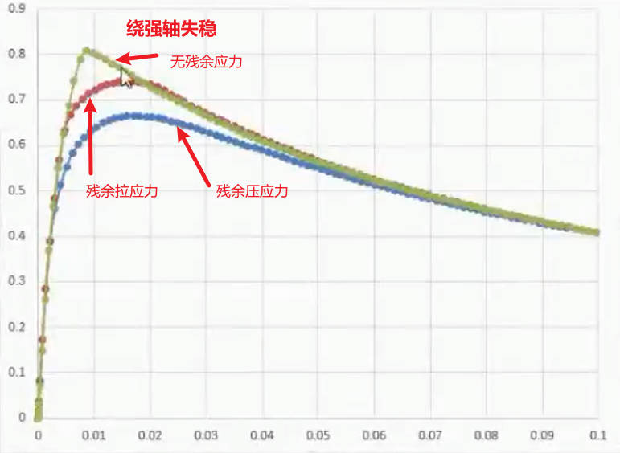

# 结构概念分析与ANSYS程序实现

> [同济大学-郭小农](https://www.bilibili.com/video/BV1d4411V7wJ?p=1&vd_source=412ee9f1892496b8506f8302ac9d1437)

## 0.课程简介

### 0.1初始缺陷

**初步特征屈曲**


注意：图例显示的 -1, 1 只是表示相应的形状，而不具有任何单位


**引入初始缺陷**


### 0.2残余应力

**简介**


**读取文件形式**


## 1.挠度

### 1.1纯弯作用-beam3

**问题：简支钢梁的跨中挠度**


**1.结构力学解答**

纯弯的简支梁跨中挠度：
$$
\delta = \frac{ML^2}{8EI}
$$


根据边缘纤维应变 $ \epsilon$ 求惯性矩：
$$
\sigma = \epsilon E \\
M = \sigma W = \sigma \frac{I}{h/2}=\epsilon E \frac{I}{h/2}\\
\delta = \frac{\epsilon E I}{h/2}  \frac{L^2}{8EI} = \frac{\epsilon L^2}{4h}
$$
**2.用 AutoCAD 画图解答**

- 划分段数，找出每一段最基本的变形准则
- 根据单元和单元之间的变形协调关系
- 校核边界条件


**分段数量越多，挠度越大!**

- AutoACD 几何画法使用多段直线去拟合圆弧
- **相当于对每一段增加了额外的刚度，从而使得结构的整体刚度变大**
- 根据常识：$F=kx$ ，可知在力相同的条件下，刚度越大，对应的位移越小

**3.ANSYS 解答**

**Beam3单元-分段数量越少，挠度越大！**


**CAD 解答**


**ANSYS beam3 解答**


**ANSYS beam188**


**对于大变形的情况-三者解答的对比**

CAD 绘图解答考虑的单元之间的协调性，当 ANSYS 打开大变形开关时，二者一致。

借助 Excel 使用理论公式的弹性解答，在 ANSYS 未打开大变形开关时二者时一致的。

#### 有限元解答的下限性


### 1.2均布荷载-beam188

**Beam188-弯曲变形+剪切变形**

**使用高阶形函数，可以划分较少的单元个数，从而在满足精度的前提下提高求解速度。**

`keyopt(3)`：沿着长度方向的形函数，**打开高阶形函数的开关**

- 0-linear 缺省
- 2-quadratic (二次抛物线)
- 3-cubic (三次)

`keyopt,1,3,2` ：对第 1 种单元的第 3 个 option 设置为 2 

**Beam3-弯曲变形**

随着跨高比越大，弯曲变形的占比越大，剪切变形的占比越大。

### 1.3剪力滞后-shell

**宽翼缘的剪力滞后效应**

正应力需要纵向剪应力的传递，使得在端部截面较近的地方，正应力出现了滞后。

对于翼缘很宽的箱型截面，可等效为两个槽钢。


**梁单元假定截面是不变的**

- 无法计算剪力滞后效应
- 无法计算局部失稳问题
- 无法计算翼缘和腹板焊缝的三向应力问题 (板壳单元也不行)

**建立刚域**

ANSYS 不能允许存在单独的节点，每个节点必须赋予一个单元与单元相连。

**注意应在网格划分之前定义额外的节点，确保好编号**

```
!!!中点节点的创建
n,1,0,0,0
n,2,L,0,0
! ansys不允许存在单独的节点
! 定义质量单元，不贡献刚度
et,2,mass21 !定义第二种 单元，用于创建的节点
r,2,1000 !为第2种单元随意定义实常数
type,2  !设定单元类型为2
real,2  !实常数为2
e,1 !通过节点定义一个单元
e,2

!!!建立刚域
!!!施加约束
nsel,s,loc,x,0,0
! 主节点1，从节点all,所有自由度
cerig,1,all,all
nsel,s,loc,x,L,L
cerig,2,all,all
nsel,all
d,1,ux,0
d,1,uy,0
d,1,uz,0
d,1,rotx,0
d,2,uy,0
d,2,uz,0
```


### 1.4一些约束的处理

**桁架与柱子约束的处理**

桁架端部截面有一定的高度，则桁架与柱子刚接


**细长杆桁架内部约束刚度的改变**

桁架内部约束刚度的变化是次要的，其刚度主要通过 EA 产生


## 2.网壳屈曲荷载

### 2.1线性屈曲分析

计算线性屈曲荷载—相当于压杆的欧拉荷载

**计算之前**

- `mxpand,10,,,1` 
- 特征值屈曲分析是应力并非真实的应力，仅表示各个模型中相对应力的概念，缺省不计算


**计算结果后处理**

- 直接获取特征值屈曲系数，在静力荷载施加单位力的时候，该特征值系数就是**线性屈曲的临界荷载**。

  `*get, modelFactor, model, 1, freq` 

```txt
!!!首先进行静力分析
/solu 
antype,0
pstres,on         !!!打开预应力开关
solve 
finish                 !!!结束当前求解

!!!然后进行屈曲分析
/solu 
antype,1  !屈曲分析    
bucopt,lanb,10 !求10个屈曲模态
mxpand,10,,,1 !扩展10个屈曲模态
solve 

!!!后处理
/post1
set,1,1
plnsol,u,z,0,1.0

!!!显示设置
/view,1,1,1,1 
/ang,1 
/ang,1,-120,zs,1
/rep,fast   
```


**time 值的含义**

- 线性屈曲系数|线性稳定系数
- 将结构上的荷载放大指定的系数后，出现响应的模态屈曲

**变形图无单位，只是指明了含义**

**线性屈曲分析描述**

- 特征值屈曲分析更多是从**数学上描述**

- 首先进行**静力学分析**，得到弹性刚度矩阵 $K_E$ ; 打开预应力开关得到几何刚度(应力刚度)矩阵 $K_G$

- 在结构变形后的位置建立平衡方程 
  $$
  ([k_E]-\lambda[k_G]){u}={0}
  $$

- **线性屈曲分析**本质上是求矩阵 $([k_E][k_G]^{-1}-\lambda[E])$的特征值 


### 2.2子程序的编写

增加逻辑的层次

- 材料 mat
- 节点 node
- 单元 ele
- 荷载 load

```txt
finish
/clear
/filname,ex02d

/PREP7
!!!输入材性，定义单元
/input,Ex02d_mat,txt

!!!输入节点坐标
/input,Ex02d_node,txt

!!!输入单元
/input,Ex02d_ele,txt

!!!定义节点约束
/input,Ex02d_bc,txt

!!!定义节点荷载
/input,Ex02d_load,txt

!!静力分析
/solu 
antype,0
pstres,on 
solve 
finish 

!!线性屈曲分析
/solu 
antype,1                  !定义Eigen buckling分析 
bucopt,lanb,3             !定义模态数量和提取方法 
mxpand,3,,,1              !扩展模态并计算单元
solve 
finish

!!!显示屈曲模态
/post1
set,1,1,
plnsol,u,z,0,1.0
```

**打开Beam188 的翘曲自由度开关**

打开 Beam188 翘曲自由度的开关：`keyopt,1,1,1` | keyopt(1)=1

打开翘曲开关，线性屈曲系数有所增加，即结构的刚度变大

**开口截面**

- 自由扭转：靠截面很薄的壁板形成的闭合剪力流来抵抗
- 约束扭转：上下翼缘板抗弯抵抗剪力


**闭口截面**

约束扭矩的贡献程度小，对 Beam188 是否打开 keyopt(1)=1 影响不大。

## 3.应力刚度

### 3.1理论解

**常见的求解方法：设临界荷载为 $P_{cr}=\lambda P$**


$$
\begin{align}
&弹性应变能：&U=&ku^2/2 \\
&荷载势能：&V=&-\lambda Pv \approx -\lambda Pu^2/2L\\
&屈曲系数：&\lambda =& \frac{V}{U}
\end{align}
$$
**屈曲分析平衡方程：**


$$
[k_G]^{-1}[k_E]=L/P \quad [k_E]=k\\
\lambda = \frac{kL}{P}
$$
**应力刚度矩阵**

P 为压力，减少结构的刚度矩阵，$([k_E]-\lambda[k_G]){u}={0}$

P 为拉力，增大结构的整体刚度，$([k_E]+\lambda[k_G]){u}={0}$

### 3.2 杆的切向刚度

例如绷紧的线，产生切线刚度


**总单元刚度矩阵**

弹性刚度矩阵 + 应力刚度矩阵 (沿着切向产生单位位移，临近约束的力)


**CAD 求解**

**顶点的位移越大，该模态越容易发生**

- 1 接屈曲模态更容易发生；
- 1，2 阶的弹簧总变形量相同，但是位移不同；
- 在总功相同的情况下，对 1 阶模态来说，其所需的力更小；


**ANSYS 计算**

- **ANSYS 中归一化准则**：将最大的位移设为 1 ，其余的位移除以位移进行归一化
- **理论解**：位移平方和为 1

**线性屈曲分析方法**

lanb 采用兰索斯法求解时没有子空间计算出来的稳定，会记录构件的轴向受压刚度 $EA/L$

```txt
bucopt,subs,NN  !采用子空间迭代法计算
bucopt, lanb, NN !读取刚度时必须采用lanb方法 
```

**100 根杆件，99 根弹簧**

第 1 阶模态和第 99 阶模态的都是正弦曲线形式，不过第 1 阶分为两个


### 3.3转角弹簧

**1.理论求解**

- **使用梁单元来模拟**
- **combine14 单元，扭转弹簧，keyopt(2)=6，绕 z 轴**


**弹性刚度矩阵**


**应力刚度矩阵与3.2的二力杆相同**

**2.ANSYS求解**

- 共用一个节点时，为刚接；

- 在同一位置分开定义两个节点，实现铰接；


**ANSYS 节点弹簧单元 combine 的定义**

```txt
type,2
real,2
mat,2
! 取第2类的弹簧单元
*do,i,1,NN
 e,2*i,2*i+1    !定义2，3等弹簧连接的节点
*enddo
```

**同坐标点自由度的一致-cpintf**

```txt
!!!施加约束
d,all,uz,0  !平面外的进行约束
d,all,rotx,0    
d,all,roty,0    !仅留绕z轴的转动
d,1,ux,0
d,1,uy,0
d,2*NN+2,ux,0
! 让所有坐标重合的节点x方向变形连接到一起
! 扭转弹簧是绕z轴的转动
cpintf,ux,0
cpintf,uy,0
```

**100 根杆件，99 根弹簧**

**与二力杆完全相反！**


### 3.4子程序的讲解-类函数


## 4.非线性

**误差随 b 的变化**


- 线性解在变形前的位置建立平衡，忽略了变形的高阶小量；
- 随着直角边 **b 的增加，$\beta$ 值也随之增加**，线性解和非线性解的**误差逐渐变小**；

### 4.1ANSYS 误差的来源

**ANSYS 打开大变形开关后-可能使用到了 2 阶项；且在变形后的位置建立平衡方程**

**1. $\delta$ -Taylor 项数的不同**


$$
线性：\delta=x \sin \beta \\
非线性(精确): \delta=\sqrt{(x+b)^2+a^2}-L
$$
- $\delta$ 取值的误差，ANSYS 用泰勒公式展开代替；
- ANSYS 线性求解时，展开到 1 阶；
- ANSYS 打开大变形开关，则继续向后保留展开的阶数；
- **下移量 x 值越大，变形误差越大，不论是 1 阶展开还是 2 阶展开；**

```txt
time,1
outres,all,all !输出每一个子步的结果
nsubst,500 !设置迭代子步数
nlgeom,on !打开结合大变形的开关

/post1
set,last
plnsol,u,y,0,1.0
```

**2.平衡力的误差**


$$
线性：P=2N \sin \beta \\
非线性(精确): P=2N \sin (\beta+ d \beta)
$$
**非线性荷载位移曲线**

结构的刚度逐渐变大，应力刚度 $k_G$ 和弹性刚度 $k_E$ 的占比：
$$
弹性刚度：k_E=2EA \frac{b_1^2}{L_1^3}\\
应力刚度：k_G = \frac{2N}{L_1} \quad (L_1为变形后的长度)
$$


**随着下移量 x 的增加，刚度都逐渐增大**

- 总刚度增加；
- 弹性刚度的贡献程度增大，x 增加 $\beta$ 增大，故其在竖向上的分量也不断增加，**极限值 $k_E=2EA/L$**；
- 应力刚度增加，极限趋于一个定值；

### 4.2求解迭代方法

**两个不同结构的比较**


- 未打开弧长法时，结构 B 作的功更多；A 和 B 存储的弹性变形能相同；
- **借助弧长法追踪全过程的平衡路径，A 和 B 作的功相同**
- B 结构刚度变化，**杆单元的跳跃失稳问题**
  - 总刚度先变小，后变大
  - 弹性刚度，先变小到 0 ，然后再变大
  - 几何刚度矩阵，刚开始是负的，在水平位置处绝对值达到最大

**后处理命令**

```txt
!!!!!!!!!!!!!!!画位移图
/post1
set,last
plnsol,u,y,0,1.0  

/post26 
nsol,2,2,u,y,   !将2节点的y向位移作为2号变量
xvar,2  !将位移作为x轴
plvar,1
```

**弧长法**

- **跟踪全过程平衡路径**
- 简单情况直接添加 `acrlen,on`
- 越过极值点


**牛顿-拉夫逊方法**

- **未打开弧长法时的默认求解方法**
- 方法 (1) 需要计算每个点的切向刚度，根据变形的位置不断计算刚度矩阵
- 方法 (2) 不需要重新组装刚度矩阵，但是迭代效率较低


### 4.3梁单元的失稳

拉索单元

## 5.受压四边简支板的屈曲荷载

### 5.1理论分析


**设置材料属性**

`aatt,mat,real,type,esys`：材料号，实常数号，单元类型号，坐标系编号

**理论解和 ANSYS 解答**

弹性力学的基本假定：(1) 刚法线假定；(2)板面内没有约束；


**板面约束后，屈曲荷载更低的分析：**

- 未施加板面内的约束，可沿着板自由伸缩
- 增加约束后，限制了板的伸缩；考虑到泊松效应，在外部施加纵向压力场的同时，**约束部位会对板产生横向压力场**，从而产生**双向压力场**。而此时板出平面的弹性抗弯刚度不变，所以线性屈曲荷载系数会降低。(一侧用力，两处作用)

- 由于约束和泊松效应，导致矩形板一侧用力，两侧都产生作用，使得屈曲荷载系数变小，但是**极限屈曲荷载的承载力变大**

**泊松比的影响**


**线性屈曲荷载：**如一个板的两个对边施加压力到一定值的时候，此时施加一个扰动的荷载，发生无法回复的变形

**极限屈曲荷载：**已经发生屈曲，继续施加力大小，此时取决于约束的提升作用。

### 5.2初始缺陷的引入

> [P35 讲解](https://www.bilibili.com/video/BV1d4411V7wJ?p=35&vd_source=412ee9f1892496b8506f8302ac9d1437)

- 得到 1 阶屈曲模态，及最大变形值
- 计算 `upgeom` 的放大比例因子，进而修改结构几何缺陷
- **一致模态法**：按照 1 阶屈曲模态施加初始缺陷，可能得到该结构非线性极限承载力的最小值。

```txt
!!!后处理，找到第1模态最大位移点
/post1
/efacet, 4  !设置的显示精度，值越大越清晰
plnsol, u, y, 0, 1.0 !显示y轴的位移
/view, 1, 0, 1, 0
set,first !显示一阶模态
nsort,u,sum !节点，按照和位移进行排序
*get,ndMax,sort,0,imax !将位移位移最大的节点编号写入ndMax
*get,dsumMax,node,ndMax,u,sum !将最大位移节点方向的位移写入到ndMax


!施加初始缺陷,1.40324
/prep7
codeFactor = mainLen/1000
initFactor = codeFactor/dsumMax
upgeom, initFactor, 1, 1, filename, rst
cdwrite, db, file_eigen, cdb    !导出文件
finish
```

**shell181 输出**

内部的面力：


### 5.3材料弹塑性

**定义理想的弹塑性**

bkin：`BKIN -- Bilinear Kinematic Hardening Specifications`

随动强化双线性模型

```txt
!!补充定义理想弹塑性
/prep7
Fy=235e6
tb,bkin,1,1,2,1
tbdata,,Fy,0,,,,
```

弧长法未设置中断条件，需手动停止

**卷尺案例**

- 四边简支板
- 三边简支板

**对于薄板弯曲，需设置 keyopt 的选项**

```txt
!!!!定义单元类型，实常数，材料特性 
et,1,shell181
keyopt,1,3,2            !!完全积分，受弯为主的薄板要打开这个开关
r,1,t
mp,ex,1,Ex
mp,prxy,1,Nu
mp,dens,1,dens
```

**施加重力荷载**

```txt
acel,0,9.80,0 !正放
acel,0,-9.80,0	!反放
```

目前计算的屈曲系数时针对结构**初始态**的弹性刚度矩阵和应力刚度矩阵

而实际包含非线性效应，应考虑**最后一刻**的切线刚度和应力刚度的特征值问题

## 6.材料非线性

### 6.1单轴拉伸

**本构关系**

- BKIN：双线性随动强化模型，具有明显屈服点的，考虑包辛格效应
- BISO：双线性各向同性强化
- KINH：多线性随动强化，无明显屈服点的，如高强钢
- MISO：多线性各向同性强化

**卸载特性**

- $\epsilon=f_y/E,E_y=0.1E,\epsilon=\epsilon_y+0.2 f_y/E_t$
- 残余应变: $\epsilon_r = \epsilon-1.2f_y/E$，只有弹性变形可恢复

**反向加载**


影响反向加载的特性

**反向加载-多线性本构关系**

采用 KINH 和 MISO 进行计算：


- KINH：CD 的长度是 OA 长度的 2 倍，D 点进入屈服
- MISO：过 E 点全截面屈服

**循环加载过程**

等幅循环加载，BKIN 或者 BISO 

**延性**


承受一定应力的情况下，具有较好的变形能力。

在考虑几何非线性和材料非线性的时候，应设置初始迭代步长较小

**ANSYS 考虑弹塑性**

- 弯矩达到塑性弯矩时，结构的刚度接近 0，此时误差较大
- 结构刚度接近于 0 时，施加力的解法误差较大
- 但是梁单元仍然满足平截面假定和变形协调关系

$$
\begin{align}
精确的曲率：\psi =& \frac{y''}{[1+(y')^2]^{\frac{3}{2}}}\\
预估曲率:\psi \approx& y''
\end{align}
$$

### 6.2残余应力对拉杆的影响

> Ex06c

拉力从 0 到 200Mpa 时，钢板的伸长量


**残余应力的分布**

- 对拉杆的承载力无影响，因为材料具有很好的延性
- 对拉杆的刚度有影响，提前降低拉杆的延性 (屈服位置，刚度 0)

**沿着长度均匀分布的残余应力**


任意的横截面上具有相等的残余应力。

**多轴应力下的材料非线性问题**

- **屈服准则**
- 流动准则：屈服后，材料应变增长的方向
- 强化法则：进入到强化阶段后，如何增加

金属材料：各向同性材料，根据 3 个主应力即可判别是否屈服

- Mises屈服准则-第 4 强度理论


位于圆柱面以内的点没有屈服，位于圆柱面以内或外部，则屈服。Mises 椭圆和圆柱面。

**先有材料，后有本构**：三向拉应力，钢材变脆，此时本构为最大拉应力准则，**提出的本构模型本质上都是去描述材料的特性。**


## 7.钢压杆极限承载力

### 7.1弯曲失稳

极限承载力：$P_u=\varphi Af_y$，$\varphi$ 为整体稳定系数：$\displaystyle \varphi = \frac{P_u}{Af_y}$，**此时的 time = $P_u/{Af_y}$ 值也就是$\varphi$**。

标准计算极限承载力，考虑初始弯曲和残余应力的影响

**注意：**应力积分点不外推的设置 (应力积分点的设置对极限承载力的影响很小) `eresx,no!关闭积分点线性外推选项`**先得到积分点的结果，而后从积分点向外推出节点的应力值**。

**考虑残余应力的极限承载力**

以弯曲失稳为主的构件，Beam188 梁单元翘曲自由度 (主要对弯扭失稳运用) 的开关对结果的影响很小。

### 7.2残余应力

- 火焰切割边的压杆等效缺陷小于剪切边
- 边缘是残余**拉应力**对受压杆件更为有利


**标准中柱子曲线的计算**


**根据截面的自平衡条件计算-弯矩和力**


- **局部坐标系显示结果**，`rsys,11`

- **残余应力对长柱的影响大于对短柱的影响**

- **机理**：截面存在残余应力，在外力的作用下，部分截面会提前屈服丧失承载力，因此剩下的弹性核越大，承载力越高

- **绕弱轴失稳**：极限承载力的的比较-边缘为残余拉应力 > 无残余应力 > 边缘为残余压应力

  

- **绕强轴失稳**：极限承载力的的比较-无残余应力 > 边缘为残余拉应力 > 边缘为残余压应力

  


## 8.动力学分析


